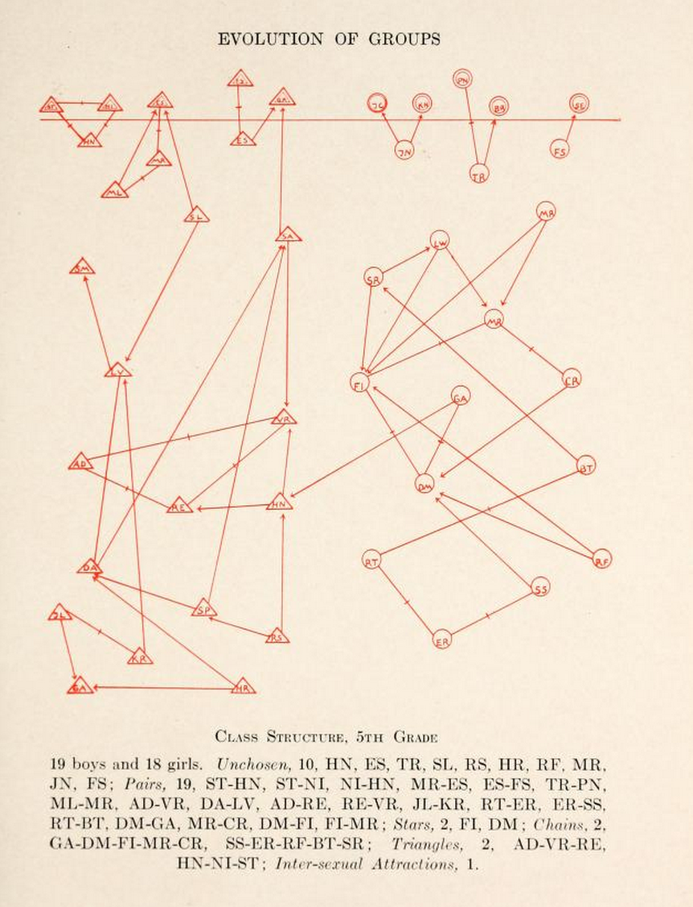
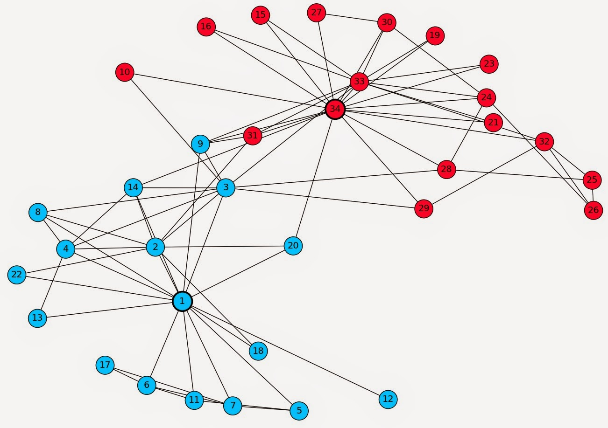

# Social Ties and Network Boundaries {#sec-tiesbound}
```{r setup, include=FALSE}
      library(ggraph)
      library(tidygraph)
      library(igraph)
```

This is likely not your first sociology course. But even if it is, relationships are relatively intuitive for people. They are all around us: you and your parents, you and your siblings, your siblings and your parents, you and your classmates, your classmates to each other. Affiliation, communication, friendship, hatred: these are the *content* of social relationships. Two people either have a relationship of some kind or they do not. 

Essentially, a relationship is a **connection** between at least two social actors. We will see that sometimes, when relations clump together into networks, two sets of relations can have different content, but still share the same **form** (e.g., arrangement, or pattern).

The technical social networks term for "relations clumping together into networks" is **concatenation** [@martin09]. For instance, every time you introduce two previously unrelated acquaintances to one another, you concatenate two previous disconnected ties into a connected triple called a **triad**.

## Social Ties

For example, you are likely enrolled in a social networks class if you are reading this, and have people you know, such as your friends and people you've taken prior classes with, but also people you've never seen before. It might be obvious that you have a relationship with those people that you know, but do you have a relationship with those you do not know?

{#fig-sociogram}

The answer is *maybe*. It depends on how you define the term social relationship. If you were asked who your friends are, you would tell me that some of your classmates are your friends, and the rest are not. If you were asked which of these people in your classroom are your *classmates*, everyone would be your classmate, except for your professor or teaching assistants. You share a particular type of equivalence relationship with these other people, your classmates, even if you've never met them. The word "classmate" even implies a relationship type, one with a different social meaning than "friend." When analyzing a social network, it is important to first understand the type of social relationship you are examining, as this directly affects the conclusions or generalizations you can draw about the social world.

## Network Boundaries

Once you have a type of social relationship you would like to examine, the next step is to *bound* the context. If you want to map out all the social relationships in the world, well, that's impossible. Imagine how difficult it would be to map out all the people at your school who are friends with one another. That might be feasible if you have only 1,000 undergraduates, but at a school of 30,000, it would be a nightmare. That is in part why it is so important to bound the social context. The other is to exclude relationships that are not meaningful for your study. **Bounding**, or to draw boundaries, is to have a rule about what will or will not be included in the study [@laumann89].

{#fig-karate}

For example, if you are interested in who is friends with whom in your social networks class, you have bound your study to look at only people who are in your social networks class. One of the most famous social network studies was performed by the anthropologist Wayne W. Zachary (see @fig-karate) at a college karate club in the 1970s [@zachary77]. Thus, the 34 members of the karate club and the outside teacher were the actors included in the study because they were involved in the day-to-day operations of the karate club at the time the data were collected.

With a type of social relationship in some bounded context, you can begin to map the social world as a graph. In its most basic form, a graph is essentially a picture of the relationships between different types of social actors. This picture becomes incredibly powerful when we use mathematical concepts to understand how actors relate to one another (which this book is mostly concerned with) or to identify the social principles on which the network may have been formed.

While this class will mostly use the terms node and edge when referring to graphs, these are not the only terms in use among those who use network analysis techniques. Additional names for nodes include **vertex** or **point**. Relationships between two nodes are, in addition to being called edges, referred to as **ties** or **links**. Table @tbl-terms shows the different network lingo people use across disciplines.

| Academic Origin | Social Actor | Relationship |
| :---: | :---: | :---: |
| **Graph Theory** | Point | Line |
| **Network Science** | Vertex | Edge |
| **Sociology** | Actor | Tie |
| **Computer Science** | Node | Link |

: Network terminology across disciplines. {#tbl-terms}

This table highlights the commonality of the underlying concept despite the varied terminology. Understanding these different terms is crucial for navigating the literature and discussions within network analysis.


## References {.unnumbered}
