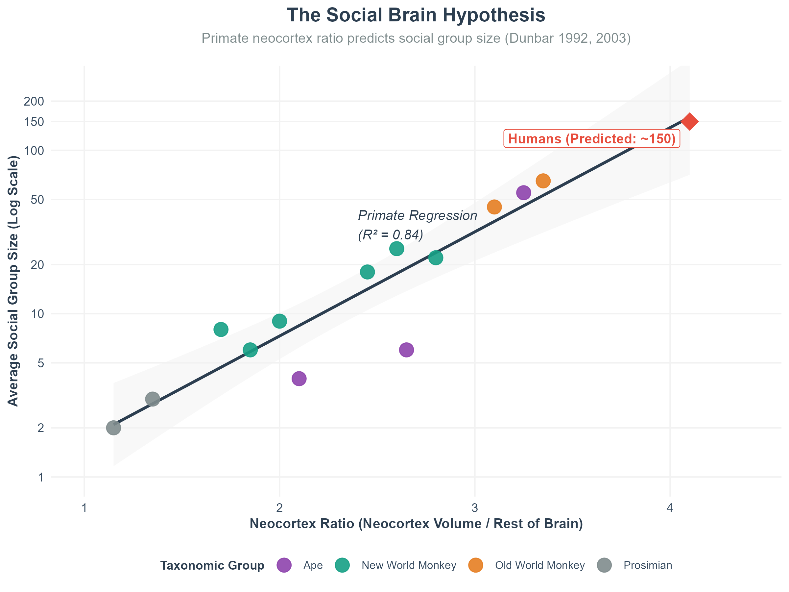
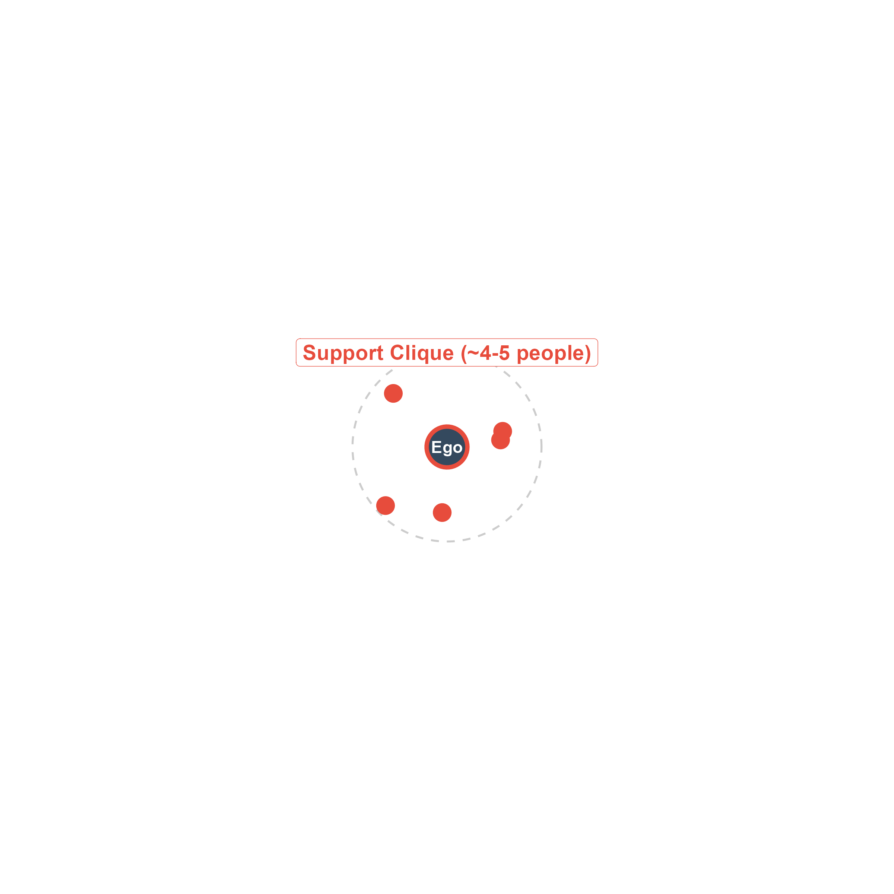
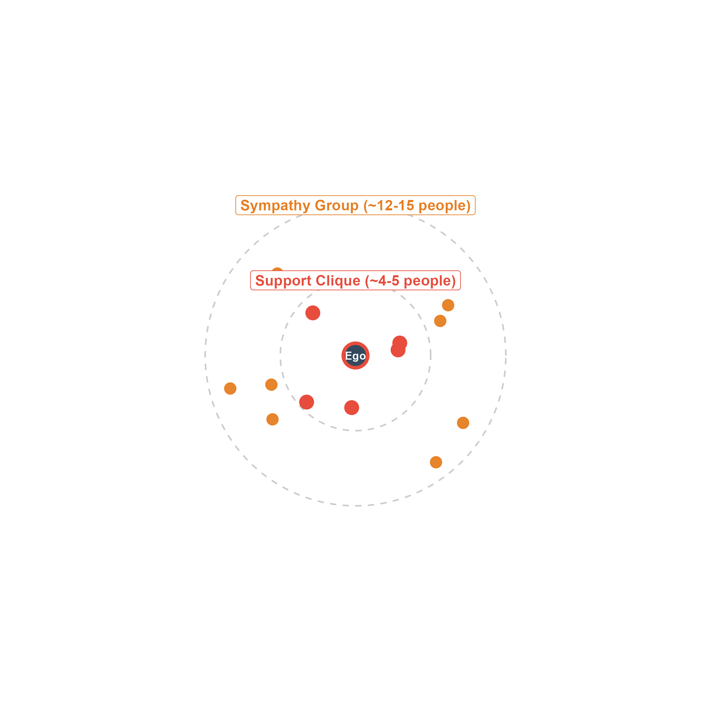
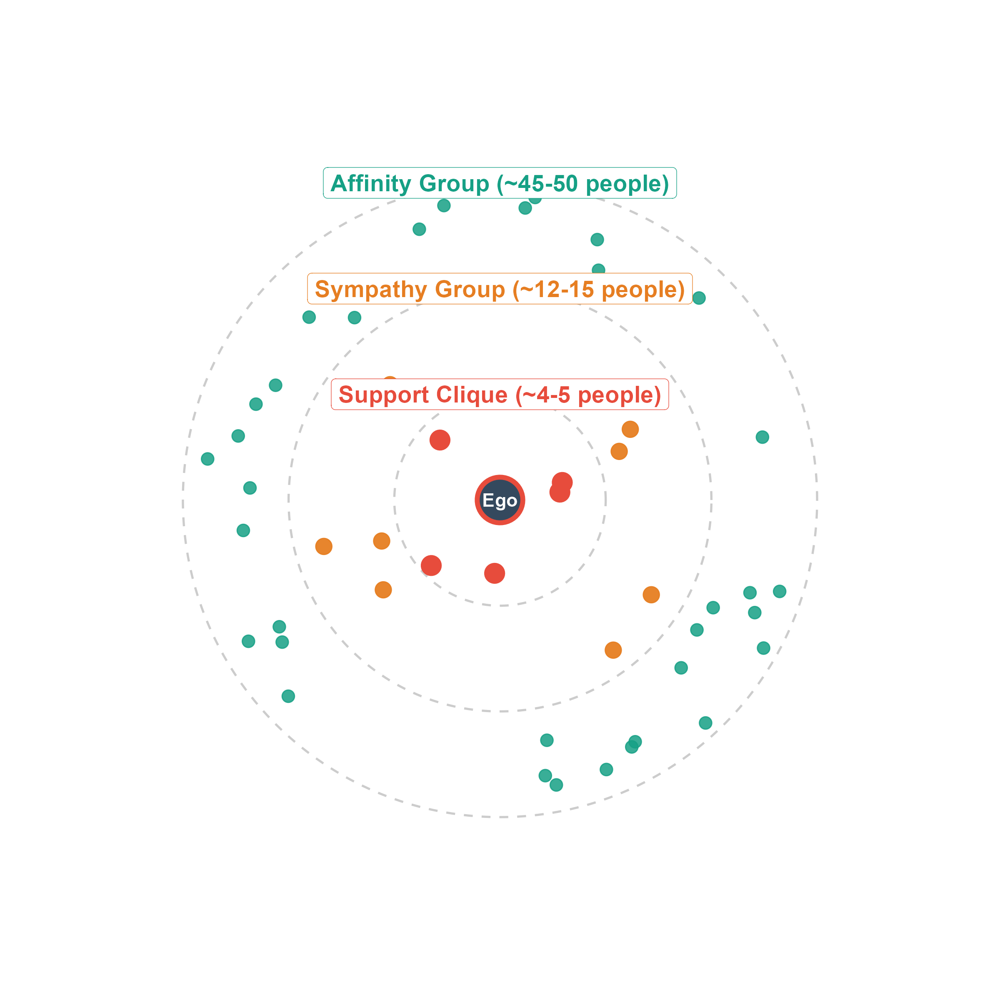
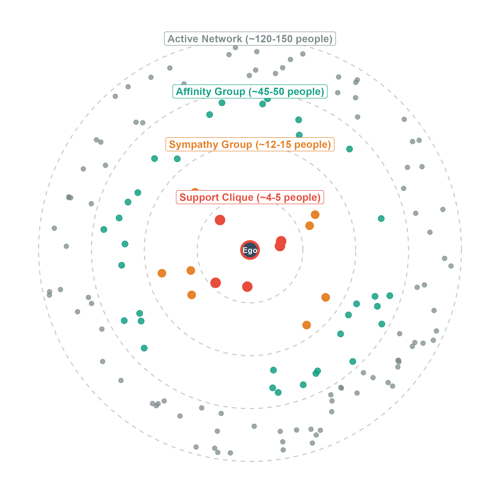

## Levels of Analysis in Social Networks

- As we move through social network analysis, we follow a natural progression:
  1. **Individual / Ego** (the actor)
  2. **Dyads** (pairs of actors and their tie properties)
  3. **Triads** (triplets of actors and local structures)
  4. **Subgroups / Cliques / Communities** (meso-level structures)
  5. **Whole Network** (macro-level structures)

- **Ego Networks** represent the personal network centered on a single actor (*ego*) and their connections (*alters*).

---

## Why Is the Human Brain So Big?

- **The Social Brain Hypothesis** (Robin Dunbar, 2003)
  - In comparison to our closest primate ancestors, humans have exceptionally large brains (specifically the neocortex) relative to body size.
  - *Why?* Because humans are incredibly social animals!
  - **Finding**: Neocortex size scales with average social group size across primate species.
  - **Explanation**: The brain evolved primarily to manage complex social relationships—keeping track of who is who, who is allied with whom, and who is an enemy.

- **Dunbar's Number (~150)**
  - Extrapolating the primate curve to humans predicts a cognitive limit of about **150 stable relationships** that an individual can maintain.

---

## Visualizing the Social Brain Hypothesis

::: {.columns}
::: {.column width="45%"}
- **Empirical Evidence** (Dunbar 1992, 2003)
  - Plotted across various primate species: prosimians, New World monkeys, Old World monkeys, and apes.
  - **Neocortex Ratio** (volume of neocortex divided by rest of brain) is strongly associated with average social group size.
  - The non-human primate regression line (solid line, $R^2 = 0.84$) represents a tight cognitive constraint.
  - **Extrapolating to Humans**:
    - A human neocortex ratio of ~4.1 predicts an average group size of **~150** (Dunbar's number).
:::

::: {.column width="55%"}
{fig-align="center" width="100%"}
:::
:::

---

## The Concept of Ego Network Layers

- Ego networks are organized into **concentric layers** based on intimacy and closeness.
- Closer layers are smaller and more intimate; farther layers are larger and less intimate.
- **Relationship Maintenance Costs**:
  - Maintaining social ties is not free. Every tie requires investments of:
    - **Cognitive/Emotional energy** (empathy, mental tracking)
    - **Time/Physical energy** (interaction frequency, communication)
  - These maintenance costs naturally limit the number of people who can fit into each successive circle.

---

## Visualizing the Dunbar Circles: The Ego

::: {.columns}
::: {.column width="45%"}
- Your personal network expands outwards from you (**Ego**).
- Let's trace how these circles of intimacy build up, layer by layer, centered around the central actor...
- Maintenance costs are zero when there are no ties to track!
:::

::: {.column width="55%"}
{fig-align="center" width="100%"}
:::
:::

---

## Visualizing the Dunbar Circles: Support Clique

::: {.columns}
::: {.column width="45%"}
- **Support Clique (~4–5 people)**
  - Your most intimate kin and best friends.
  - High emotional and cognitive investment.
  - These are the people you can rely on in times of crisis and emergency (e.g., "the 3 AM call" if your car breaks down or you are hospitalized).
:::

::: {.column width="55%"}
{fig-align="center" width="100%"}
:::
:::

---

## Visualizing the Dunbar Circles: Sympathy Group

::: {.columns}
::: {.column width="45%"}
- **Sympathy Group (~12–15 people)**
  - Close kin and good friends whom you interact with frequently.
  - Less intimate than the support clique but still highly valued.
  - These are the people with whom you share a strong bond and who provide mutual aid and services (e.g., helping you pack up and move to a new house).
:::

::: {.column width="55%"}
{fig-align="center" width="100%"}
:::
:::

---

## Visualizing the Dunbar Circles: Affinity Group

::: {.columns}
::: {.column width="45%"}
- **Affinity Group (~45–50 people)**
  - More casual but still close friends, extended family.
  - Frequent enough contact that you consider them part of your active social circle.
  - These are people you would invite to a birthday party or dinner, but whom you wouldn't necessarily call in a crisis.
:::

::: {.column width="55%"}
{fig-align="center" width="100%"}
:::
:::

---

## Visualizing the Dunbar Circles: Active Network

::: {.columns}
::: {.column width="45%"}
- **Active Network (~120–150 people)**
  - The outermost boundary of meaningful personal relationships.
  - People you recognize by face and name (without digital aids) and interact with at least once a year.
  - These are people you consider when making decisions, or potential contacts for job opportunities.
:::

::: {.column width="55%"}
{fig-align="center" width="100%"}
:::
:::

---

## Tie Strength & Dunbar Circles

- We can map **Granovetter's Tie Strength (1973)** directly onto Dunbar circles:
  - **Strong Ties** occupy the inner layers (*Support Clique* and *Sympathy Group*).
  - **Weak Ties** occupy the outer layers (*Affinity Group* and *Active Network*).

- **The Tradeoff of Network Structure**:
  - **Inner Circles (Strong Ties)**:
    - High trust, emotional intensity, and mutual aid.
    - Governed by **g-transitivity** (triadic closure): your close friends are likely friends with each other, leading to high density but highly **redundant information**.
  - **Outer Circles (Weak Ties)**:
    - Violate transitivity (your acquaintances are rarely friends with each other).
    - Function as **bridges** connecting you to distant parts of the social structure, providing **novel, diverse information**.

---

## Dunbar Circles in the Digital Age

- *Do social media websites (Facebook, Instagram, LinkedIn) break Dunbar's limit?*
  - Digital platforms allow us to have thousands of online "friends" and "connections."
  - **But can we maintain them?**
  - **Research Finding**: No. Even on digital platforms, cognitive and emotional constraints remain.
  - While we can accumulate thousands of weak or passive ties, our active network size (those we actually interact with) and our intimate support clique sizes remain remarkably consistent with Dunbar's predictions (~150 active contacts, ~4-5 close confidants).
  - Technology changes the *ease* of tracking weak ties, but it does not change the core limits of the human neocortex.

---

## Summary of Key Takeaways

- **Ego Networks are Layered**: Intimacy and group size are in an inverse relationship. Closer layers are smaller and require higher maintenance costs.
- **The Social Brain**: Our cognitive and emotional capacity is the primary constraint on our social network size.
- **Functional Dualism**:
  - The **inner circles** (strong ties) provide **emotional support, trust, and safety**.
  - The **outer circles** (weak ties) provide **novelty, information, and bridges** to other social networks.
