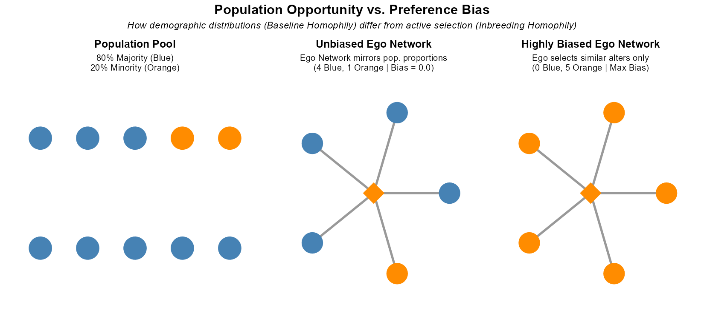
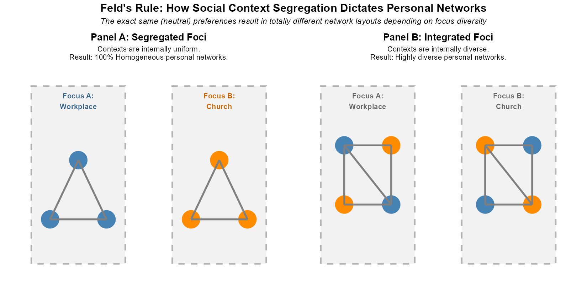
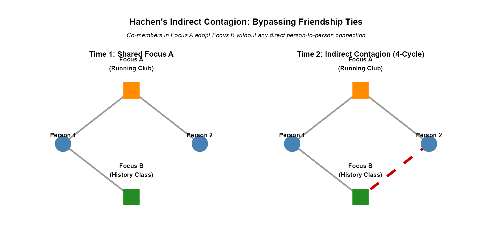
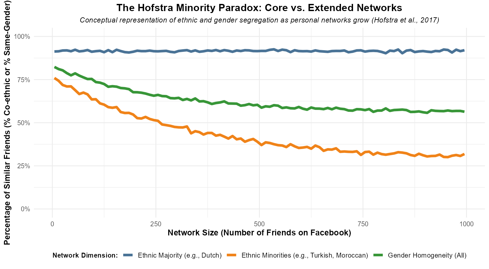

## The Puzzle of Homogeneity and Diversity

- **The Homophily Propensity**:
  - In everyday social life, "birds of a feather flock together."
  - People tend to form relationships with others who share similar traits (gender, race, class, age, religion).

- **The Core Analytical Question**:
  - Why are ego networks homogeneous or diverse?
  - **Individualist/Selection Explanation**: People have psychological preferences for similarity, choosing similar alters (**choice homophily**).
  - **Structuralist/Constraint Explanation**: Broad social forces and contexts structure opportunity, sorting people so they can only meet similar others (**induced homophily**).

- **Structural Sources**:
  - We examine how society's macro-demographic layout (Blau), organizational settings (Feld), and network size constraints (Marsden) shape homogeneity and diversity independent of individual preferences.

---

## McPherson's Classic Homophily Framework

- **Defining Homophily**:
  - McPherson, Smith-Lovin, and Cook (2001) define **homophily** as the principle that contact between similar people occurs at a higher rate than among dissimilar people.
  - It is the primary structural property of human social networks, creating a highly segmented social world.

- **The Baseline vs. Inbreeding Distinction**:
  - To study homophily scientifically, McPherson et al. split the phenomenon into two types:
  - **1. Baseline Homophily**: The demographic opportunity structure. It is the expected level of similarity if ties were formed completely at random within the pool of available potential partners.
  - **2. Inbreeding Homophily**: Active selection. It is the level of similarity formed *over and above* the baseline demographic opportunity (driven by choice, cultural tastes, or systemic bias).

---

## Visualizing Baseline vs. Inbreeding Homophily

::: {.columns}
::: {.column width="45%"}
- **How Population Structure Shapes Bias**:
  - **Population Pool**: Determines the base statistical probability of contact.
  - **Unbiased Network (Baseline)**: An orange minority member has an ego network that matches the 80/20 population distribution (4 Blue, 1 Orange). 
  - **Highly Biased Network (Inbreeding)**: Overriding population constraints, the minority member associates exclusively with orange alters (0 Blue, 5 Orange).
  - *Takeaway*: A network is only "biased" if its homogeneity exceeds the baseline population pool.
:::

::: {.column width="55%"}
{fig-align="center" width="100%"}
:::
:::

---

## McPherson's Sources and Dimensions of Homophily

- **The Major Dimensions of Homophily**:
  - **Race and Ethnicity**: The strongest and most persistent social split in personal networks.
  - **Other Key Dimensions**: Gender, age, religion, education, occupation, and social class.

- **The Five Structural Sources of Homophily**:
  - **1. Geography**: Spatial distance heavily restricts face-to-face encounters.
  - **2. Family**: Kinship ties are naturally locked-in and highly homophilous on race and class.
  - **3. Organizational Foci**: School, work, and associations sort similar people together (Feld's foci).
  - **4. Isomorphic Positions**: People occupying similar social roles (e.g., professions) develop similar habits, activities, and schedules.
  - **5. Cognitive Ease**: Communication with similar others requires less mental effort, reducing friction and coordination costs.

---

## Blau's Macrostructural Theory: Parameters

- **Social Structure as Distribution**:
  - Peter Blau (1977) defines social structure as the *distribution* of people across various **social positions** (demographics, occupations, etc.).
  - These distributions directly determine the *structural opportunities* individuals have to associate with one another.

- **Structural Parameters**:
  - The dimensions along which these social distinctions are made:
  - **Nominal Parameters**: Categorical attributes with no inherent rank or ordering (e.g., gender, race, religion, nationality).
  - **Graduated Parameters**: Rank-ordered attributes with inherent "higher" and "lower" values (e.g., age, education, income, wealth).

- **Societal Properties**:
  - **Heterogeneity**: The degree to which people are equally or unequally distributed across nominal parameters.
  - **Inequality**: The degree to which resources or attributes are unequally distributed across graduated parameters.

---

## Blau's Group Size Effects (Rules 1 & 2)

- Broad demographic proportions determine the statistical probability of meeting ingroup versus outgroup members, heavily biasing ego networks.

- **Rule 1: Smaller Groups and Outgroup Ties**
  - *Members of numerically smaller groups (minorities) are proportionally more likely to form ties with individuals outside their own group (outgroup members).*
  - This is a mathematical certainty: because the number of available ingroup partners is small, the probability of random encounters with outgroup members is high.
  - Minorities naturally experience greater social diversity in their personal networks.

- **Rule 2: Larger Groups and Ingroup Ties**
  - *Members of numerically larger groups (majorities) are proportionally more likely to form ties within their own group (ingroup members), regardless of choice.*
  - When a group dominates numerically, its members have almost exclusively ingroup ties, because the probability of meeting an outgroup member is statistically negligible.

---

## Visualizing Blau's Group Size Effects

{fig-align="center" width="85%"}

---

## Blau's Multiform Heterogeneity (Rule 3)

- **Rule 3: Correlated Dimensions of Association**
  - Broad social structures rarely exhibit independent parameters. Instead, dimensions of social differentiation are systematically correlated at the macro level (e.g., race and religion, age and wealth, race and income).

- **Propagated Bias**:
  - If your network exhibits a bias based on one parameter (e.g., race), it will *automatically* exhibit a bias along correlated parameters (e.g., religion), even if you are entirely neutral about religion.
  - Observed homogeneity is often an outcome of societal correlations, not personal choices.

- **Three Types of Structural Correlations**:
  - **Categorical-Categorical**: Race and religion (e.g., racial sorting in U.S. religious denominations).
  - **Categorical-Continuous**: Race and income (e.g., systemic racial wealth/income gaps).
  - **Continuous-Continuous**: Age and wealth (e.g., wealth accumulating over the life course).

---

## Feld's Theory of Social Foci

- **Context-Driven Link Formation**:
  - Scott Feld (1981) posits that social ties do not form in a vacuum or solely from abstract preferences. They emerge from specific social contexts.
  - **Social Focus**: *Any social, psychological, legal, or physical entity around which joint activities are organized* (e.g., workplaces, student clubs, voluntary groups, neighborhood hangouts, families).

- **Mechanisms of Tie Formation**:
  - **From circle to relation**: Being sorted into the same social circle/group makes individuals highly likely to form interpersonal ties.
  - **From common activity to relation**: Shared activities in a focus increase interaction frequency, facilitating connection.

- **Tie Maintenance**:
  - Foci create supportive environments. Ties embedded within highly constraining foci are much more likely to persist over time, even if individual sentiment or liking declines.

---

## Dimensions of Social Foci and Structural Effects

::: {.columns}
::: {.column width="45%"}
- **Two Key Dimensions of Foci**:
  - **Size**: The number of people involved in the focus. Large foci (e.g., universities) offer diverse pools; small foci (e.g., nuclear family) force intimate interaction.
  - **Constraint**: The amount of time and energy a focus demands. Highly constraining foci (e.g., full-time job, military squad) restrict opportunities to meet outsiders, leading to homogeneous networks.

- **Cross-Cutting Circles**:
  - Individuals belong to multiple intersecting foci.
  - Overlapping memberships bring together diverse alters, creating local clustering but also bridging opportunities.

- **Feld's Rule on Segregation**:
  - *Segregated (or non-segregated) networks can arise solely from the layout of social foci, independent of individual preferences and group sizes.*
:::

::: {.column width="55%"}
{fig-align="center" width="100%"}
:::
:::

---

## Feld's Rule: How Segregated Foci Drive Homogeneity

::: {.columns}
::: {.column width="45%"}
- **How Context Shapes Diversity (Feld, 1981)**:
  - Feld's Rule states that segregated networks can arise solely from how social foci are organized, *independent* of personal choice or group size.
  - **Panel A: Segregated Foci**: Workplace is 100% Blue; Church is 100% Orange. Egos in each focus form completely homogeneous networks.
  - **Panel B: Integrated Foci**: Both settings are diverse (50/50). Egos in either focus naturally develop diverse personal networks.
  - *Takeaway*: The exact same (neutral) preferences lead to highly segregated or diverse networks depending on context diversity.
:::

::: {.column width="55%"}
{fig-align="center" width="100%"}
:::
:::

---

## Dynamic Focus Theory: Tie Generators vs. Taste Diffusers

- **Beyond Static Foci**:
  - Scott Feld's classic theory is a "one-way comparative static": joint membership in a focus exogenously drives friendship formation (**Tie Generation**).
  - Hachen, Wang, Sepulvado, and Lizardo (2024) introduce **Dynamic Focus Theory**, treating interpersonal relationships and context affiliations as a two-way, co-evolving system.

- **The Dual Pathways of Co-Evolution**:
  - **1. Tie Formation via Joint Affiliation** (Foci as *Tie Generators*): People join the same focus first (e.g., a student club), and this shared context subsequently generates an interpersonal friendship.
  - **2. Foci Affiliation via Social Ties** (Foci as *Taste Diffusers*): People are friends first, and one friend subsequently recruits or pulls the other into joining their focus (e.g., adopting a music taste).

---

## The Foci Continuum: Cultural Structures vs. Sites of Activity

Different social contexts behave differently based on their physical boundedness, entry barriers, and interaction costs (Hachen et al., 2024):

- **1. Concrete Sites of Social Activity (The Tie Generators)**:
  - *Example*: **Student Clubs**. High face-to-face interaction and entry barriers. They are excellent at generating friendships, but friends do not easily recruit others due to activity/coordination costs.
- **2. Broad Cultural Structures (The Taste Diffusers)**:
  - *Example*: **Musical Genres**. Virtually unbounded, low barrier to entry. They do not generate friendships directly, but people are easily "recruited" into adopting musical tastes by pre-existing friends.
- **3. Hybrid Foci (Generators & Diffusers)**:
  - *Example*: **Course Areas** (academic majors) and **Activities** (drinking, gaming, volunteering). They involve both concrete face-to-face workspaces (generating ties) and shared cultural-intellectual preferences (diffusing tastes).

---

## Visualizing Dynamic Foci Processes

::: {.columns}
::: {.column width="45%"}
- **How Coupled Networks Co-Evolve**:
  - **Panel A: Tie Generation (Classic Focus Effect)**:
    - Time 1: Person 1 and Person 2 both belong to Focus A.
    - Time 2: The shared context brings them together, and a new tie forms.
  - **Panel B: Taste Diffusion (Dynamic Focus Effect)**:
    - Time 1: Person 1 belongs to Focus A and is friends with Person 2.
    - Time 2: Social influence or peer recruitment leads Person 2 to also adopt Focus A.
- **Key Lesson**: Foci are both *conduits for friendship* and *items of taste* that diffuse through those friendships.
:::

::: {.column width="55%"}
{fig-align="center" width="100%"}
:::
:::

---

## Hachen's Concept of 'Indirect Contagion'

::: {.columns}
::: {.column width="45%"}
- **Contagion without Friendship**:
  - Hachen et al. (2024) uncovered **Positive Affiliation Contagion** (the "4-cycle" effect).
  - People in the same focus (co-members) tend to adopt each other's *other* affiliations **without sharing any direct friendship tie**.

- **Why It Happens (Three Drivers)**:
  - **1. Institutional Linkages**: Organizations are naturally linked (e.g., academic departments share advisors/buildings, guiding students across foci).
  - **2. Context Mapping**: People observe what co-members in one focus do, then independently copy their behaviors and tastes.
  - **3. Structural Pairing**: Some lifestyles or tastes naturally pair together (e.g., country music and bluegrass).
:::

::: {.column width="55%"}
{fig-align="center" width="100%"}
:::
:::

---

## Marsden's Theory of Ego Network Diversity

- Peter Marsden (1987) utilized the 1985 General Social Survey (GSS)—which used name generators to measure **core discussion networks** ("discuss matters important to you")—to uncover fundamental structural rules of personal networks.

- **The Size-Diversity-Clustering Trade-off**:
  - Network structural features constrain and shape diversity and homophily.

- **1. Network Size and Diversity (Marsden's Rule)**:
  - **Larger ego networks** tend to be more diverse, less homophilous, and less constrained (less clustered/dense; alters are less likely to know one another).
  - As an individual expands network size, they are mathematically forced to move beyond their closest, most similar circles, encountering different types of people.
  - **Smaller ego networks** tend to be highly clustered, less diverse, and highly homophilous (usually centered on close family or core friends).

---

## Marsden's Rule, Tie Strength, and Kinship

::: {.columns}
::: {.column width="45%"}
- **2. The Role of Tie Strength**:
  - Ego networks with high average **tie strength** tend to exhibit high clustering but low diversity.
  - Strong ties imply shared context and mutual dependencies, leading to network closure and homogeneity.

- **3. Kinship Density**:
  - A higher proportion of **kin (relatives)** in an ego network leads to:
    - Greater clustering (relatives almost all know one another).
    - Greater homophily and lower overall socio-demographic diversity.
    - *Note*: Kinship ties represent structurally locked-in relationships that strongly resist dilution.
:::

::: {.column width="55%"}
{fig-align="center" width="100%"}
:::
:::

---

## Testing Theories in the Digital Era: The Hofstra Facebook Study

- **The Empirical Setting (Hofstra, Corten, van Tubergen, & Ellison, 2017)**:
  - The authors analyzed the Facebook networks of Dutch adolescents ($N = 2,810$ individuals, ~1.1 million ties) to compare small core (strong-tie) networks with larger extended (weak-tie) networks.
  - They tested whether classic offline network rules of opportunity (Blau) and context (Feld) hold true in massive, seemingly unbounded online networks.

- **Core Findings on Segregation**:
  - **1. Ethnicity vs. Gender**: They found that online networks are significantly more ethnically segregated than gender-segregated.
    * *Why?* Gender is a 50/50 split in the population (high baseline opportunity for mixed ties), while ethnic group sizes are highly unequal.
  - **2. The Power of Foci**: Classroom and school compositions (Feld's foci) directly predict online network segregation. Physical meeting opportunities remain the primary gateway to online friendship.

---

## Connecting Hofstra to Blau & Marsden: Core Concepts

::: {.columns}
::: {.column width="45%"}
- **The Theoretical Interplay**:
  - Hofstra et al. (2017) explored how population size (Blau) and network size (Marsden) jointly dictate segregation.
  - **Marsden's Rule**: Expanding network size should naturally dilute homophily, making networks more diverse.
  - **Blau's Group Size Effect**: Majorities are surrounded by co-ethnics, while minorities face limited ingroup partners.
  - **The Question**: Does growing your network always increase diversity, or does your group's size override this effect?
:::

::: {.column width="55%"}
{fig-align="center" width="100%"}
:::
:::

---

## Hofstra's Findings: The Minority Paradox

::: {.columns}
::: {.column width="45%"}
- **For Ethnic Minorities**:
  - **Marsden's rule holds**. As their Facebook network grows, their co-ethnic friend percentage **drops significantly** (orange curve).
  - *Why?* They quickly "run out" of co-ethnic alters in the population, forcing them to bridge to other groups.

- **For the Ethnic Majority**:
  - **Marsden's rule is violated!** As their Facebook network grows, co-ethnic percentage **remains completely flat and extremely high** (near 91%, blue line).
  - *Why?* Majority members are so plentiful they never run out of co-ethnics.

- **Gender Baseline**:
  - For both boys and girls, expanding networks dilutes gender homogeneity toward the 50% population baseline (green curve).
:::

::: {.column width="55%"}
{fig-align="center" width="100%"}
:::
:::

---

## Synthesis: Structural Sources of Ego Network Composition

The composition of your personal network is heavily structured for you by forces beyond your direct control:

::: {style="font-size: 0.55em;"}
| Theorist | Core Source of Network Layout | Key Dynamic / Findings |
|---|---|---|
| **Miller McPherson** | Multidimensional social space and opportunity structures. | Distinguishes baseline (demographic pools) from inbreeding (choice) homophily. |
| **Peter Blau** | Macro-demographic proportions & societal parameter correlations. | Group sizes dictate outgroup probabilities. Biases propagate via parameter correlations. |
| **Scott Feld** | Organizational contexts, physical entities, and joint activities (foci). | Co-membership drives tie formation; focus constraint determines tie maintenance. |
| **David Hachen et al.** | Co-evolving coupled network ecology (one-mode & two-mode). | Classifies contexts as Tie Generators (clubs), Taste Diffusers (music), or hybrids. |
| **Peter Marsden** | Structural features, network size, and tie properties. | Expanding network size mathematically dilutes homophily and clustering. |
:::

- **Takeaway**: Network scholars must control for macro-opportunities, organizational sorting, and size constraints before attributing network homogeneity to individual choice.

---

## Active Learning: Concept Check!

- **Review Question**:
  - Suppose a university establishes a new compulsory **First-Year Seminar Program** where students are randomly assigned to small, 15-student discussion cohorts that meet weekly. 
  - Over the school year, dense friendship circles form within these cohorts. In some cohorts, students also begin sharing and adopting each other's music and fashion preferences.

- **Class Discussion Questions**:
  - **1. Context-Driven Tie Generation**: Which of **Feld's** social foci dimensions explain the dense friendship circles?
  - **2. Co-Evolution of Context and Tastes**: According to **Hachen's** dynamic foci framework, how do we distinguish whether these cohorts acted as *Tie Generators* or *Taste Diffusers*? What observable network sequences would support each pathway?
  - **3. Network Spillover**: If a student in Seminar A begins attending another student's separate campus group without any friendship ties, what dynamic focus process does this represent?
  - **4. Opportunity Restrictions**: How would **Blau's** rules of relative group size and **Marsden's** size-diversity rule predict the demographic composition of these student friendship circles?
