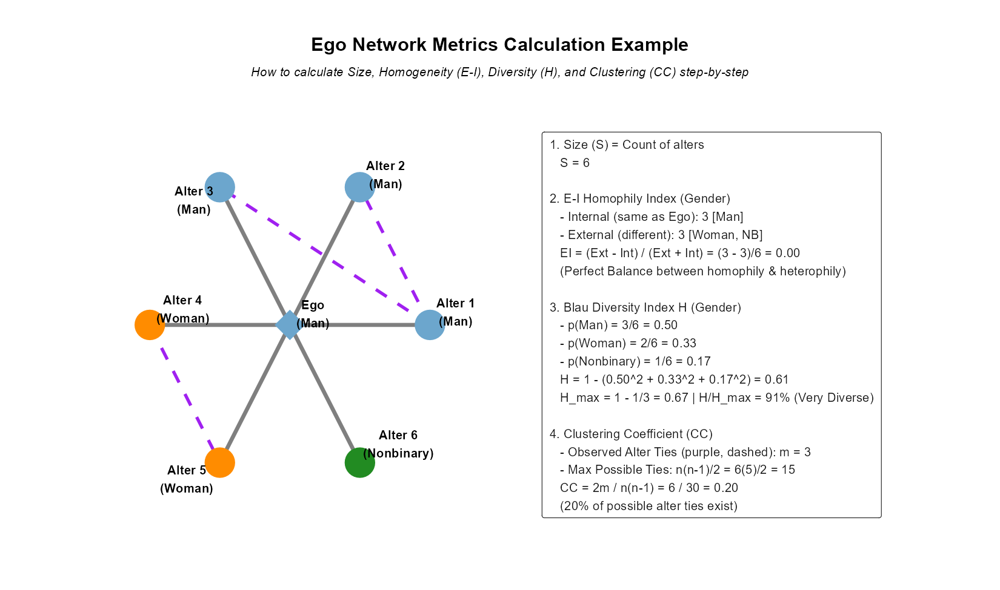

## Key Ego Network Metrics: Size and Homogeneity

To analyze personal networks empirically, researchers compute specific structural properties based on ego-alter attributes and alter-alter connections.

- **1. Ego Network Size ($S(Ego)$)**:
  - The simplest metric: a count of the ego-to-alter ties ($E_{ea}$), equivalent to the degree ($k^{Ego}$) of the ego node.
  - $$S(Ego) = |N(Ego)| = |E_{ea}|$$

- **2. E-I Homophily Index (Krackhardt & Stern, 1988)**:
  - Measures in-group and out-group preference based on categorical attributes of ego and alters.
  - $$EI = \frac{External - Internal}{External + Internal}$$
  - **Internal Ties (Int)**: Ties to alters who share the exact same category as Ego.
  - **External Ties (Ext)**: Ties to alters in categories different from Ego.
  - **Range**: $[-1.0, +1.0]$
    - **-1.0**: Complete Homophily (exclusively similar alters).
    - **+1.0**: Complete Heterophily (exclusively dissimilar alters).
    - **0.0**: Perfect Balance (equal number of internal and external ties).

---

## Step-by-Step Metrics Calculation Example

::: {.columns}
::: {.column width="45%"}
- **Let's trace the calculation for the network on the right**:
  - **Ego**: Man (Blue)
  - **Alters**: 3 Men (Blue), 2 Women (Orange), 1 Nonbinary (Green).

- **1. Size ($S$)**:
  - $S = 6$ alters.

- **2. E-I Homophily Index (Gender)**:
  - Internal ($Int$) = 3 (Alters 1, 2, 3 are Men, same as Ego)
  - External ($Ext$) = 3 (Alters 4, 5 are Women; Alter 6 is Nonbinary)
  - $$EI = \frac{3 - 3}{3 + 3} = \frac{0}{6} = 0.00$$
  - The network is in perfect balance, showing no structural bias toward ingroup or outgroup.
:::

::: {.column width="55%"}
{fig-align="center" width="100%"}
:::
:::

---

## Key Ego Network Metrics: Diversity and Clustering

- **3. Blau's Heterogeneity Index ($H$)**:
  - Measures overall sociodemographic diversity among alters. Crucially, **Ego's own attribute does not matter**.
  - $$H = 1 - \sum_{k} p_k^2$$
  - Where $p_k$ is the proportion of alters belonging to category $k$.
  - **Range**: $[0.0, H_{max}]$
    - **0.0**: No diversity (all alters belong to a single category).
    - **Maximum Diversity ($H_{max}$)**: Occurs when categories are equally represented.
    - $$H_{max} = 1 - \frac{1}{k} \quad (\text{where } k \text{ is the number of available categories})$$

- **4. Clustering Coefficient ($CC_i$)**:
  - Measures the density of connections among alters, ignoring the ego and ego-to-alter edges.
  - $$CC_i = \frac{2m}{n(n-1)}$$
  - Where $n$ is ego network size, and $m$ is the count of **alter-to-alter** ties.
  - **Range**: $[0.0, 1.0]$. A $CC = 0.20$ means 20% of all possible friendships among alters actually exist.

---

## Summary of Measuring Ego Networks

- **Four Core Properties**:
  - **Size**: How many alters in the network?
  - **Homogeneity (E-I)**: How similar are alters to ego?
  - **Diversity (H)**: How varied are the attributes of the alters?
  - **Clustering (CC)**: To what extent do alters know one another?

- **Key Takeaways**:
  - Choosing the right metric depends entirely on your research question.
  - Homogeneity and diversity are distinct: an ego network can have high homogeneity but low diversity, or vice versa, depending on group definitions.
  - Ego clustering measures network density, showing whether an ego is embedded in a single tight-knit circle or bridges separate, unconstrained social worlds.
