# Part 1: Indirect Connections & Paths

---

## Adjacency vs. Indirect Connections

:::: {.columns align=center}

::: {.column width="60%"}
::: {.incremental}
- **Adjacency** captures direct connections between nodes:
  - If $A$ is adjacent to $B$, they share an edge.
- But many network processes operate **indirectly**:
  - We must look beyond immediate contacts to the "friends of our friends."
  - **Diffusion Channels**: Indirect connections act as channels for gossip, information transmission, disease contagion, or social influence.
- In graph theory, indirect connections are formalized using three core concepts:
  - **Path**, **Connectivity**, and **Reachability**.
:::
:::

::: {.column width="40%"}

::: {.cell layout-align="center"}
::: {.cell-output-display}
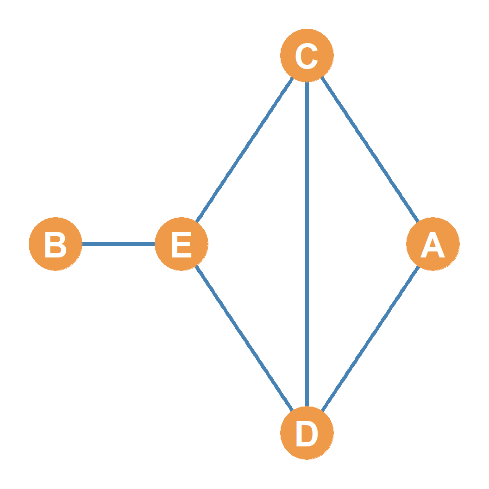{fig-align='center' width=528}
:::
:::

:::

::::

---

## What is a Path?

:::: {.columns align=center}

::: {.column width="60%"}
::: {.incremental}
- A **path** between $u$ and $v$ is an alternating sequence of nodes and edges that:
  - Begins with an **origin node** ($u$).
  - Ends with a **destination node** ($v$).
  - Does **not repeat any nodes** (which implies edges are not repeated either!).
- **Anatomy of a Path** (e.g. Red path from $B$ to $D$ on the right):
  - Written as: $B-D = \{BE, ED\}$ (length $l = 2$).
  - **Origin**: $B$, **Destination**: $D$ (together called the **end nodes**).
  - **Inner Nodes**: $E$ (the nodes in between).
:::
:::

::: {.column width="40%"}

::: {.cell layout-align="center"}
::: {.cell-output-display}
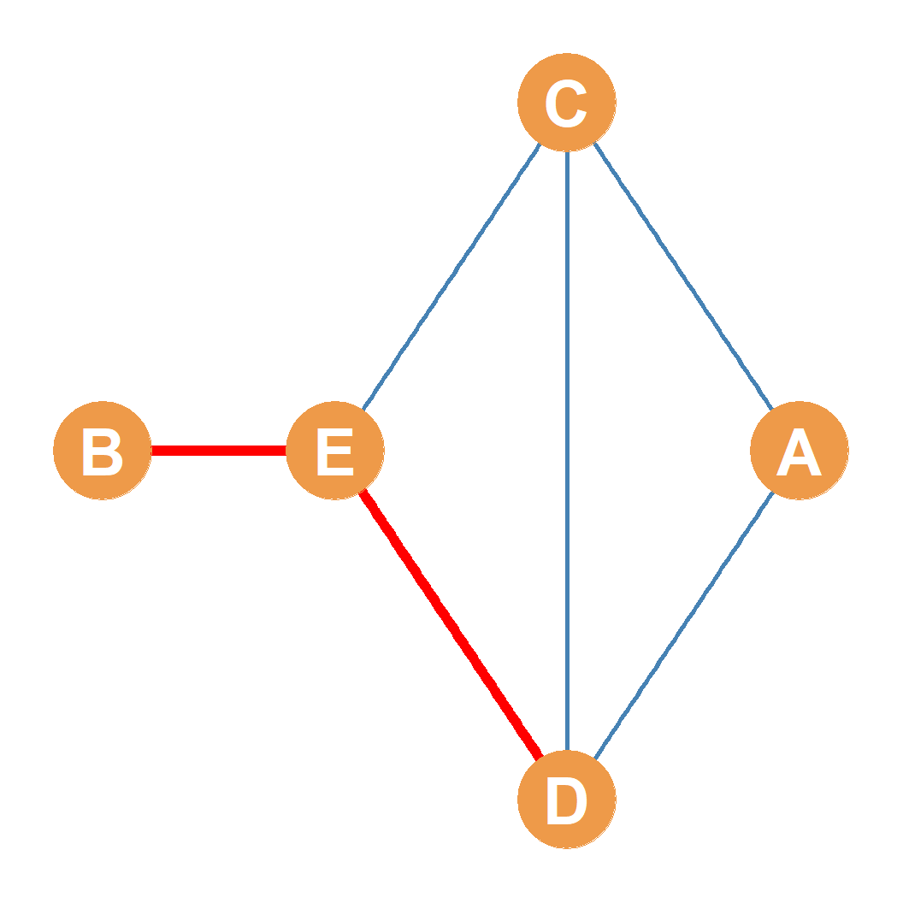{fig-align='center' width=528}
:::
:::

:::

::::

---

## Multiple Paths & Geodesics

:::: {.columns align=center}

::: {.column width="60%"}
::: {.incremental}
- Multiple distinct paths can connect the same pair of nodes.
- Let's trace paths from $B$ to $A$:
  - $P_1 = \{BE, ED, DA\} \quad (l = 3)$
  - $P_2 = \{BE, EC, CA\} \quad (l = 3)$
  - $P_3 = \{BE, ED, DC, CA\} \quad (l = 4)$
  - $P_4 = \{BE, EC, CD, DA\} \quad (l = 4)$
- **Shortest Path (Geodesic)**:
  - The path of minimum length between two nodes.
  - **Geodesic Distance**: The length of the geodesic path (here, geodesic distance $d(B, A) = 3$, with tied geodesics $P_1$ and $P_2$).
:::
:::

::: {.column width="40%"}

::: {.cell layout-align="center"}
::: {.cell-output-display}
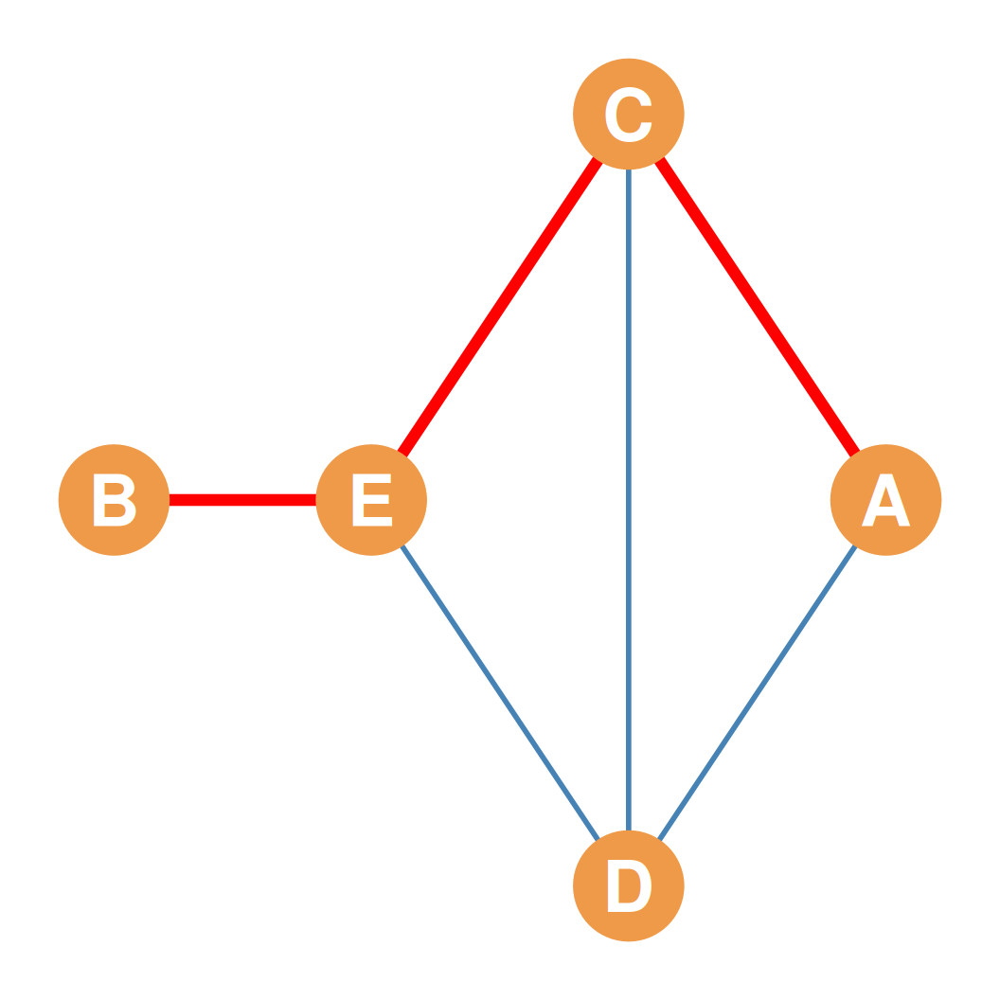{fig-align='center' width=528}
:::
:::

:::

::::

---

## What is a Cycle?

:::: {.columns align=center}

::: {.column width="60%"}
::: {.incremental}
- A **cycle** is a path of length 3 or larger that starts and ends on the same node.
- **Key Concepts**:
  - Origin and destination are identical, but inner nodes are unique.
  - **Graph Girth**: The length of the **shortest** cycle in a graph (here, girth is $3$, the triangle $\{ED, DC, CE\}$).
  - **Graph Circumference**: The length of the **longest** cycle in a graph (here, circumference is $4$, $\{ED, DA, AC, CE\}$).
:::
:::

::: {.column width="40%"}

::: {.cell layout-align="center"}
::: {.cell-output-display}
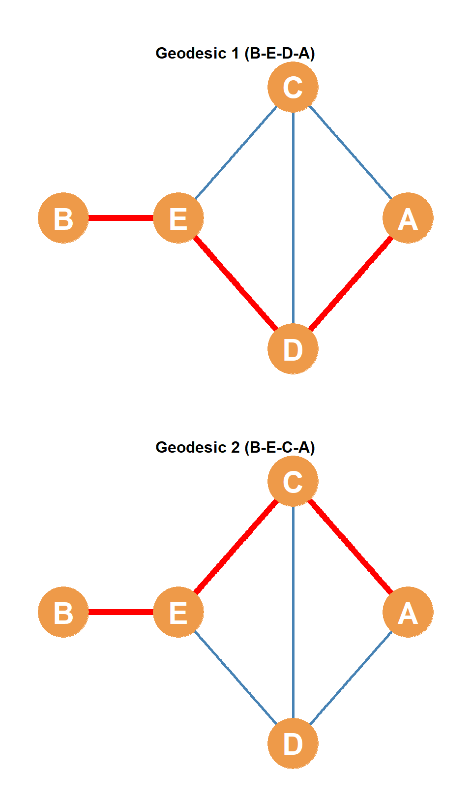{fig-align='center' width=528}
:::
:::

:::

::::

---

## Cycle Length: Girth vs. Circumference

::: {.cell layout-align="center"}
::: {.cell-output-display}
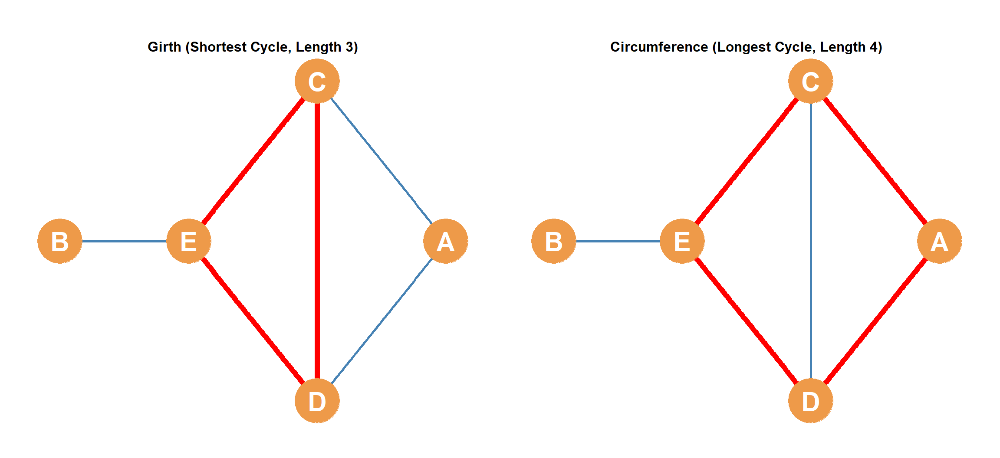{fig-align='center' width=1152}
:::
:::

---

## Walks, Trails, and Paths

::: {.incremental}
- **Walk**: Any sequence of alternating nodes and edges connecting $u$ to $v$.
  - *No restrictions*: Nodes and edges can be repeated as much as you want!
  - e.g., $\{B \rightarrow E \rightarrow C \rightarrow E \rightarrow D\}$ (traverses $E$ and edge $E-C$ twice).
- **Trail**: A walk that does not repeat any **edges**.
  - *Repeated nodes are allowed*, but every edge in the sequence must be unique.
  - e.g., $\{A \rightarrow C \rightarrow D \rightarrow E \rightarrow C \rightarrow B\}$ (repeats node $C$ but all edges are unique).
- **Path**: A walk that does not repeat any **nodes** (which means edges cannot be repeated either).
- **The Nested Hierarchy**: All paths are trails, and all trails are walks, but the reverse is not true:
  $$Paths \subset Trails \subset Walks$$
:::

---

## Walks & Trails: Visual Examples

::: {.cell layout-align="center"}
::: {.cell-output-display}
{fig-align='center' width=1152}
:::
:::

# Part 2: Directed Paths & Reachability

---

## Paths in Directed Graphs (Digraphs)

:::: {.columns align=center}

::: {.column width="60%"}
::: {.incremental}
- In directed graphs, paths must strictly **respect the direction of the arrows**!
- Let's trace directed paths from $A$ to $B$ in our digraph:
  - $P_1 = \{AC, CE, EB\} \quad (l = 3)$
  - $P_2 = \{AD, DE, EB\} \quad (l = 3)$
  - $P_3 = \{AC, CD, DE, EB\} \quad (l = 4)$
- But can we find any directed path from $B$ to $A$?
  - **No!** All arrows lead away from $A$ and toward $B$.
:::
:::

::: {.column width="40%"}

::: {.cell layout-align="center"}
::: {.cell-output-display}
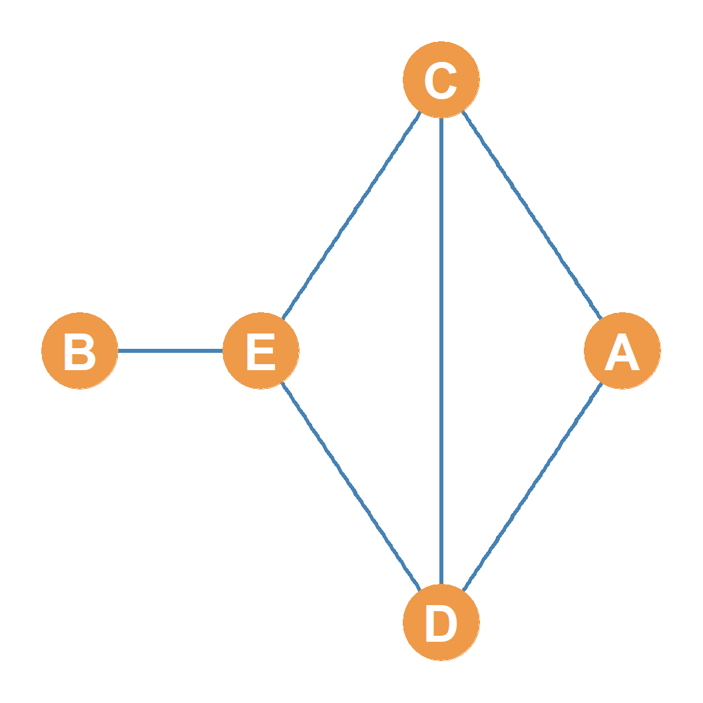{fig-align='center' width=528}
:::
:::

:::

::::

---

## Directed Reachability

::: {.incremental}
- **Asymmetric Reachability**:
  - Node $A$ can reach $B$ via directed path $\{AD, DE, EB\}$ ($l_{AB} = 3$).
  - But node $B$ **cannot** reach $A$ because we cannot travel against the arrows ($l_{BA} = \infty$).
- **Mutual Reachability**:
  - Two nodes $u$ and $v$ are mutually reachable if there exists a directed path from $u \rightarrow v$ AND from $v \rightarrow u$.
  - These two paths **do not** have to be the same length!
  - **Example**: Nodes $B$ and $C$ are mutually reachable:
    - $B$ reaches $C$ via $\{BE, ED, DC\} \quad (l = 3)$
    - $C$ reaches $B$ via shortest path $\{CE, EB\} \quad (l = 2)$
:::

---

## Directed Reachability: Visual Examples

::: {.cell layout-align="center"}
::: {.cell-output-display}
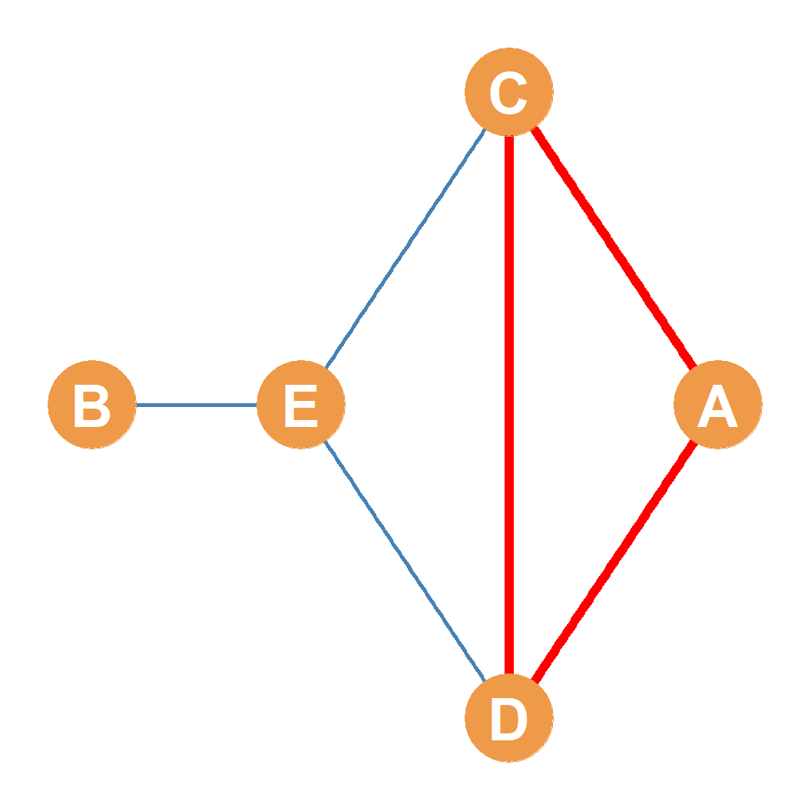{fig-align='center' width=1152}
:::
:::

---

## Directed Cycles & DAGs

:::: {.columns align=center}

::: {.column width="60%"}
::: {.incremental}
- A **directed cycle** is a cycle where all arrows flow in a single, continuous direction.
  - **Example**: Cycle starting and ending at $C$:
    - $\{CE, ED, DC\} \quad (l = 3)$
- **Directed Acyclic Graphs (DAGs)**:
  - Directed graphs that contain **no directed cycles**.
  - e.g. strict organizational command structures, directed trees.
  - Anti-symmetric relations (like "is boss of") structurally forbid cycles to maintain consistent hierarchy.
:::
:::

::: {.column width="40%"}

::: {.cell layout-align="center"}
::: {.cell-output-display}
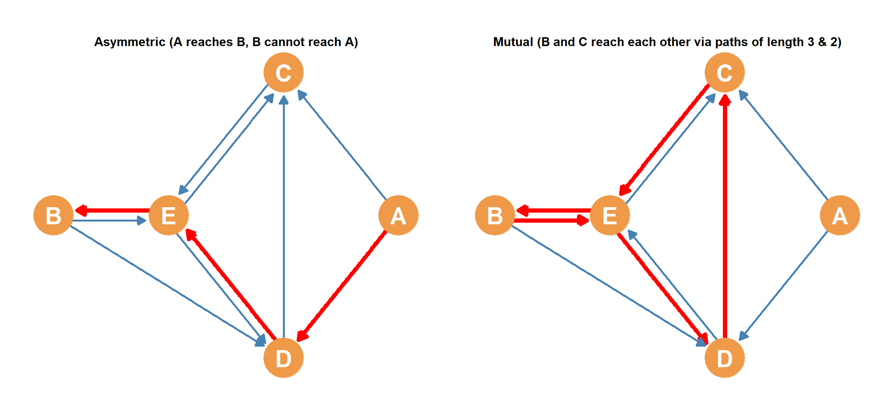{fig-align='center' width=528}
:::
:::

:::

::::

---

## Ignoring the Arrows: Semipaths

:::: {.columns align=center}

::: {.column width="60%"}
::: {.incremental}
- What if we want to trace connections in a directed graph but **ignore the arrows**?
- This is called a **semipath** (or semicycle if it is a closed loop).
- A semipath treats directed arcs as undirected edges.
- **Example**: Semipath connecting $B$ and $A$:
  - $\{BE, EC, CA\}$ (highlighted in red on the right).
:::
:::

::: {.column width="40%"}

::: {.cell layout-align="center"}
::: {.cell-output-display}
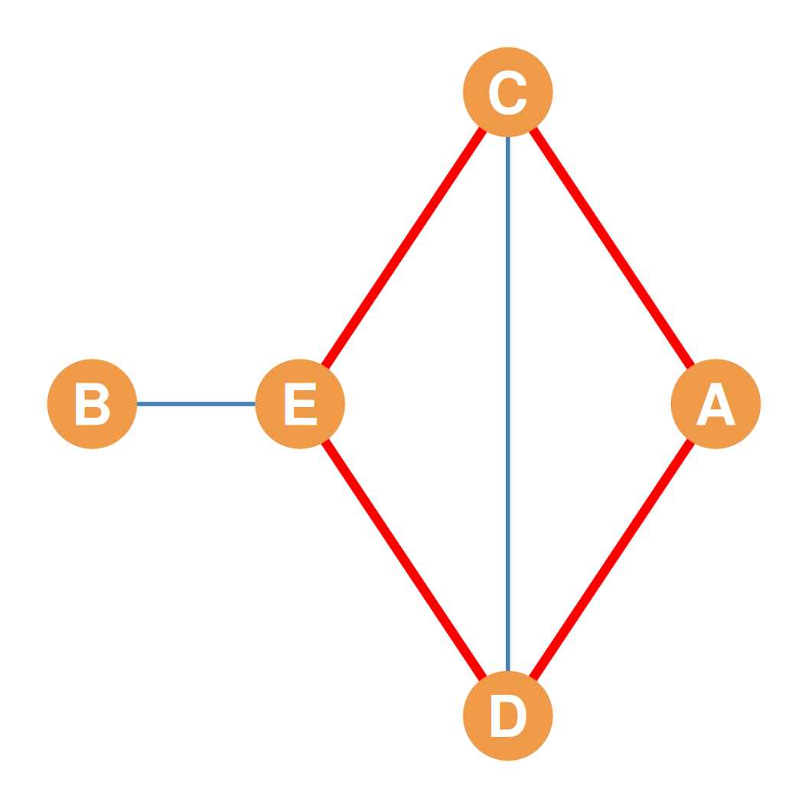{fig-align='center' width=528}
:::
:::

:::

::::

# Part 3: Graph Connectivity & Components

---

## Connected vs. Disconnected Graphs

:::: {.columns align=center}

::: {.column style="width: 50%; display: flex; flex-direction: column; justify-content: center; align-items: center;"}
**Connected Graph**

::: {.cell layout-align="center"}
::: {.cell-output-display}
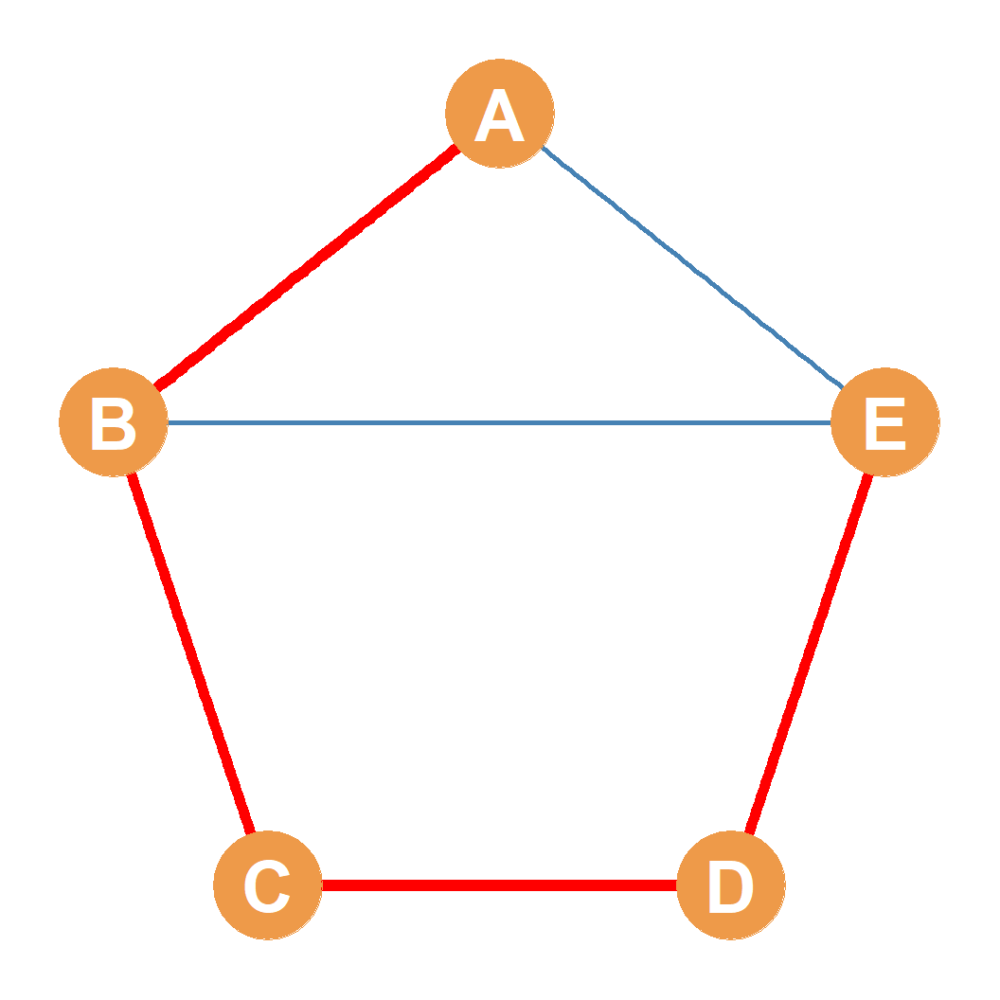{fig-align='center' width=432}
:::
:::

:::

::: {.column style="width: 50%; display: flex; flex-direction: column; justify-content: center; align-items: center;"}
**Disconnected Graph**

::: {.cell layout-align="center"}
::: {.cell-output-display}
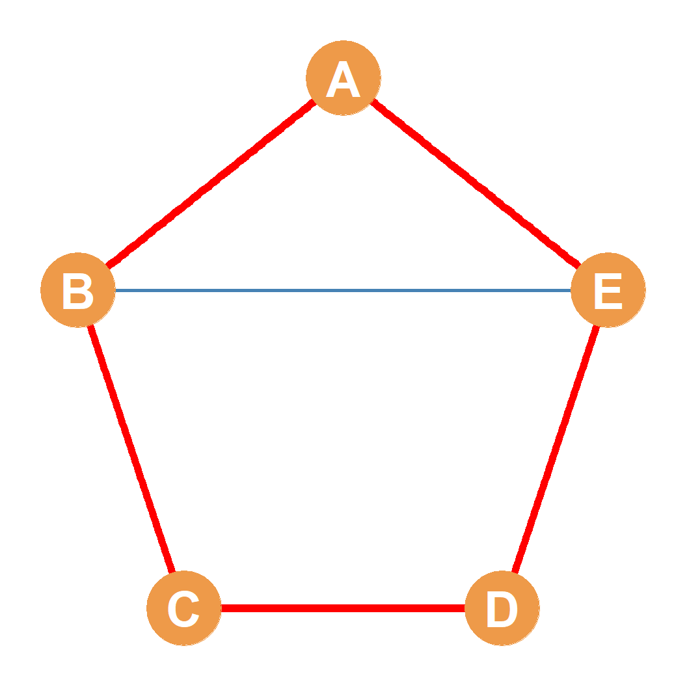{fig-align='center' width=432}
:::
:::

:::

::::

- **Connected**: A path of some finite length exists between *every* pair of nodes.
- **Disconnected**: At least one pair of nodes is unreachable (e.g. no path between A and G).

---

## Components & The Giant Component

:::: {.columns align=center}

::: {.column style="width: 50%; display: flex; flex-direction: column; justify-content: center; align-items: center;"}
**Disconnected Graph with 2 Components**

::: {.cell layout-align="center"}
::: {.cell-output-display}
{fig-align='center' width=432}
:::
:::

:::

::: {.column style="width: 50%; display: flex; flex-direction: column; justify-content: center; align-items: flex-start;"}
- **Component**: A maximally connected subgraph within a larger disconnected graph.
  - The graph on the left contains exactly **two components**.
- **Giant Component**: The largest connected component in a disconnected graph.
  - The red component $\{A, B, C, D, E, F\}$ is the **giant component** (of order 6).
  - The blue component $\{G, H, I\}$ is a smaller component (of order 3).
:::

::::

# Part 4: Node and Edge Connectivity (Bridges & Cutsets)

---

## Bridges & Local Bridges

::: {.incremental}
- We can disconnect a graph by removing edges.
- **Bridge**:
  - A single edge whose removal disconnects the graph, splitting it into separate components.
  - Represents the most critical, yet vulnerable transmission links in a network.
- **Mark Granovetter's "Strength of Weak Ties" (1973)**:
  - Bridges represent critical pathways for novel information diffusing between separate social clusters.
- **Local Bridge**:
  - An edge that, if removed, does not necessarily disconnect the entire graph, but significantly increases the shortest path length between its end nodes (acting as a key shortcut).
:::

---

## Bridges: Visual Examples

::: {.cell layout-align="center"}
::: {.cell-output-display}
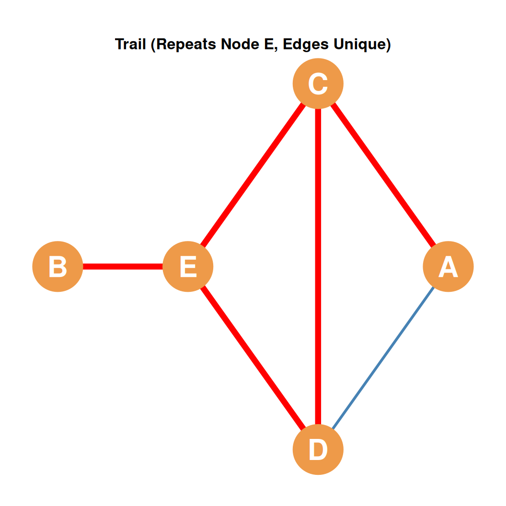{fig-align='center' width=1152}
:::
:::

---

## Node Connectivity & k-Connected Graphs

::: {.incremental}
- We can also disconnect a graph by **removing nodes** (vertices).
- Removing a node also removes all edges incident to it—nodes "take their links with them"!
- **Node Cutset (Vertex Cutset)**:
  - The minimum set of nodes whose removal disconnects the graph.
  - Nodes in the cutset represent critical **brokerage** or "connector" positions.
- **$k$-Connected Graph**:
  - A graph is $k$-connected if the minimum number of nodes required to disconnect it is $k$:
    - **1-Connected**: Removing 1 node can disconnect the graph (contains a cutpoint).
    - **2-Connected**: Requires removing at least 2 nodes to disconnect it.
    - **3-Connected**: Requires removing at least 3 nodes to disconnect it.
- **Menger's Theorem (1927)**: If a graph is $k$-connected, there are at least $k$ node-independent paths connecting each non-adjacent pair of vertices.
:::

---

## Edge Cutset: A Visual Example

:::: {.columns align=center}

::: {.column width="40%"}
::: {.incremental}
- An **edge cutset** is a set of edges whose removal disconnects the graph.
- Removing both **C-A** and **D-A** (red) completely disconnects node $A$.
- This is an edge cutset of size **2**.
:::
:::

::: {.column width="60%"}

::: {.cell layout-align="center"}
::: {.cell-output-display}
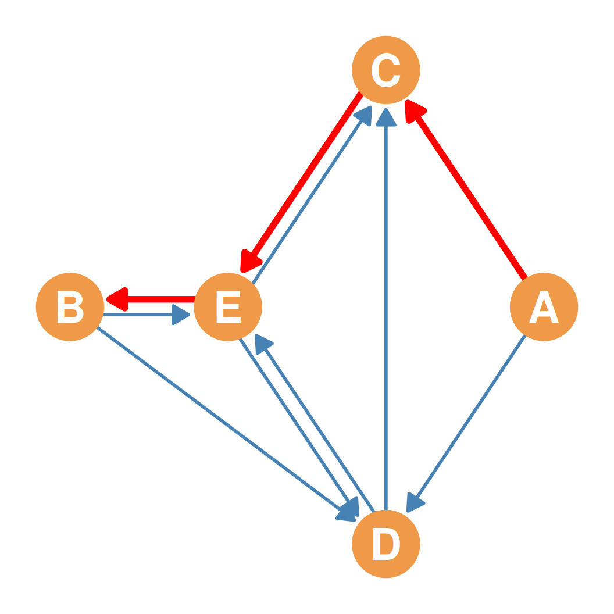{fig-align='center' width=768}
:::
:::

:::

::::

---

## Node Cutset: A Visual Example

:::: {.columns align=center}

::: {.column width="40%"}
::: {.incremental}
- A **node cutset** is a set of nodes whose removal disconnects the graph.
- Removing node **E** (red) also removes its incident edges, completely isolating node $B$.
- This is a node cutset of size **1** (Node $E$ is a **cutpoint**).
:::
:::

::: {.column width="60%"}

::: {.cell layout-align="center"}
::: {.cell-output-display}
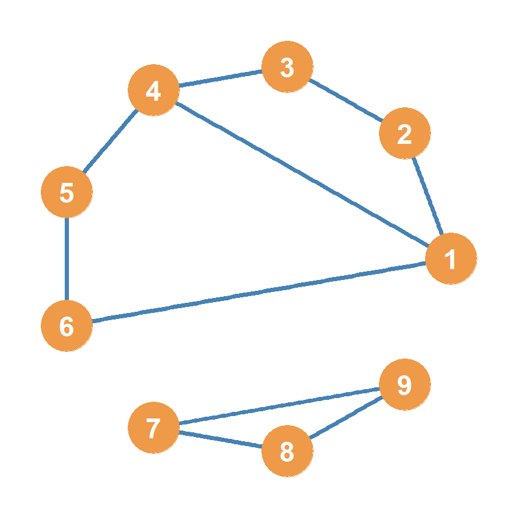{fig-align='center' width=768}
:::
:::

:::

::::

---

## Levels of k-Connectivity: Visual Examples

::: {.cell .fig-cap-location-bottom}
::: {.cell-output-display}
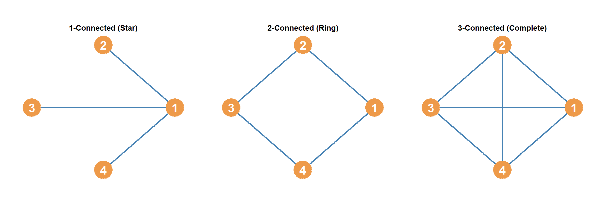{#fig-kconn-slides width=1152}
:::
:::

---

## Graph Cutsets: Quantitative Cohesion

::: {.incremental}
- **Cohesion** can be directly translated to graph-theoretic cutsets:
  - **Cohesive Groups**: Have large edge-cutsets and node-cutsets. Many connections or individuals must be removed to disrupt or fragment the group.
  - **Fragmented Groups**: Have small cutsets (such as bridges or single cutpoints). They are vulnerable to rapid disruption if key facilitators are removed.
- Any network can be decomposed into hierarchical subgraphs with specific levels of $k$-connectivity.
:::

# Part 5: Directed Connectivity & Matrices

---

## Flavors of Connectivity in Directed Graphs

::: {.incremental}
- Because of edge directionality, directed graphs have three levels of connectivity:
1. **Strongly Connected**: Every pair of nodes is **mutually reachable** via directed paths.
2. **Unilaterally Connected**: Every pair is connected by **at least one directed path** (from $u \rightarrow v$ OR $v \rightarrow u$, but not necessarily both).
3. **Weakly Connected**: Every pair of nodes is connected by at least a **semipath** (connected if we ignore arrow directions).
:::

---

## Directed Connectivity: Visual Examples

::: {.cell layout-align="center"}
::: {.cell-output-display}
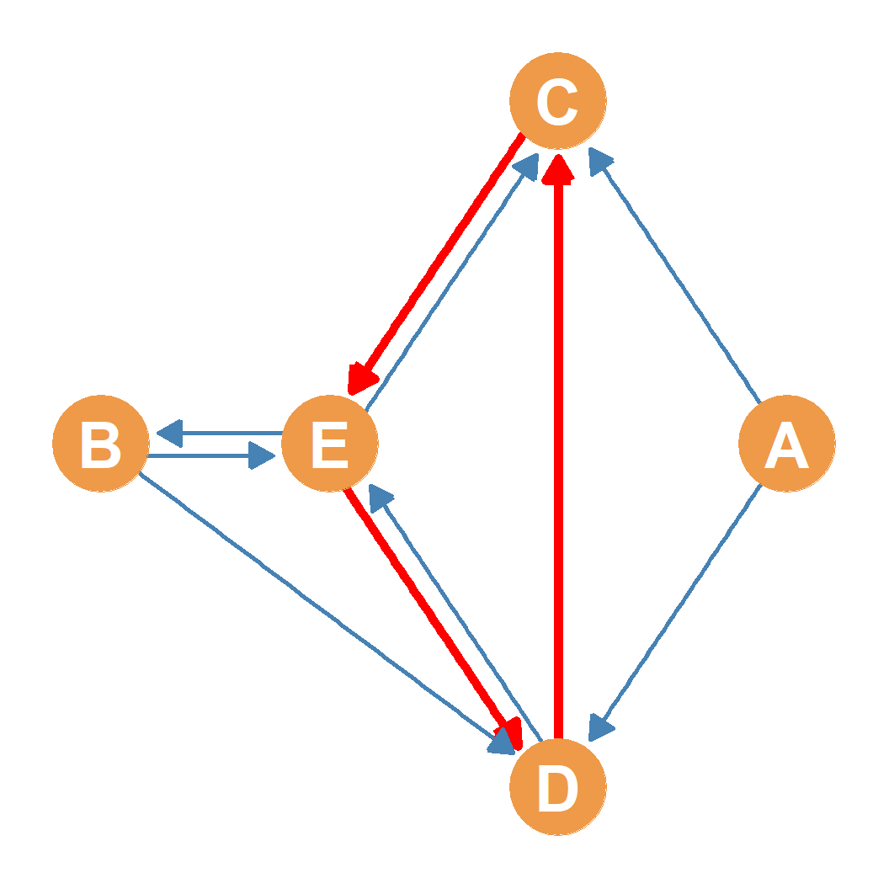{fig-align='center' width=1152}
:::
:::

---

## The Reachability Matrix ($D_r$)

:::: {.columns align=center}

::: {.column width="60%"}
::: {.incremental}
- The **reachability matrix** ($D_r$) of a graph records whether each pair of nodes can reach each other ($D_r(i,j) = 1$ if node $i$ can reach $j$ via a path of any length).
- **Matrix Row & Column Patterns**:
  - **Receiver Nodes**: Have all zeros in their corresponding row of $D_r$ (cannot reach anyone, e.g. Node $D$ on the right).
  - **Transmitter Nodes**: Have all zeros in their corresponding column of $D_r$ (cannot be reached by anyone, e.g. Nodes $A, B, C$ on the right).
:::
:::

::: {.column width="40%"}
| | A | B | C | D | E |
|---|---|---|---|---|---|
| **A** | -- | 0 | 1 | 1 | 1 |
| **B** | 0 | -- | 0 | 1 | 1 |
| **C** | 0 | 0 | -- | 1 | 1 |
| **D** | 0 | 0 | 0 | -- | 0 |
| **E** | 0 | 0 | 0 | 1 | -- |

: Reachability Matrix for our Directed Graph {#tbl-reach-slides}
:::

::::

---

## Reachability & Directed Connectivity

:::: {.columns align=center}

::: {.column width="60%"}
::: {.incremental}
- The reachability matrix reveals the global connectivity type of the digraph:
  - **Strongly Connected**: The matrix is the **all-ones matrix** (excluding diagonal).
  - **Unilaterally Connected**: The matrix contains some zeros, but for any pair, either $D_r(i,j) = 1$ or $D_r(j,i) = 1$. There are no mutually unreachable pairs.
  - **Weakly Connected**: Contains at least one pair of nodes that are mutually unreachable ($D_r(i,j) = 0$ AND $D_r(j,i) = 0$).
:::
:::

::: {.column width="40%"}
| | A | B | C | D | E |
|---|---|---|---|---|---|
| **A** | -- | 0 | 1 | 1 | 1 |
| **B** | 0 | -- | 0 | 1 | 1 |
| **C** | 0 | 0 | -- | 1 | 1 |
| **D** | 0 | 0 | 0 | -- | 0 |
| **E** | 0 | 0 | 0 | 1 | -- |

: Reachability Matrix for our Directed Graph {#tbl-reach-slides-2}
:::

::::

---

## Graph Connectedness ($C$)

::: {.incremental}
- **Graph Connectedness** ($C$) measures the extent to which a network approaches the ideal where *everyone can reach everyone else*.
- Mathematically, it is the **density of the directed reachability matrix**:
  $$C = \frac{\sum_{i \neq j} D_r(i,j)}{n(n-1)}$$
- **Example Calculation**:
  - Sum of ones in our reachability matrix ($D_r$): $3 + 2 + 2 + 1 = 8$.
  - Total possible connections: $n(n-1) = 5(4) = 20$.
  - Connectedness: $C = \frac{8}{20} = 0.40 \quad (40\%)$.
:::

---

## The Geodesic Distance Matrix ($D_g$)

:::: {.columns align=center}

::: {.column width="60%"}
::: {.incremental}
- The **geodesic distance matrix** ($D_g$) records the length of the **shortest path** (geodesic) connecting each pair of nodes.
- **Rules**:
  - Adjacent nodes get a distance of $1$.
  - Non-adjacent nodes get the length of their shortest path.
  - Unconnected nodes (unreachable) get a distance of **infinity** ($\infty$ or `Inf`).
- In undirected graphs, $D_g$ is symmetric. In directed graphs, $D_g$ is asymmetric.
:::
:::

::: {.column width="40%"}
| | A | B | C | D | E |
|---|---|---|---|---|---|
| **A** | -- | 3 | 1 | 1 | 2 |
| **B** | Inf | -- | 3 | 2 | 1 |
| **C** | Inf | 2 | -- | 1 | 1 |
| **D** | Inf | 3 | 1 | -- | 2 |
| **E** | Inf | 1 | 2 | 1 | -- |

: Geodesic Distance Matrix for our Digraph {#tbl-dist-slides}
:::

::::

---

## Node Eccentricity, Diameter & Girth

From the geodesic distance matrix, we extract several fundamental whole-graph metrics:

::: {.incremental}
- **Node Eccentricity**: The maximum geodesic distance from a focal node to any other reachable node in the graph.
- **Graph Diameter** ($d$): The *maximum* geodesic distance across all pairs of connected nodes (longest shortest path).
  - For our undirected graph, $d = 3$.
- **Graph Girth**: The length of the *shortest* cycle in a graph (smallest loop).
  - For our undirected graph, the girth is $3$ (the triangle $\{ED, DC, CE\}$).
:::

---

## Conclusion & Core Takeaways

::: {.incremental}
- **Indirect connection is the engine of diffusion**:
  - Paths trace how resources, information, and influence flow through networks.
- **Directed path flows are asymmetric**:
  - Edge directions create unequal access, where some nodes can reach everyone, but are completely unreachable themselves.
- **Matrices provide global signatures**:
  - The **reachability matrix** ($D_r$) and the **distance matrix** ($D_g$) let us calculate connectedness, diameter, and eccentricity, transforming qualitative network structures into rigorous quantitative indices.
:::

---

## References {.unnumbered}

