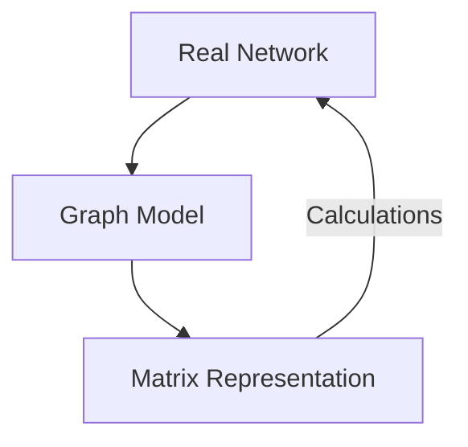

```{r setup, include=FALSE}
library(ggplot2)
library(ggraph)
library(tidygraph)
library(igraph)
library(dplyr)
library(kableExtra)

# Set seed for reproducible layout of 5-node graph
set.seed(42)

# Symmetrical 5-node undirected house graph
nodes_5 <- data.frame(name = c("A", "B", "C", "D", "E"), x = c(0, -1, 1, -1, 1), y = c(1, 0, 0, -1, -1))
edges_undir <- data.frame(from = c(1, 1, 2, 2, 3, 4), to = c(2, 3, 3, 4, 5, 5))
gr_undir <- tbl_graph(nodes = nodes_5, edges = edges_undir, directed = FALSE)

# Layout coordinates for manual placement
layout_coords <- as.matrix(nodes_5[, c("x", "y")])

# Helper function to plot undirected graph with highlighted edges
plot_undir_highlight <- function(active_edges = NULL, active_nodes = NULL) {
  edges_mod <- edges_undir
  edges_mod$highlight <- "no"
  if (!is.null(active_edges)) {
    for (i in seq_len(nrow(edges_mod))) {
      f <- edges_mod$from[i]
      t <- edges_mod$to[i]
      if (paste(f, t, sep="-") %in% active_edges || paste(t, f, sep="-") %in% active_edges) {
        edges_mod$highlight[i] <- "yes"
      }
    }
  }
  
  nodes_mod <- nodes_5
  nodes_mod$highlight <- "no"
  if (!is.null(active_nodes)) {
    nodes_mod$highlight[nodes_mod$name %in% active_nodes] <- "yes"
  }
  
  gr <- tbl_graph(nodes = nodes_mod, edges = edges_mod, directed = FALSE)
  
  p <- ggraph(gr, layout = layout_coords) +
    geom_edge_link(aes(color = highlight, edge_width = highlight)) +
    geom_node_point(aes(color = highlight), size = 18) +
    geom_node_text(aes(label = name), size = 8, fontface = "bold", color = "white") +
    scale_edge_color_manual(values = c("yes" = "red", "no" = "steelblue"), guide = "none") +
    scale_edge_width_manual(values = c("yes" = 2.2, "no" = 1.0), guide = "none") +
    scale_color_manual(values = c("yes" = "red", "no" = "tan2"), guide = "none") +
    theme_graph() + coord_cartesian(clip = "off")
  return(p)
}

# Directed 5-node graph with same nodes and coordinates
edges_dir <- data.frame(from = c(1, 2, 1, 2, 2, 3, 5), to = c(2, 1, 3, 3, 4, 5, 4))
gr_dir <- tbl_graph(nodes = nodes_5, edges = edges_dir, directed = TRUE)

# Helper function to plot directed graph with highlighted edges
plot_dir_highlight <- function(active_edges = NULL, active_nodes = NULL) {
  edges_mod <- edges_dir
  edges_mod$highlight <- "no"
  if (!is.null(active_edges)) {
    for (i in seq_len(nrow(edges_mod))) {
      f <- edges_mod$from[i]
      t <- edges_mod$to[i]
      if (paste(f, t, sep="-") %in% active_edges) {
        edges_mod$highlight[i] <- "yes"
      }
    }
  }
  
  nodes_mod <- nodes_5
  nodes_mod$highlight <- "no"
  if (!is.null(active_nodes)) {
    nodes_mod$highlight[nodes_mod$name %in% active_nodes] <- "yes"
  }
  
  gr <- tbl_graph(nodes = nodes_mod, edges = edges_mod, directed = TRUE)
  
  p = ggraph(gr, layout = layout_coords) +
    geom_edge_link(aes(color = highlight, edge_width = highlight),
                   arrow = arrow(length = unit(4, 'mm')),
                   end_cap = circle(6, 'mm')) +
    geom_node_point(aes(color = highlight), size = 18) +
    geom_node_text(aes(label = name), size = 8, fontface = "bold", color = "white") +
    scale_edge_color_manual(values = c("yes" = "red", "no" = "steelblue"), guide = "none") +
    scale_edge_width_manual(values = c("yes" = 2.2, "no" = 1.0), guide = "none") +
    scale_color_manual(values = c("yes" = "red", "no" = "tan2"), guide = "none") +
    theme_graph() + coord_cartesian(clip = "off")
  return(p)
}
```

# Part 1: What is a Matrix? Basics & Notation

---

## Defining a Matrix

::: {.incremental}
- A **matrix** is a two-dimensional rectangular array of numbers organized into:
  - **Rows** (horizontal lines)
  - **Columns** (vertical lines)
- **Dimensions**:
  - Described as **Rows $\times$ Columns** ($R \times C$).
  - *Rows always come first, columns second.*
- **Rectangular Matrices**:
  - Matrices where the number of rows does not equal the number of columns ($R \neq C$).
  - This is the standard shape for dataset tables and surveys.
:::

---

## An Intuitive Example: Survey Data Matrix

Let's look at an intuitive rectangular matrix ($4 \times 3$) containing survey data:

| | Age | Education (Years) | Annual Income ($) |
| :--- | :---: | :---: | :---: |
| **Alice** | 25 | 16 | 55,000 |
| **Bob** | 42 | 12 | 48,000 |
| **Charlie** | 31 | 18 | 95,000 |
| **David** | 54 | 14 | 62,000 |

::: {.incremental}
- **Rows** represent **cases** (the people we surveyed: Alice, Bob, Charlie, David).
- **Columns** represent **attributes** (Age, Education, Income).
- Each cell contains a meaningful numerical value representing a specific person's attribute.
:::

---

## Matrix Notation & Indexing

- By convention, we name matrices using **boldfaced capital letters** (e.g., Matrix $\mathbf{B}$).
- We refer to a specific cell in the matrix using a lowercase letter with row and column indices:
  - $$b_{ij}$$
  - Where $i$ is the **row index** and $j$ is the **column index**.

| | Col 1 (Age) | Col 2 (Edu) | Col 3 (Income) |
| :--- | :---: | :---: | :---: |
| **Row 1 (Alice)** | $b_{11} = 25$ | $b_{12} = 16$ | $b_{13} = 55,000$ |
| **Row 2 (Bob)** | $b_{21} = 42$ | $b_{22} = 12$ | $b_{23} = 48,000$ |
| **Row 3 (Charlie)** | $b_{31} = 31$ | **$b_{32} = 18$** | $b_{33} = 95,000$ |
| **Row 4 (David)** | $b_{41} = 54$ | $b_{42} = 14$ | $b_{43} = 62,000$ |

::: {.incremental}
- Cell **$b_{32}$** represents Row 3 (Charlie) and Column 2 (Education), which holds **18**.
:::

---

## Transitioning to Relationship Matrices

::: {.incremental}
- Survey data matrices relate cases to attributes. They do **not** represent networks.
- To represent a network, we use a **Relationship Matrix**:
  - We put the **exact same set of actors** on *both* the rows and the columns.
  - Cell $a_{ij}$ records how Row Actor $i$ relates to Column Actor $j$.
- **Square Matrices**:
  - All relationship matrices are **square matrices** ($R = C$).
  - A square matrix of size $N$ is said to be of **order $N$**.
:::

---

## Diagonal vs. Off-Diagonal Cells

:::: {.columns align=center}

::: {.column width="60%"}
::: {.incremental}
- **The Main Diagonal**:
  - The diagonal cells running from top-left to bottom-right, where **row index equals column index** ($i = j$).
  - Represents the relationship of actors with themselves ($a_{ii}$), which we typically ignore by **blocking the diagonals** with a dash (`--`).
- **Off-Diagonal Cells ($i \neq j$)**:
  - **Upper Triangle ($i < j$)**: Cells above the main diagonal (e.g., $a_{12}, a_{13}$).
  - **Lower Triangle ($i > j$)**: Cells below the main diagonal (e.g., $a_{21}, a_{31}$).
:::
:::

::: {.column width="40%"}
### Square Relationship Matrix
| | Actor A | Actor B | Actor C |
| :--- | :---: | :---: | :---: |
| **Actor A** | *--* | $a_{12}$ | $a_{13}$ |
| **Actor B** | $a_{21}$ | *--* | $a_{23}$ |
| **Actor C** | $a_{31}$ | $a_{32}$ | *--* |

- If the relationship is symmetric (e.g., spouses), then $a_{ij} = a_{ji}$ (symmetric matrix).
- If asymmetric (e.g., advice), then $a_{ij} \neq a_{ji}$ (asymmetric matrix).
:::

::::

# Part 2: The Undirected Adjacency Matrix Step-by-Step

---

## What is an Adjacency Matrix?

::: {.incremental}
- An **Adjacency Matrix** is a binary relationship matrix indicating whether pairs of nodes are directly connected (**adjacent**) in the graph.
- **Binary Rules**:
  - $$A_{ij} = 1 \quad \text{if a tie exists between } i \text{ and } j$$
  - $$A_{ij} = 0 \quad \text{if no tie exists}$$
- If the graph is **undirected**, the relation is reciprocal. This always yields a **symmetric matrix** where the upper and lower triangles are mirror images across the main diagonal ($A_{ij} = A_{ji}$).
- Let's construct one step-by-step from a 5-node reference graph.
:::

---

## The Reference Graph & Empty Matrix

:::: {.columns align=center}

::: {.column width="50%"}
### Reference Undirected Graph
- We have 5 nodes: $\{A, B, C, D, E\}$.
- Since it is an undirected graph, lines do not have arrowheads.
- Let's build the $5 \times 5$ matrix of **order 5**.
- Diagonals are blocked (`--`) because simple graphs have no self-loops.
:::

::: {.column width="50%"}
```{r}
#| echo: false
#| fig-align: "center"
#| fig-width: 5.2
#| fig-height: 5.2
plot_undir_highlight()
```
:::

::::

---

## Step 1: Filling Row A (Actor A's Ties)

:::: {.columns align=center}

::: {.column width="50%"}
### Left: A's connections highlighted
- Node **A** is connected directly to **B** and **C**.
- Node **A** has no connections to $D$ or $E$.
- **Adjacency Rule**:
  - Set cells $a_{AB} = 1$ and $a_{AC} = 1$.
  - Set cells $a_{AD} = 0$ and $a_{AE} = 0$.
- **Row A**: `(--,  1,  1,  0,  0)`
:::

::: {.column width="50%"}
```{r}
#| echo: false
#| fig-align: "center"
#| fig-width: 5.2
#| fig-height: 5.2
plot_undir_highlight(active_edges = c("A-B", "A-C"), active_nodes = "A")
```

### Adjacency Matrix progress
| | A | B | C | D | E |
|:---:|:---:|:---:|:---:|:---:|:---:|
| **A** | **--** | **1** | **1** | **0** | **0** |
| **B** |  ?   |  *--*   |  ?   |  ?   |  ?   |
| **C** |  ?   |  ?   |  *--*   |  ?   |  ?   |
| **D** |  *--*  |  *--*   |  *--*  |  *--*   |  *--*   |
| **E** |  *--*  |  *--*   |  *--*  |  *--*   |  *--*   |
:::

::::

---

## Step-by-Step Cell Correspondence

:::: {.columns align=center}

::: {.column width="50%"}
- Let's look at how specific edges map to cell values:
  - **Edge A-C exists**: 
    - This fills two cells: $a_{13} = 1$ (Row A, Column C) and $a_{31} = 1$ (Row C, Column A).
  - **No Edge A-D exists**:
    - This fills cells $a_{14} = 0$ (Row A, Column D) and $a_{41} = 0$ (Row D, Column A).
- In an undirected graph, every single edge $\{i, j\}$ corresponds to **two symmetrical cell entries** in the matrix!
:::

::: {.column width="50%"}
```{r}
#| echo: false
#| fig-align: "center"
#| fig-width: 5.2
#| fig-height: 5.2
plot_undir_highlight(active_edges = c("A-C"), active_nodes = c("A", "C"))
```

### Edge to Cell Mapping
- Edge $\{A, C\} \Longrightarrow a_{AC} = 1$ and $a_{CA} = 1$
- No Edge $\{A, D\} \Longrightarrow a_{AD} = 0$ and $a_{DA} = 0$
:::

::::

---

## Step 2: Symmetrical Filling (Symmetry across Diagonal)

:::: {.columns align=center}

::: {.column width="50%"}
### Left: Undirected lines are reciprocal
- Because the graph is undirected, if A is connected to B and C, then **B and C must also be connected to A**.
- **Symmetric Rule ($A_{ij} = A_{ji}$)**:
  - Since Row A columns B/C are $1$, then **Column A rows B/C must be $1$**.
  - Since Row A columns D/E are $0$, then **Column A rows D/E must be $0$**.
- **Column A**: `(--,  1,  1,  0,  0)`
:::

::: {.column width="50%"}
```{r}
#| echo: false
#| fig-align: "center"
#| fig-width: 5.2
#| fig-height: 5.2
plot_undir_highlight(active_edges = c("A-B", "A-C"), active_nodes = "A")
```

### Adjacency Matrix progress
| | A | B | C | D | E |
|:---:|:---:|:---:|:---:|:---:|:---:|
| **A** | **--** | **1** | **1** | **0** | **0** |
| **B** | **1** | -- | ? | ? | ? |
| **C** | **1** | ? | -- | ? | ? |
| **D** | **0** | ? | ? | -- | ? |
| **E** | **0** | ? | ? | ? | -- |
:::

::::

---

## Step 3: Filling Row B (Actor B's Ties)

:::: {.columns align=center}

::: {.column width="50%"}
### Left: B's connections highlighted
- Node **B** connects to **A**, **C**, and **D**.
- Node **B** has no connections to $E$.
- **Adjacency Rule**:
  - $a_{BA} = 1$ (already filled!)
  - Set $a_{BC} = 1$ and $a_{BD} = 1$.
  - Set $a_{BE} = 0$.
- **Row B**: `(1,  --,  1,  1,  0)`
- **Column B**: `(1,  --,  1,  1,  0)`
:::

::: {.column width="50%"}
```{r}
#| echo: false
#| fig-align: "center"
#| fig-width: 5.2
#| fig-height: 5.2
plot_undir_highlight(active_edges = c("A-B", "B-C", "B-D"), active_nodes = "B")
```

### Adjacency Matrix progress
| | A | B | C | D | E |
|:---:|:---:|:---:|:---:|:---:|:---:|
| **A** | -- | **1** | 1 | 0 | 0 |
| **B** | **1** | **--** | **1** | **1** | **0** |
| **C** | 1 | **1** | -- | ? | ? |
| **D** | 0 | **1** | ? | -- | ? |
| **E** | 0 | **0** | ? | ? | -- |
:::

::::

---

## Step 4: The Final Undirected Adjacency Matrix

:::: {.columns align=center}

::: {.column width="50%"}
### Left: Completed Undirected Graph
- We repeat this process for rows C, D, and E:
  - **C** connects to $\{A, B, E\} \rightarrow$ `(1, 1, --, 0, 1)`.
  - **D** connects to $\{B, E\} \rightarrow$ `(0, 1, 0, --, 1)`.
  - **E** connects to $\{C, D\} \rightarrow$ `(0, 0, 1, 1, --)`.
- Notice the **perfect mirror symmetry** of the upper and lower triangles!
:::

::: {.column width="50%"}
```{r}
#| echo: false
#| fig-align: "center"
#| fig-width: 5.2
#| fig-height: 5.2
plot_undir_highlight()
```

### Symmetric Adjacency Matrix ($\mathbf{A}$)
| | A | B | C | D | E |
|:---:|:---:|:---:|:---:|:---:|:---:|
| **A** | -- | 1 | 1 | 0 | 0 |
| **B** | 1 | -- | 1 | 1 | 0 |
| **C** | 1 | 1 | -- | 0 | 1 |
| **D** | 0 | 1 | 0 | -- | 1 |
| **E** | 0 | 0 | 1 | 1 | -- |
:::

::::

# Part 3: The Directed Adjacency Matrix Step-by-Step

---

## Directed Graphs & Asymmetry

::: {.incremental}
- In a **directed graph** (digraph), relationships are asymmetric and have a specific **direction** (represented by arrowheads).
- **Matrix Convention (Sender to Receiver)**:
  - Row = **Sender** of the tie (origin).
  - Column = **Receiver** of the tie (destination).
  - $$A_{ij} = 1 \quad \text{if there is an arrow from Row } i \rightarrow \text{ Column } j$$
  - $$A_{ij} = 0 \quad \text{otherwise}$$
- Because ties are directed, $A_{ij}$ is not necessarily equal to $A_{ji}$, yielding an **asymmetric adjacency matrix**.
- Let's construct one step-by-step.
:::

---

## The Directed Reference Graph & Empty Matrix

:::: {.columns align=center}

::: {.column width="50%"}
### Reference Directed Graph
- We use the exact same 5-node nodes $\{A, B, C, D, E\}$ with the same spatial layout.
- However, we now introduce directed arrows.
- Observe:
  - Some ties are **reciprocal** (e.g., $A \leftrightarrow B$).
  - Some ties are **unidirectional** (e.g., $A \rightarrow C$ but $C \not\rightarrow A$).
:::

::: {.column width="50%"}
```{r}
#| echo: false
#| fig-align: "center"
#| fig-width: 5.2
#| fig-height: 5.2
plot_dir_highlight()
```
:::

::::

---

## Step 1: Filling Row A (A as Sender)

:::: {.columns align=center}

::: {.column width="50%"}
### Left: Outgoing arrows from A highlighted
- Look only at arrows **originating** at node **A**:
  - $A$ sends an arrow to $B$ ($A \rightarrow B$).
  - $A$ sends an arrow to $C$ ($A \rightarrow C$).
  - $A$ sends no arrows to $D$ or $E$.
- **Adjacency Rule**:
  - Set cells $a_{AB} = 1$ and $a_{AC} = 1$.
  - Set cells $a_{AD} = 0$ and $a_{AE} = 0$.
- **Row A**: `(--,  1,  1,  0,  0)`
:::

::: {.column width="50%"}
```{r}
#| echo: false
#| fig-align: "center"
#| fig-width: 5.2
#| fig-height: 5.2
plot_dir_highlight(active_edges = c("A-B", "A-C"), active_nodes = "A")
```

### Directed Matrix progress
| | A | B | C | D | E |
|:---:|:---:|:---:|:---:|:---:|:---:|
| **A** | **--** | **1** | **1** | **0** | **0** |
| **B** | ? | -- | ? | ? | ? |
| **C** | ? | ? | -- | ? | ? |
| **D** | ? | ? | ? | -- | ? |
| **E** | ? | ? | ? | ? | -- |
:::

::::

---

## Step-by-Step Directed Cell Correspondence

:::: {.columns align=center}

::: {.column width="50%"}
- Let's look at how unreciprocated arrows map to cell asymmetry:
  - **Arrow $A \rightarrow C$ exists**:
    - This is cell $a_{13} = 1$ (Row A, Column C).
  - **No Arrow $C \rightarrow A$ exists**:
    - This is cell $a_{31} = 0$ (Row C, Column A).
- In a directed graph, each cell corresponds to a **unique directional relationship**.
- Contrast this with the undirected case, where cells $a_{AC}$ and $a_{CA}$ were forced to be identical!
:::

::: {.column width="50%"}
```{r}
#| echo: false
#| fig-align: "center"
#| fig-width: 5.2
#| fig-height: 5.2
plot_dir_highlight(active_edges = c("A-C"), active_nodes = c("A", "C"))
```

### Arrow to Cell Mapping
- Arrow $A \rightarrow C \Longrightarrow a_{AC} = 1$
- No Arrow $C \rightarrow A \Longrightarrow a_{CA} = 0$
:::

::::

---

## Step 2: Filling Row B (B as Sender)

:::: {.columns align=center}

::: {.column width="50%"}
### Left: Outgoing arrows from B highlighted
- Look only at arrows **originating** at node **B**:
  - $B$ sends an arrow to $A$ ($B \rightarrow A$).
  - $B$ sends an arrow to $C$ ($B \rightarrow C$).
  - $B$ sends an arrow to $D$ ($B \rightarrow D$).
  - $B$ sends no arrow to $E$.
- **Adjacency Rule**:
  - Set cells $a_{BA} = 1, a_{BC} = 1, a_{BD} = 1$.
  - Set cell $a_{BE} = 0$.
- **Row B**: `(1,  --,  1,  1,  0)`
:::

::: {.column width="50%"}
```{r}
#| echo: false
#| fig-align: "center"
#| fig-width: 5.2
#| fig-height: 5.2
plot_dir_highlight(active_edges = c("B-A", "B-C", "B-D"), active_nodes = "B")
```

### Directed Matrix progress
| | A | B | C | D | E |
|:---:|:---:|:---:|:---:|:---:|:---:|
| **A** | -- | 1 | 1 | 0 | 0 |
| **B** | **1** | **--** | **1** | **1** | **0** |
| **C** | ? | ? | -- | ? | ? |
| **D** | ? | ? | ? | -- | ? |
| **E** | ? | ? | ? | ? | -- |
:::

::::

---

## Step 3: Filling Row C (C as Sender)

:::: {.columns align=center}

::: {.column width="50%"}
### Left: Outgoing arrows from C highlighted
- Look only at arrows **originating** at node **C**:
  - $C$ sends an arrow to $E$ ($C \rightarrow E$).
  - $C$ sends no arrows to $A, B,$ or $D$.
- **Adjacency Rule**:
  - Set cell $a_{CE} = 1$.
  - Set cells $a_{CA} = 0, a_{CB} = 0, a_{CD} = 0$.
- **Row C**: `(0,  0,  --,  0,  1)`
- *Notice that even though A and B point to C, C does not point back to them!*
:::

::: {.column width="50%"}
```{r}
#| echo: false
#| fig-align: "center"
#| fig-width: 5.2
#| fig-height: 5.2
plot_dir_highlight(active_edges = "C-E", active_nodes = "C")
```

### Directed Matrix progress
| | A | B | C | D | E |
|:---:|:---:|:---:|:---:|:---:|:---:|
| **A** | -- | 1 | 1 | 0 | 0 |
| **B** | 1 | -- | 1 | 1 | 0 |
| **C** | **0** | **0** | **--** | **0** | **1** |
| **D** | ? | ? | ? | -- | ? |
| **E** | ? | ? | ? | ? | -- |
:::

::::

---

## Step 4: The Completed Directed Adjacency Matrix

:::: {.columns align=center}

::: {.column width="50%"}
### Left: Completed Directed Graph
- We repeat for the remaining rows D and E:
  - **Row D**: Node D sends **no arrows** at all! It is a pure receiver (sink node) $\rightarrow$ `(0, 0, 0, --, 0)`.
  - **Row E**: Node E sends only one arrow to D ($E \rightarrow D$) $\rightarrow$ `(0, 0, 0, 1, --)`.
- Notice the clear asymmetry (e.g. $A_{CB} = 0$ but $A_{BC} = 1$).
:::

::: {.column width="50%"}
```{r}
#| echo: false
#| fig-align: "center"
#| fig-width: 5.5
#| fig-height: 5.5
ggraph(gr_dir, layout = layout_coords) +
  geom_edge_link(color = "steelblue", edge_width = 1.25,
                 arrow = arrow(length = unit(4, 'mm')),
                 end_cap = circle(6, 'mm')) +
  geom_node_point(color = "tan2", size = 16) +
  geom_node_text(aes(label = name), size = 8, fontface = "bold", color = "white") +
  theme_graph() + coord_cartesian(clip = "off")
```

### Asymmetric Adjacency Matrix ($\mathbf{A}$)
| | A | B | C | D | E |
|:---:|:---:|:---:|:---:|:---:|:---:|
| **A** | -- | 1 | 1 | 0 | 0 |
| **B** | 1 | -- | 1 | 1 | 0 |
| **C** | 0 | 0 | -- | 0 | 1 |
| **D** | 0 | 0 | 0 | -- | 0 |
| **E** | 0 | 0 | 0 | 1 | -- |
:::

::::

# Part 4: Comparing Undirected & Directed Matrices

---

## Symmetric vs. Asymmetric Structure

:::: {.columns align=center}

::: {.column width="50%"}
### Undirected Symmetric Matrix
- **Mirror Images**: Cells across the main diagonal are identical ($A_{ij} = A_{ji}$).
- **Lower Density**: Information is duplicated (only upper or lower triangle is needed).
| | A | B | C | D | E |
|:---:|:---:|:---:|:---:|:---:|:---:|
| **A** | -- | **1** | **1** | 0 | 0 |
| **B** | **1** | -- | **1** | **1** | 0 |
| **C** | **1** | **1** | -- | 0 | **1** |
| **D** | 0 | **1** | 0 | -- | **1** |
| **E** | 0 | 0 | **1** | **1** | -- |
:::

::: {.column width="50%"}
### Directed Asymmetric Matrix
- **No Mirror Images**: Cells across the diagonal represent independent relations.
- **Asymmetric Ties**: e.g., B sends to D ($a_{BD}=1$), but D does not send to B ($a_{DB}=0$).
| | A | B | C | D | E |
|:---:|:---:|:---:|:---:|:---:|:---:|
| **A** | -- | **1** | **1** | 0 | 0 |
| **B** | **1** | -- | **1** | **1** | 0 |
| **C** | 0 | 0 | -- | 0 | **1** |
| **D** | 0 | 0 | 0 | -- | 0 |
| **E** | 0 | 0 | 0 | **1** | -- |
:::

::::

---

## Summary of Adjacency Principles

:::: {.columns}

::: {.column width="60%"}
::: {.incremental}
- **Adjacency is binary**:
  - Cell value $1$ indicates connection; $0$ indicates separation.
- **Diagonal blocks self-loops**:
  - Simple graphs have no ties with oneself (`--`).
- **Undirected Graphs $\rightarrow$ Symmetric Matrices**:
  - Bidirectional relations mean the matrix is its own transpose ($A = A^T$).
- **Directed Graphs $\rightarrow$ Asymmetric Matrices**:
  - Row = Sender, Column = Receiver. Allows us to identify **sinks** (D, row of all 0s) and **asymmetries** (C to E but not E to C).
:::
:::

::: {.column width="40%"}
### Matrix Duality

:::

::::
