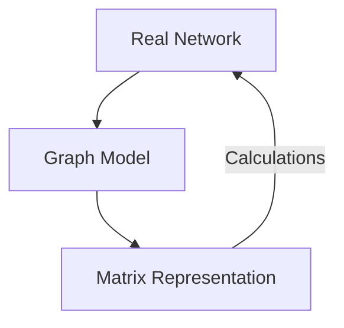

```{r setup, include=FALSE}
library(ggplot2)
library(ggraph)
library(tidygraph)
library(igraph)
library(dplyr)
library(kableExtra)

# Set seed for reproducible layout of 5-node graph
set.seed(42)

# Symmetrical 5-node undirected house graph
nodes_5 <- data.frame(name = c("A", "B", "C", "D", "E"), x = c(0, -1, 1, -1, 1), y = c(1, 0, 0, -1, -1))
edges_undir <- data.frame(from = c(1, 1, 2, 2, 3, 4), to = c(2, 3, 3, 4, 5, 5))
gr_undir <- tbl_graph(nodes = nodes_5, edges = edges_undir, directed = FALSE)

# Layout coordinates for manual placement
layout_coords <- as.matrix(nodes_5[, c("x", "y")])

# Helper function to plot undirected graph with highlighted edges
plot_undir_highlight <- function(active_edges = NULL, active_nodes = NULL) {
  edges_mod <- edges_undir
  edges_mod$highlight <- "no"
  if (!is.null(active_edges)) {
    for (i in seq_len(nrow(edges_mod))) {
      f <- edges_mod$from[i]
      t <- edges_mod$to[i]
      if (paste(f, t, sep="-") %in% active_edges || paste(t, f, sep="-") %in% active_edges) {
        edges_mod$highlight[i] <- "yes"
      }
    }
  }
  
  nodes_mod <- nodes_5
  nodes_mod$highlight <- "no"
  if (!is.null(active_nodes)) {
    nodes_mod$highlight[nodes_mod$name %in% active_nodes] <- "yes"
  }
  
  gr <- tbl_graph(nodes = nodes_mod, edges = edges_mod, directed = FALSE)
  
  p <- ggraph(gr, layout = layout_coords) +
    geom_edge_link(aes(color = highlight, edge_width = highlight)) +
    geom_node_point(aes(color = highlight), size = 18) +
    geom_node_text(aes(label = name), size = 8, fontface = "bold", color = "white") +
    scale_edge_color_manual(values = c("yes" = "red", "no" = "steelblue"), guide = "none") +
    scale_edge_width_manual(values = c("yes" = 2.2, "no" = 1.0), guide = "none") +
    scale_color_manual(values = c("yes" = "red", "no" = "tan2"), guide = "none") +
    theme_graph() + coord_cartesian(clip = "off")
  return(p)
}

# Directed 5-node graph with same nodes and coordinates
edges_dir <- data.frame(from = c(1, 2, 1, 2, 2, 3, 5), to = c(2, 1, 3, 3, 4, 5, 4))
gr_dir <- tbl_graph(nodes = nodes_5, edges = edges_dir, directed = TRUE)

# Helper function to plot directed graph with highlighted edges
plot_dir_highlight <- function(active_edges = NULL, active_nodes = NULL) {
  edges_mod <- edges_dir
  edges_mod$highlight <- "no"
  if (!is.null(active_edges)) {
    for (i in seq_len(nrow(edges_mod))) {
      f <- edges_mod$from[i]
      t <- edges_mod$to[i]
      if (paste(f, t, sep="-") %in% active_edges) {
        edges_mod$highlight[i] <- "yes"
      }
    }
  }
  
  nodes_mod <- nodes_5
  nodes_mod$highlight <- "no"
  if (!is.null(active_nodes)) {
    nodes_mod$highlight[nodes_mod$name %in% active_nodes] <- "yes"
  }
  
  gr <- tbl_graph(nodes = nodes_mod, edges = edges_mod, directed = TRUE)
  
  p <- ggraph(gr, layout = layout_coords) +
    geom_edge_link(aes(color = highlight, edge_width = highlight),
                   arrow = arrow(length = unit(4, 'mm')),
                   end_cap = circle(6, 'mm')) +
    geom_node_point(aes(color = highlight), size = 18) +
    geom_node_text(aes(label = name), size = 8, fontface = "bold", color = "white") +
    scale_edge_color_manual(values = c("yes" = "red", "no" = "steelblue"), guide = "none") +
    scale_edge_width_manual(values = c("yes" = 2.2, "no" = 1.0), guide = "none") +
    scale_color_manual(values = c("yes" = "red", "no" = "tan2"), guide = "none") +
    theme_graph() + coord_cartesian(clip = "off")
  return(p)
}
```

# Part 1: What is a Matrix? Basics & Notation

---

## Defining a Matrix

:::: {.columns}

::: {.column width="60%"}
::: {.incremental}
- A **matrix** is a two-dimensional rectangular array of numbers organized into:
  - **Rows** (horizontal lines)
  - **Columns** (vertical lines)
- **Dimensions**:
  - Described as **Rows $\times$ Columns** ($R \times C$).
  - *Rows always come first, columns second.*
- **Rectangular Matrices**:
  - Matrices where the number of rows does not equal the number of columns ($R \neq C$).
  - This is the standard shape for dataset tables and surveys.
:::
:::

::: {.column width="40%"}
### Visual Blueprint
$$\mathbf{M} = \begin{pmatrix}
m_{11} & m_{12} & m_{13} \\
m_{21} & m_{22} & m_{23} \\
m_{31} & m_{32} & m_{33} \\
m_{41} & m_{42} & m_{43}
\end{pmatrix}$$

- Dimensions: **$4 \times 3$**
- 4 Rows ($i = 1, \dots, 4$)
- 3 Columns ($j = 1, \dots, 3$)
:::

::::

---

## An Intuitive Example: Survey Data Matrix

:::: {.columns}

::: {.column width="50%"}
### Rectangular Matrix Example
- Here is an intuitive $4 \times 3$ matrix containing survey data:

| | Age | Education | Income |
| :--- | :---: | :---: | :---: |
| **Alice** | 25 | 16 | 55,000 |
| **Bob** | 42 | 12 | 48,000 |
| **Charlie** | 31 | 18 | 95,000 |
| **David** | 54 | 14 | 62,000 |
:::

::: {.column width="50%"}
::: {.incremental}
- **Rows** represent **cases** (the people surveyed: Alice, Bob, Charlie, David).
- **Columns** represent **attributes** (Age, Years of Education, Annual Income).
- Each cell contains a meaningful numerical value representing a specific person's attribute.
:::
:::

::::

---

## Matrix Notation & Indexing

:::: {.columns}

::: {.column width="50%"}
### Indexing Matrix ($\mathbf{B}$)

| | Col 1 (Age) | Col 2 (Edu) | Col 3 (Inc) |
| :--- | :---: | :---: | :---: |
| **Row 1 (Alice)** | $b_{11} = 25$ | $b_{12} = 16$ | $b_{13} = 55\text{k}$ |
| **Row 2 (Bob)** | $b_{21} = 42$ | $b_{22} = 12$ | $b_{23} = 48\text{k}$ |
| **Row 3 (Charlie)** | $b_{31} = 31$ | **$b_{32} = 18$** | $b_{33} = 95\text{k}$ |
| **Row 4 (David)** | $b_{41} = 54$ | $b_{42} = 14$ | $b_{43} = 62\text{k}$ |
:::

::: {.column width="50%"}
::: {.incremental}
- We name matrices using **boldfaced capital letters** (e.g., Matrix $\mathbf{B}$).
- We refer to a specific cell using a lowercase letter with row and column indices:
  - $$b_{ij}$$
  - Where $i$ is the **row index** and $j$ is the **column index**.
- Cell **$b_{32}$** represents Row 3 (Charlie) and Column 2 (Education), which holds **18**.
:::
:::

::::

---

## Transitioning to Relationship Matrices

:::: {.columns}

::: {.column width="60%"}
::: {.incremental}
- Survey matrices relate cases to attributes. They do **not** represent networks.
- To represent a network, we use a **Relationship Matrix**:
  - We put the **exact same set of actors** on *both* the rows and the columns.
  - Cell $a_{ij}$ records how Row Actor $i$ relates to Column Actor $j$.
- **Square Matrices**:
  - All relationship matrices are **square matrices** ($R = C$).
  - A square matrix of size $N$ is said to be of **order $N$**.
:::
:::

::: {.column width="40%"}
### Relationship Layout
| | Actor A | Actor B | Actor C |
| :--- | :---: | :---: | :---: |
| **Actor A** | $a_{11}$ | $a_{12}$ | $a_{13}$ |
| **Actor B** | $a_{21}$ | $a_{22}$ | $a_{23}$ |
| **Actor C** | $a_{31}$ | $a_{32}$ | $a_{33}$ |

- Dimensions: **$3 \times 3$**
- Order: **$N = 3$**
:::

::::

---

## Diagonal vs. Off-Diagonal Cells

:::: {.columns align=center}

::: {.column width="60%"}
::: {.incremental}
- **The Main Diagonal**:
  - The diagonal cells where **row index equals column index** ($i = j$).
  - Represents the relationship of actors with themselves ($a_{ii}$), which we typically ignore by **blocking the diagonals** with a dash (`--`).
- **Off-Diagonal Cells ($i \neq j$)**:
  - **Upper Triangle ($i < j$)**: Cells above the main diagonal (e.g., $a_{12}, a_{13}$).
  - **Lower Triangle ($i > j$)**: Cells below the main diagonal (e.g., $a_{21}, a_{31}$).
:::
:::

::: {.column width="40%"}
### Blocked Diagonals
| | Actor A | Actor B | Actor C |
| :--- | :---: | :---: | :---: |
| **Actor A** | *--* | $a_{12}$ | $a_{13}$ |
| **Actor B** | $a_{21}$ | *--* | $a_{23}$ |
| **Actor C** | $a_{31}$ | $a_{32}$ | *--* |

- **Symmetric**: $a_{ij} = a_{ji}$ (undirected).
- **Asymmetric**: $a_{ij} \neq a_{ji}$ (directed).
:::

::::

# Part 2: The Undirected Adjacency Matrix Step-by-Step

---

## What is an Adjacency Matrix?

:::: {.columns}

::: {.column width="60%"}
::: {.incremental}
- An **Adjacency Matrix** is a binary relationship matrix indicating whether pairs of nodes are directly connected (**adjacent**) in the graph.
- **Binary Rules**:
  - $$A_{ij} = 1 \quad \text{if a tie exists between } i \text{ and } j$$
  - $$A_{ij} = 0 \quad \text{if no tie exists}$$
- If the graph is **undirected**, the relation is reciprocal. This always yields a **symmetric matrix** where the upper and lower triangles are mirror images across the main diagonal ($A_{ij} = A_{ji}$).
:::
:::

::: {.column width="40%"}
### Symmetrical Setup
| | A | B | C | D | E |
|:---:|:---:|:---:|:---:|:---:|:---:|
| **A** | -- | $a_{12}$ | $a_{13}$ | $a_{14}$ | $a_{15}$ |
| **B** | $a_{21}$ | -- | $a_{23}$ | $a_{24}$ | $a_{25}$ |
| **C** | $a_{31}$ | $a_{32}$ | -- | $a_{34}$ | $a_{35}$ |
| **D** | $a_{41}$ | $a_{42}$ | $a_{43}$ | -- | $a_{45}$ |
| **E** | $a_{51}$ | $a_{52}$ | $a_{53}$ | $a_{54}$ | -- |
:::

::::

---

## Reference Graph & Empty Matrix

:::: {.columns align=center}

::: {.column width="50%"}
### Reference Undirected Graph
- We have 5 nodes: $\{A, B, C, D, E\}$.
- No arrowheads (undirected).
- Order: **$5$**.
- Diagonals are blocked (`--`) because simple graphs have no self-loops.
:::

::: {.column width="50%"}
### Empty Matrix Layout
| | A | B | C | D | E |
|:---:|:---:|:---:|:---:|:---:|:---:|
| **A** | -- | ? | ? | ? | ? |
| **B** | ? | -- | ? | ? | ? |
| **C** | ? | ? | -- | ? | ? |
| **D** | ? | ? | ? | -- | ? |
| **E** | ? | ? | ? | ? | -- |

```{r}
#| echo: false
#| fig-align: "center"
#| fig-width: 3.5
#| fig-height: 3.5
plot_undir_highlight()
```
:::

::::

---

## Step 1: Filling Row A (Actor A's Ties)

Row **A** (sender) connects directly to **B** and **C**. Cells $a_{AB}$ and $a_{AC}$ are marked $1$; others are $0$.

:::: {.columns align=center}

::: {.column width="50%"}
### Highlighted Graph
```{r}
#| echo: false
#| fig-align: "center"
#| fig-width: 4.8
#| fig-height: 4.8
plot_undir_highlight(active_edges = c("A-B", "A-C"), active_nodes = "A")
```
:::

::: {.column width="50%"}
### Adjacency Matrix Progress
| | A | B | C | D | E |
|:---:|:---:|:---:|:---:|:---:|:---:|
| **A** | **--** | **1** | **1** | **0** | **0** |
| **B** | ? | -- | ? | ? | ? |
| **C** | ? | ? | -- | ? | ? |
| **D** | ? | ? | ? | -- | ? |
| **E** | ? | ? | ? | ? | -- |
:::

::::

---

## Step-by-Step Cell Correspondence

Each undirected edge $\{i, j\}$ maps directly to **two symmetrical cell values** in the matrix.

:::: {.columns align=center}

::: {.column width="50%"}
### Highlighted Edge $\{A, C\}$
```{r}
#| echo: false
#| fig-align: "center"
#| fig-width: 4.8
#| fig-height: 4.8
plot_undir_highlight(active_edges = c("A-C"), active_nodes = c("A", "C"))
```
:::

::: {.column width="50%"}
### Edge to Cell Mapping
- **Edge A-C exists**:
  - Cell $a_{13} = 1$ (Row A, Col C)
  - Cell $a_{31} = 1$ (Row C, Col A)
- **No Edge A-D exists**:
  - Cell $a_{14} = 0$ (Row A, Col D)
  - Cell $a_{41} = 0$ (Row D, Col A)
:::

::::

---

## Step 2: Symmetrical Filling (Column A)

Since undirected ties are reciprocal, **Column A** must mirror **Row A**.

:::: {.columns align=center}

::: {.column width="50%"}
### Highlighted Graph
```{r}
#| echo: false
#| fig-align: "center"
#| fig-width: 4.8
#| fig-height: 4.8
plot_undir_highlight(active_edges = c("A-B", "A-C"), active_nodes = "A")
```
:::

::: {.column width="50%"}
### Adjacency Matrix Progress
| | A | B | C | D | E |
|:---:|:---:|:---:|:---:|:---:|:---:|
| **A** | **--** | **1** | **1** | **0** | **0** |
| **B** | **1** | -- | ? | ? | ? |
| **C** | **1** | ? | -- | ? | ? |
| **D** | **0** | ? | ? | -- | ? |
| **E** | **0** | ? | ? | ? | -- |
:::

::::

---

## Step 3: Filling Row B (Actor B's Ties)

Row **B** connects to **A**, **C**, and **D**. $a_{BA} = 1$ (filled!), $a_{BC} = 1$, $a_{BD} = 1$, $a_{BE} = 0$.

:::: {.columns align=center}

::: {.column width="50%"}
### Highlighted Graph
```{r}
#| echo: false
#| fig-align: "center"
#| fig-width: 4.8
#| fig-height: 4.8
plot_undir_highlight(active_edges = c("A-B", "B-C", "B-D"), active_nodes = "B")
```
:::

::: {.column width="50%"}
### Adjacency Matrix Progress
| | A | B | C | D | E |
|:---:|:---:|:---:|:---:|:---:|:---:|
| **A** | -- | **1** | 1 | 0 | 0 |
| **B** | **1** | **--** | **1** | **1** | **0** |
| **C** | 1 | **1** | -- | ? | ? |
| **D** | 0 | **1** | ? | -- | ? |
| **E** | 0 | **0** | ? | ? | -- |
:::

::::

---

## Step 4: The Final Undirected Adjacency Matrix

Repeating for rows C, D, and E completes the matrix. Note the perfect bilateral mirror symmetry!

:::: {.columns align=center}

::: {.column width="50%"}
### Reference Graph
```{r}
#| echo: false
#| fig-align: "center"
#| fig-width: 4.8
#| fig-height: 4.8
plot_undir_highlight()
```
:::

::: {.column width="50%"}
### Symmetric Adjacency Matrix ($\mathbf{A}$)
| | A | B | C | D | E |
|:---:|:---:|:---:|:---:|:---:|:---:|
| **A** | -- | 1 | 1 | 0 | 0 |
| **B** | 1 | -- | 1 | 1 | 0 |
| **C** | 1 | 1 | -- | 0 | 1 |
| **D** | 0 | 1 | 0 | -- | 1 |
| **E** | 0 | 0 | 1 | 1 | -- |
:::

::::

# Part 3: The Directed Adjacency Matrix Step-by-Step

---

## Directed Graphs & Asymmetry

::: {.incremental}
- In a **directed graph** (digraph), relationships are asymmetric and have a specific **direction** (represented by arrowheads).
- **Matrix Convention (Sender to Receiver)**:
  - Row = **Sender** of the tie (origin).
  - Column = **Receiver** of the tie (destination).
  - $$A_{ij} = 1 \quad \text{if there is an arrow from Row } i \rightarrow \text{ Column } j$$
  - $$A_{ij} = 0 \quad \text{otherwise}$$
- Because ties are directed, $A_{ij}$ is not necessarily equal to $A_{ji}$, yielding an **asymmetric adjacency matrix**.
- Let's construct one step-by-step.
:::

---

## The Directed Reference Graph & Empty Matrix

The same 5 nodes $\{A, B, C, D, E\}$ are used, but we now introduce directed arrows.

:::: {.columns align=center}

::: {.column width="50%"}
### Reference Directed Graph
```{r}
#| echo: false
#| fig-align: "center"
#| fig-width: 4.8
#| fig-height: 4.8
plot_dir_highlight()
```
:::

::: {.column width="50%"}
### Empty Matrix Layout
| | A | B | C | D | E |
|:---:|:---:|:---:|:---:|:---:|:---:|
| **A** | -- | ? | ? | ? | ? |
| **B** | ? | -- | ? | ? | ? |
| **C** | ? | ? | -- | ? | ? |
| **D** | ? | ? | ? | -- | ? |
| **E** | ? | ? | ? | ? | -- |
:::

::::

---

## Step 1: Filling Row A (A as Sender)

Node **A** sends arrows to **B** and **C**, but none to $D$ or $E$.

:::: {.columns align=center}

::: {.column width="50%"}
### Highlighted Graph
```{r}
#| echo: false
#| fig-align: "center"
#| fig-width: 4.8
#| fig-height: 4.8
plot_dir_highlight(active_edges = c("1-2", "1-3"), active_nodes = "A")
```
:::

::: {.column width="50%"}
### Adjacency Matrix Progress
| | A | B | C | D | E |
|:---:|:---:|:---:|:---:|:---:|:---:|
| **A** | **--** | **1** | **1** | **0** | **0** |
| **B** | ? | -- | ? | ? | ? |
| **C** | ? | ? | -- | ? | ? |
| **D** | ? | ? | ? | -- | ? |
| **E** | ? | ? | ? | ? | -- |
:::

::::

---

## Step-by-Step Directed Cell Correspondence

In a directed graph, each cell corresponds to a **unique directional relationship** (Sender $\rightarrow$ Receiver).

:::: {.columns align=center}

::: {.column width="50%"}
### Highlighted Arrow $A \rightarrow C$
```{r}
#| echo: false
#| fig-align: "center"
#| fig-width: 4.8
#| fig-height: 4.8
plot_dir_highlight(active_edges = c("1-3"), active_nodes = c("A", "C"))
```
:::

::: {.column width="50%"}
### Arrow to Cell Mapping
- **Arrow $A \rightarrow C$ exists**:
  - Cell $a_{13} = 1$ (Row A, Col C)
- **No Arrow $C \rightarrow A$ exists**:
  - Cell $a_{31} = 0$ (Row C, Col A)
- *The asymmetric relationship breaks the mirror symmetry across the diagonal.*
:::

::::

---

## Step 2: Filling Row B (B as Sender)

Node **B** sends arrows to **A**, **C**, and **D**, but none to $E$.

:::: {.columns align=center}

::: {.column width="50%"}
### Highlighted Graph
```{r}
#| echo: false
#| fig-align: "center"
#| fig-width: 4.8
#| fig-height: 4.8
plot_dir_highlight(active_edges = c("2-1", "2-3", "2-4"), active_nodes = "B")
```
:::

::: {.column width="50%"}
### Adjacency Matrix Progress
| | A | B | C | D | E |
|:---:|:---:|:---:|:---:|:---:|:---:|
| **A** | -- | 1 | 1 | 0 | 0 |
| **B** | **1** | **--** | **1** | **1** | **0** |
| **C** | ? | ? | -- | ? | ? |
| **D** | ? | ? | ? | -- | ? |
| **E** | ? | ? | ? | ? | -- |
:::

::::

---

## Step 3: Filling Row C (C as Sender)

Node **C** sends an arrow only to **E** ($C \rightarrow E$). It has no arrows pointing to $A, B,$ or $D$.

:::: {.columns align=center}

::: {.column width="50%"}
### Highlighted Graph
```{r}
#| echo: false
#| fig-align: "center"
#| fig-width: 4.8
#| fig-height: 4.8
plot_dir_highlight(active_edges = "3-5", active_nodes = "C")
```
:::

::: {.column width="50%"}
### Adjacency Matrix Progress
| | A | B | C | D | E |
|:---:|:---:|:---:|:---:|:---:|:---:|
| **A** | -- | 1 | 1 | 0 | 0 |
| **B** | 1 | -- | 1 | 1 | 0 |
| **C** | **0** | **0** | **--** | **0** | **1** |
| **D** | ? | ? | ? | -- | ? |
| **E** | ? | ? | ? | ? | -- |
:::

::::

---

## Step 4: The Completed Directed Adjacency Matrix

Row D sends no arrows (sink node) $\rightarrow$ `(0, 0, 0, --, 0)`. Row E sends only one arrow to D ($E \rightarrow D$) $\rightarrow$ `(0, 0, 0, 1, --)`.

:::: {.columns align=center}

::: {.column width="50%"}
### Reference Graph
```{r}
#| echo: false
#| fig-align: "center"
#| fig-width: 4.8
#| fig-height: 4.8
plot_dir_highlight()
```
:::

::: {.column width="50%"}
### Asymmetric Adjacency Matrix ($\mathbf{A}$)
| | A | B | C | D | E |
|:---:|:---:|:---:|:---:|:---:|:---:|
| **A** | -- | 1 | 1 | 0 | 0 |
| **B** | 1 | -- | 1 | 1 | 0 |
| **C** | 0 | 0 | -- | 0 | 1 |
| **D** | 0 | 0 | 0 | -- | 0 |
| **E** | 0 | 0 | 0 | 1 | -- |
:::

::::

# Part 4: Comparing Undirected & Directed Matrices

---

## Undirected Networks: Symmetric Adjacency

Symmetric matrices feature mirror-image upper and lower triangles ($A_{ij} = A_{ji}$). Only half the matrix is needed.

:::: {.columns align=center}

::: {.column width="50%"}
### Undirected Graph
```{r}
#| echo: false
#| fig-align: "center"
#| fig-width: 4.8
#| fig-height: 4.8
plot_undir_highlight()
```
:::

::: {.column width="50%"}
### Symmetric Matrix ($\mathbf{A}$)
| | A | B | C | D | E |
|:---:|:---:|:---:|:---:|:---:|:---:|
| **A** | -- | **1** | **1** | 0 | 0 |
| **B** | **1** | -- | **1** | **1** | 0 |
| **C** | **1** | **1** | -- | 0 | **1** |
| **D** | 0 | **1** | 0 | -- | **1** |
| **E** | 0 | 0 | **1** | **1** | -- |
:::

::::

---

## Directed Networks: Asymmetric Adjacency

Asymmetric matrices represent unidirectional links where $A_{ij} \neq A_{ji}$. Diagonals are still blocked.

:::: {.columns align=center}

::: {.column width="50%"}
### Directed Graph
```{r}
#| echo: false
#| fig-align: "center"
#| fig-width: 4.8
#| fig-height: 4.8
plot_dir_highlight()
```
:::

::: {.column width="50%"}
### Asymmetric Matrix ($\mathbf{A}$)
| | A | B | C | D | E |
|:---:|:---:|:---:|:---:|:---:|:---:|
| **A** | -- | **1** | **1** | 0 | 0 |
| **B** | **1** | -- | **1** | **1** | 0 |
| **C** | 0 | 0 | -- | 0 | **1** |
| **D** | 0 | 0 | 0 | -- | 0 |
| **E** | 0 | 0 | 0 | **1** | -- |
:::

::::

---

## Summary of Adjacency Principles

:::: {.columns}

::: {.column width="60%"}
::: {.incremental}
- **Adjacency is binary**:
  - Cell value $1$ indicates connection; $0$ indicates separation.
- **Diagonal blocks self-loops**:
  - Simple graphs have no ties with oneself (`--`).
- **Undirected Graphs $\rightarrow$ Symmetric Matrices**:
  - Bidirectional relations mean the matrix is its own transpose ($A = A^T$).
- **Directed Graphs $\rightarrow$ Asymmetric Matrices**:
  - Row = Sender, Column = Receiver. Allows us to identify **sinks** (D, row of all 0s) and **asymmetries** (C to E but not E to C).
:::
:::

::: {.column width="40%"}
### Matrix Duality

:::

::::
