# Node Neighborhoods

---

## Node Neighborhoods

::: {.incremental}
- **Neighborhood** ($\mathcal{N}(v)$):
  - The set of nodes that are directly connected (adjacent) to node $v$.
  - These are a node's immediate **neighbors**.
  - Isolates have an empty neighborhood set ($\emptyset$).
:::

---

## Node Neighborhoods: Example

:::: {.columns align=center}

::: {.column width="55%"}
::: {.incremental}
- Let's look at the graph on the right:
  - **Focal Node**: **4** (in tomato)
  - **Neighborhood**: $\mathcal{N}(4) = \{3, 7\}$ (in gold)
- Another example:
  - $\mathcal{N}(1) = \{3\}$
:::
:::

::: {.column width="45%"}

::: {.cell layout-align="center"}
::: {.cell-output-display}
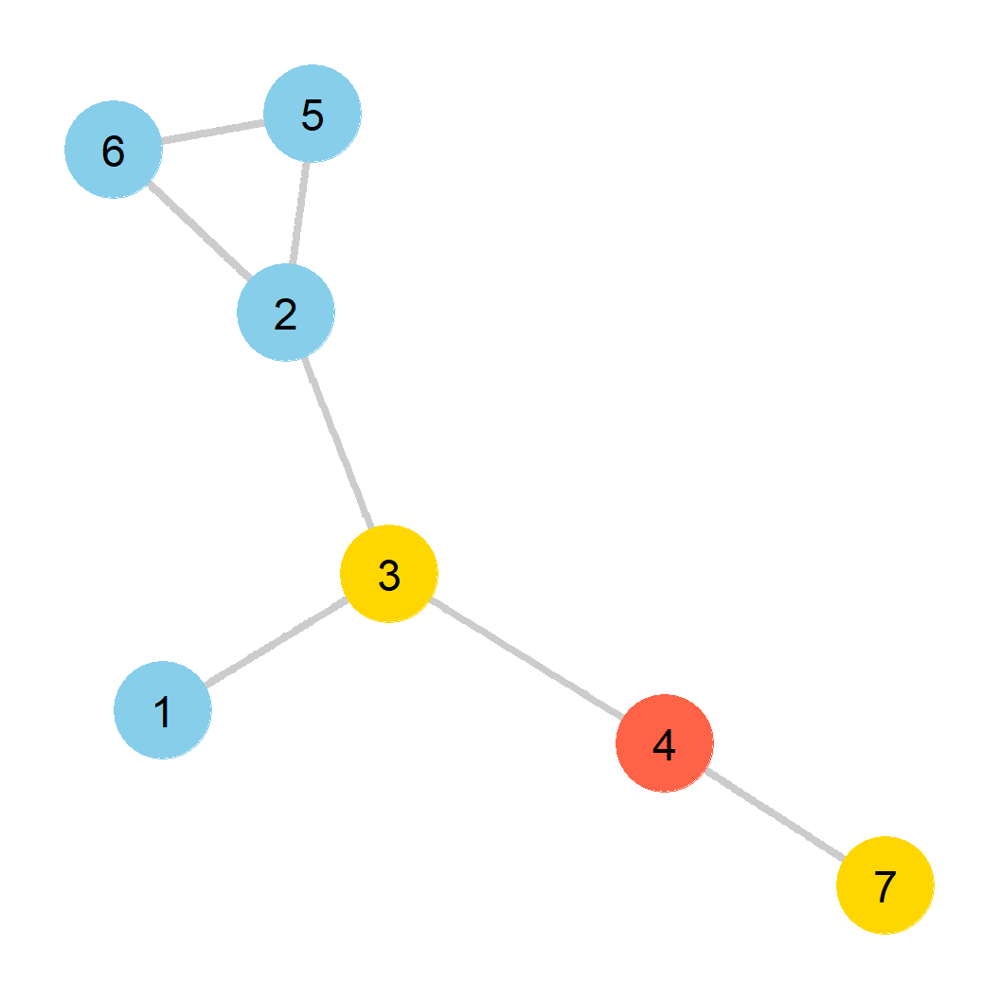{fig-align='center' width=528}
:::
:::

:::

::::

---

## Neighborhood Intersection

:::: {.columns align=center}

::: {.column width="60%"}
::: {.incremental}
- **Neighborhood Intersection** ($\mathcal{N}(u) \cap \mathcal{N}(v)$) is the set of **common neighbors** connected to both $u$ and $v$.
- In our graph:
  - $N(1) = \{3\}$
  - $N(4) = \{3, 7\}$
- The intersection is the single node they share:
  - $N(1) \cap N(4) = \{3\}$
:::
:::

::: {.column width="40%"}

::: {.cell layout-align="center"}
::: {.cell-output-display}
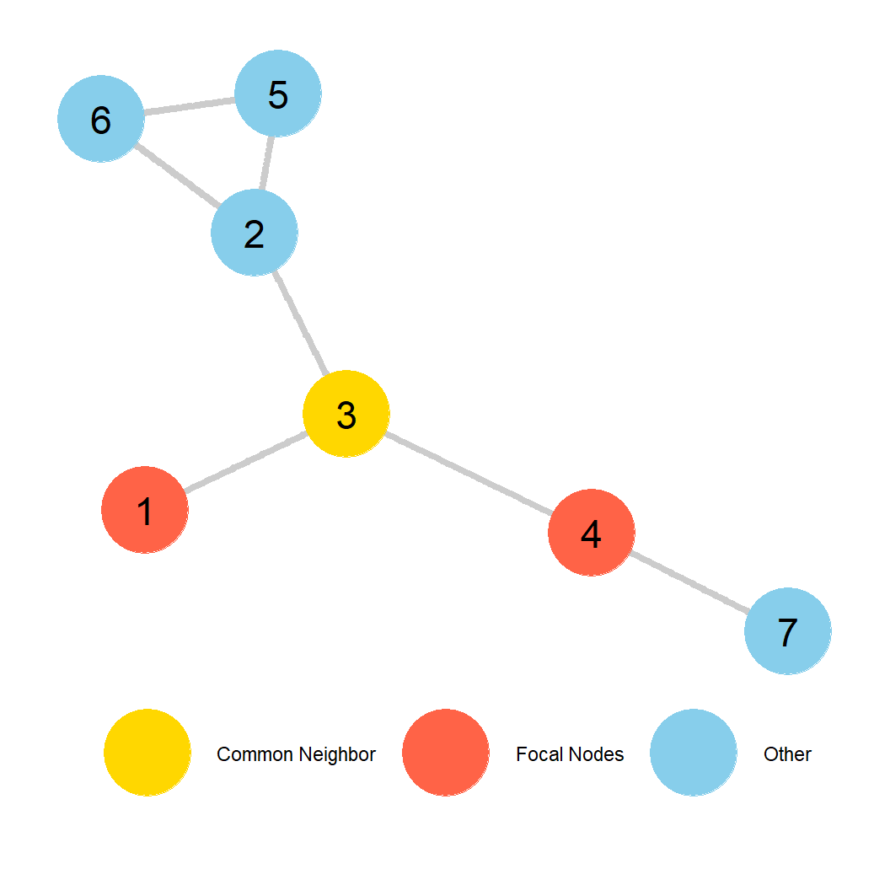{fig-align='center' width=528}
:::
:::

:::

::::

---

## Neighborhood Intersection: Example 2

::: {.incremental}
- Let's find the neighborhood intersection of nodes **5** and **3**.
- First, list their individual neighborhood sets:
  - $\mathcal{N}(5) = \{2, 6\}$
  - $\mathcal{N}(3) = \{1, 2, 4\}$
- The intersection is the set of common neighbors they share:
  - $\mathcal{N}(5) \cap \mathcal{N}(3) = \{2\}$
:::

---

## Neighborhood Intersection: Example 2 (Graph)

:::: {.columns align=center}

::: {.column width="50%"}
::: {.incremental}
- Nodes **5** and **3** (in tomato) are not directly connected.
- However, they share a common neighbor: node **2** (in gold).
- Therefore, their neighborhood intersection is:
  $$\mathcal{N}(5) \cap \mathcal{N}(3) = \{2\}$$
:::
:::

::: {.column width="50%"}

::: {.cell layout-align="center"}
::: {.cell-output-display}
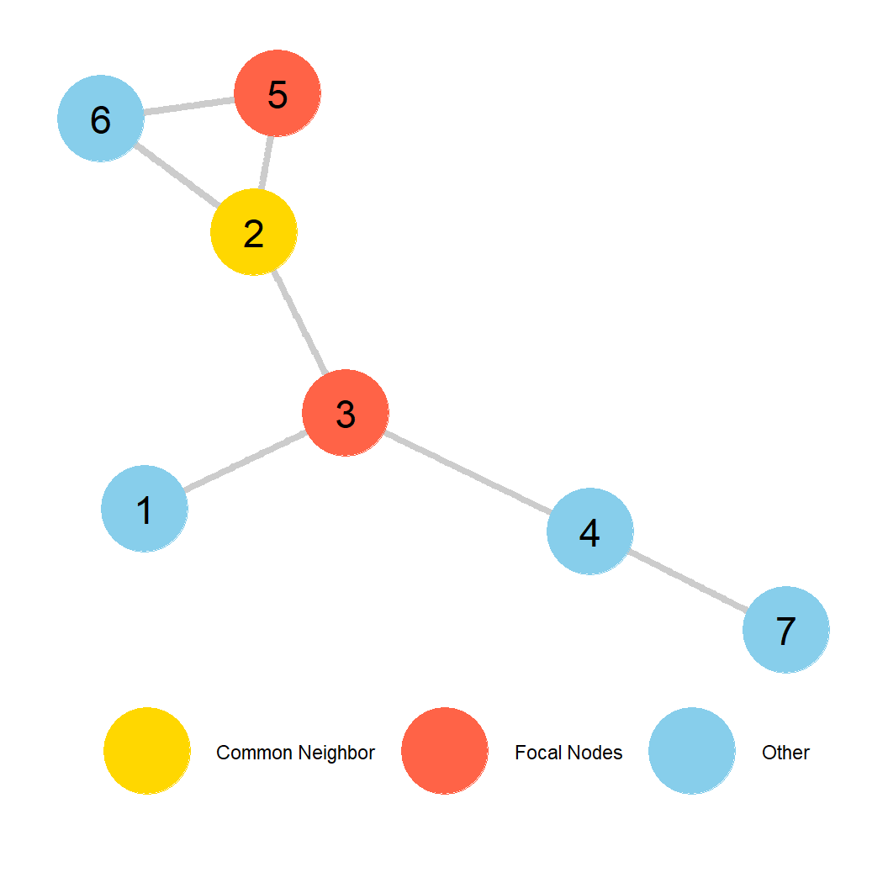{fig-align='center' width=528}
:::
:::

:::

::::

---

## Neighborhood Union

:::: {.columns align=center}

::: {.column width="60%"}
::: {.incremental}
- **Neighborhood Union** ($\mathcal{N}(u) \cup \mathcal{N}(v)$) is the set of all nodes connected to *either* $u$ or $v$.
- In our graph:
  - $N(1) = \{3\}$
  - $N(4) = \{3, 7\}$
- The union contains all unique neighbors from both sets:
  - $N(1) \cup N(4) = \{3, 7\}$
:::
:::

::: {.column width="40%"}

::: {.cell layout-align="center"}
::: {.cell-output-display}
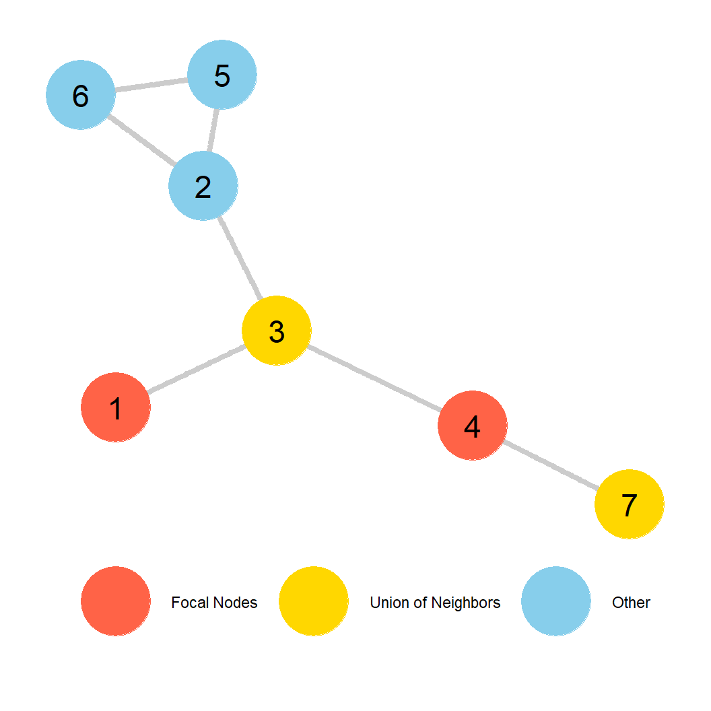{fig-align='center' width=528}
:::
:::

:::

::::

---

## Neighborhood Union: Example 2

::: {.incremental}
- Let's find the neighborhood union of nodes **5** and **3**.
- First, list their individual neighborhood sets:
  - $\mathcal{N}(5) = \{2, 6\}$
  - $\mathcal{N}(3) = \{1, 2, 4\}$
- The union combines all unique neighbors from both sets:
  - $\mathcal{N}(5) \cup \mathcal{N}(3) = \{1, 2, 4, 6\}$
:::

---

## Neighborhood Union: Example 2 (Graph)

:::: {.columns align=center}

::: {.column width="50%"}
::: {.incremental}
- Focal nodes **5** and **3** are shown in tomato.
- The union of their neighbors (nodes **1, 2, 4, 6**) is shown in gold.
- Therefore, the union of neighbors is:
  $$\mathcal{N}(5) \cup \mathcal{N}(3) = \{1, 2, 4, 6\}$$
:::
:::

::: {.column width="50%"}

::: {.cell layout-align="center"}
::: {.cell-output-display}
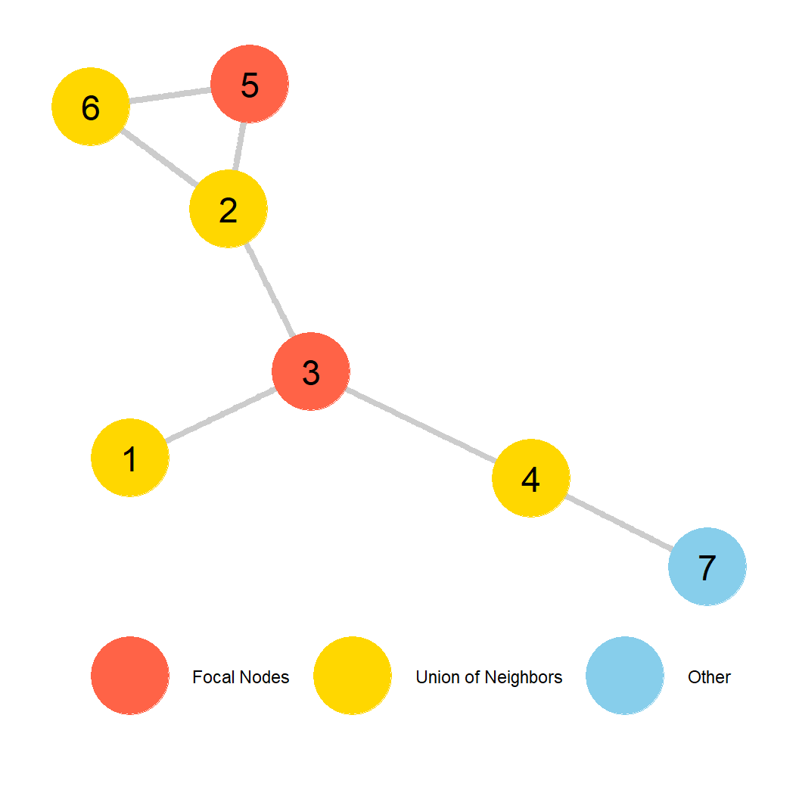{fig-align='center' width=528}
:::
:::

:::

::::

---

# Directed Graph Elements & Metrics

---

## Asymmetric Ties & Directed Graphs

::: {.incremental}
- Some relationships have an inherent **directionality** (**asymmetric ties**):
  - e.g., "A helps B", "A seeks advice from B".
- Unlike symmetric ties, **mutuality** or **reciprocity** is not guaranteed by definition.
- Reciprocity is an empirical event in the world (mutuality must be measured rather than assumed).
:::

---

## Directed Graph Representation

::: {.incremental}
- Asymmetric networks are represented as a **directed graph** (or **digraph**):
  - Simple lines are replaced with **arrows** indicating directionality.
  - Every edge has a **source node** (sender) and a **destination node** (receiver).
  - Unlike undirected graphs, node order matters: edge $AB$ is distinct from $BA$.
:::

---

## Directed Graph: An Example

:::: {.columns align=center}

::: {.column width="55%"}
::: {.incremental}
- Let's look at the digraph on the right:
  - Arrows indicate the direction of the relationship.
  - Some ties are **reciprocated** (e.g., $A \leftrightarrow B$ and $B \leftrightarrow D$).
  - Others are strictly **asymmetric** (e.g., $E \rightarrow C$, $G \rightarrow F$).
:::
:::

::: {.column width="45%"}

::: {.cell layout-align="center"}
::: {.cell-output-display}
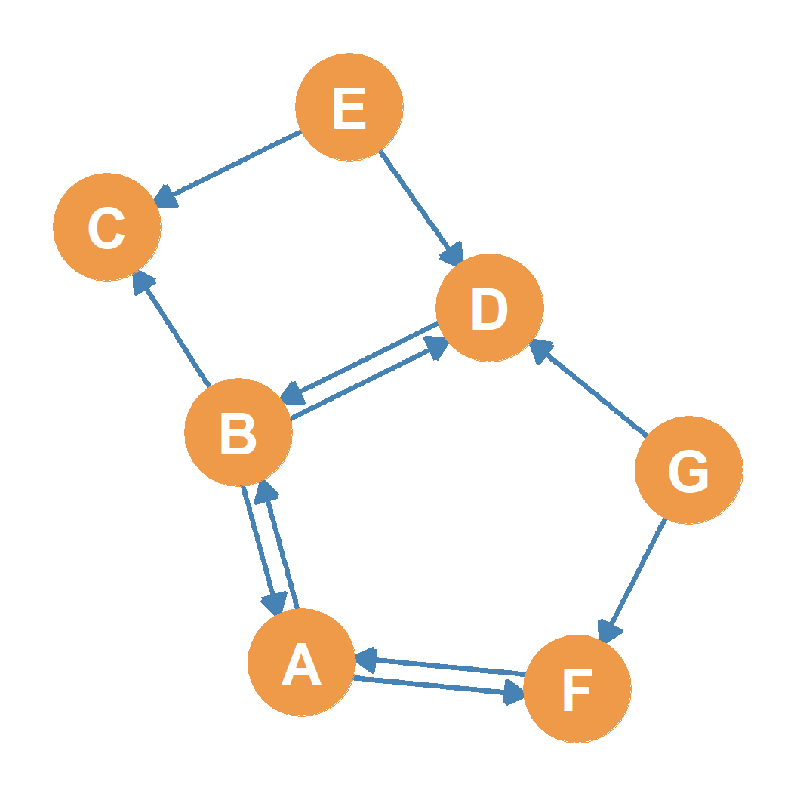{fig-align='center' width=528}
:::
:::

:::

::::

---

## Types of Nodes in Directed Graphs

::: {.incremental}
- In a directed graph, we can distinguish three types of (non-isolate) nodes based on incoming and outgoing ties:
  1. **Receivers**: Nodes that receive ties but do not send them ($k_{in} > 0$ and $k_{out} = 0$).
  2. **Transmitters**: Nodes that send ties but do not receive them ($k_{in} = 0$ and $k_{out} > 0$).
  3. **Carriers**: Nodes that both receive and send ties ($k_{in} > 0$ and $k_{out} > 0$).
:::

---

## Node Types: An Example

:::: {.columns align=center}

::: {.column width="55%"}
::: {.incremental}
- Looking at the directed graph on the right:
  - **Receiver**: Node **C** (only receives ties).
  - **Transmitters**: Nodes **E** and **G** (only send ties).
  - **Carriers**: Nodes **A**, **B**, **D**, **F** (both receive and send ties).
:::
:::

::: {.column width="45%"}

::: {.cell layout-align="center"}
::: {.cell-output-display}
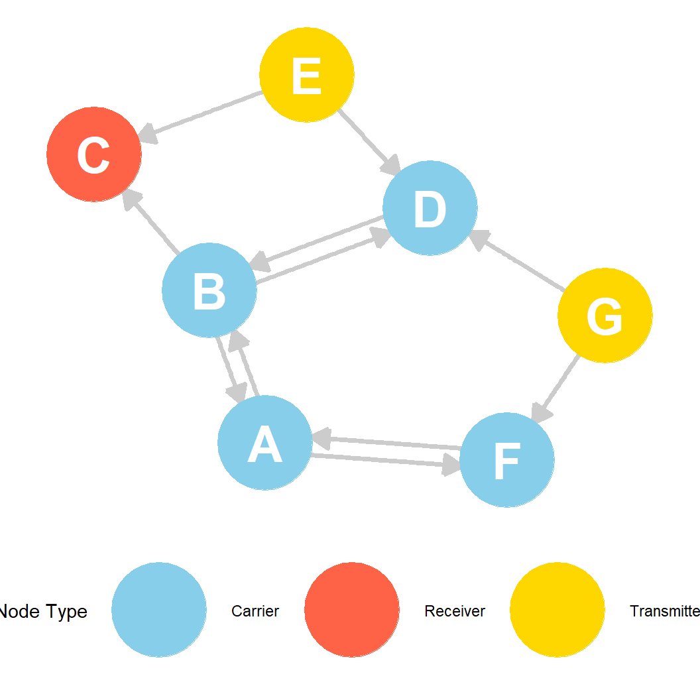{fig-align='center' width=528}
:::
:::

:::

::::

---

## Neighborhoods in Directed Graphs (1)

:::: {.columns}

::: {.column width="55%"}
::: {.incremental}
- Because links are directional, nodes have two neighborhoods.
- **In-Neighborhood** ($N^{in}(v)$):
  - Set of source nodes pointing *to* $v$.
  - Example: $N^{in}(D) = \{B, E, G\}$ (highlighted in gold, pointing to focal node D in tomato).
:::
:::

::: {.column width="45%"}

::: {.cell layout-align="center"}
::: {.cell-output-display}
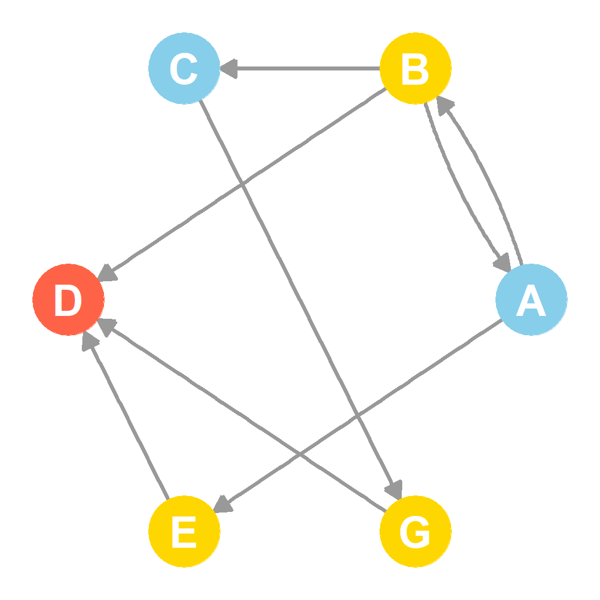{fig-align='center' width=528}
:::
:::

:::

::::

---

## Neighborhoods in Directed Graphs (2)

:::: {.columns align=center}

::: {.column width="55%"}
::: {.incremental}
- **Out-Neighborhood** ($N^{out}(v)$):
  - Set of destination nodes that $v$ points *to*.
  - Example: $N^{out}(B) = \{A, C, D\}$ (highlighted in gold, pointing from focal node B in tomato).
:::
:::

::: {.column width="45%"}

::: {.cell layout-align="center"}
::: {.cell-output-display}
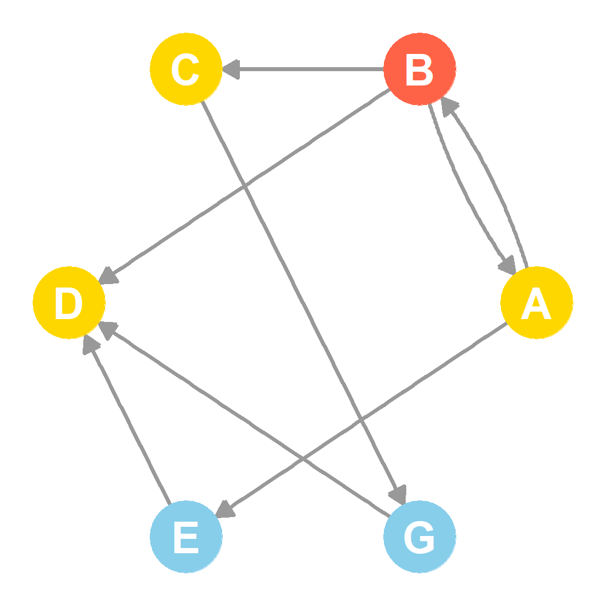{fig-align='center' width=528}
:::
:::

:::

::::

---

## Directed Neighborhoods: Reciprocity

:::: {.columns align=center}

::: {.column width="55%"}
::: {.incremental}
- A node appears in both neighborhoods only if there is a **reciprocal** (mutual) tie.
- Example for Node **B** (in tomato):
  - In-Neighborhood: $N^{in}(B) = \{A\}$
  - Out-Neighborhood: $N^{out}(B) = \{A, C, D\}$
:::
:::

::: {.column width="45%"}

::: {.cell layout-align="center"}
::: {.cell-output-display}
{fig-align='center' width=528}
:::
:::

:::

::::

---

## Directed Neighborhoods: Reciprocity Overlap

:::: {.columns align=center}

::: {.column width="55%"}
::: {.incremental}
- Since there is a reciprocal tie $A \leftrightarrow B$, node **A** (in gold) belongs to both sets.
- Therefore, the overlap is the intersection of these two neighborhoods:
  $$N^{in}(B) \cap N^{out}(B) = \{A\}$$
:::
:::

::: {.column width="45%"}

::: {.cell layout-align="center"}
::: {.cell-output-display}
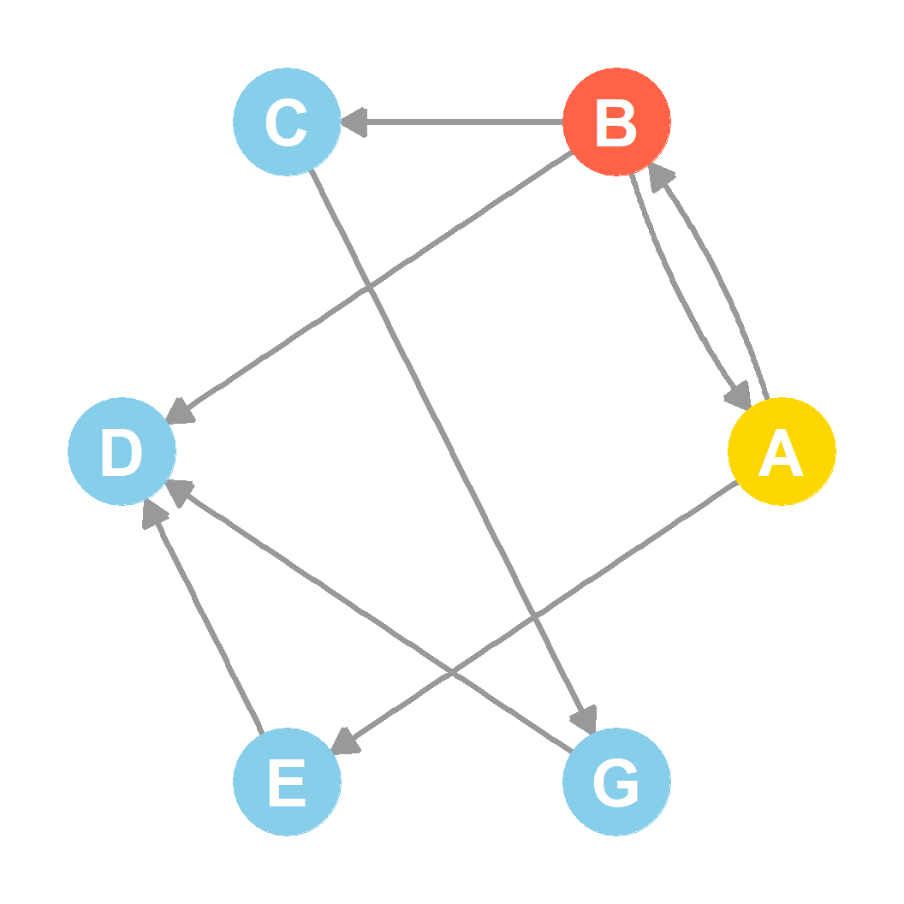{fig-align='center' width=528}
:::
:::

:::

::::

---

## Directed Neighborhood Intersection

::: {.incremental}
- In directed graphs, neighborhood intersections can be defined for incoming or outgoing ties:
- **In-Neighborhood Intersection**: Common source nodes pointing to both $u$ and $v$:
  - $N^{in}(D) \cap N^{in}(A) = \{B\}$ (Node $B$ points to both $D$ and $A$)
- **Out-Neighborhood Intersection**: Common destination nodes that both $u$ and $v$ point to:
  - $N^{out}(B) \cap N^{out}(E) = \{D\}$ (Both $B$ and $E$ point to $D$)
:::

---

## Directed Neighborhood Intersection: Example

:::: {.columns align=center}

::: {.column width="55%"}
::: {.incremental}
- Let's visualize the **out-neighborhood intersection** of nodes **B** and **E** (in tomato):
  - $N^{out}(B) = \{A, C, D\}$
  - $N^{out}(E) = \{D\}$
- They share one common destination node:
  $$N^{out}(B) \cap N^{out}(E) = \{D\}\text{ (in gold)}$$
:::
:::

::: {.column width="45%"}

::: {.cell layout-align="center"}
::: {.cell-output-display}
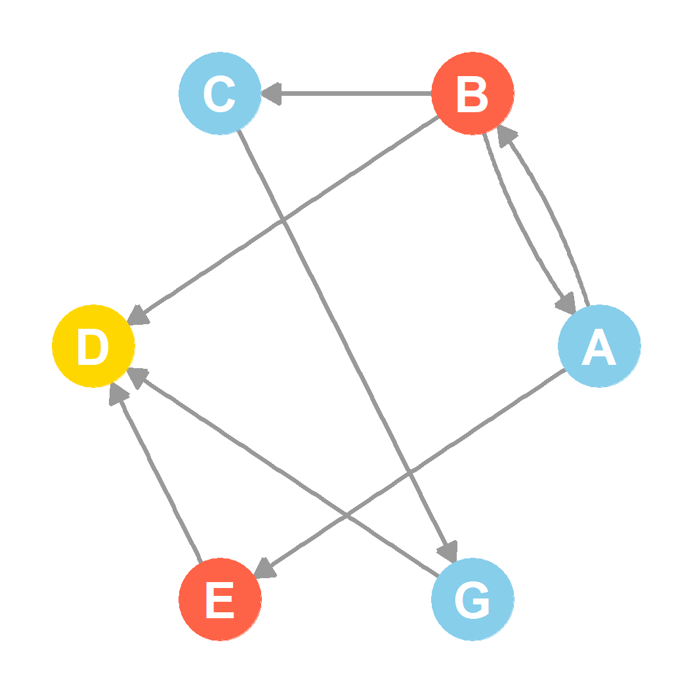{fig-align='center' width=528}
:::
:::

:::

::::

---

## Directed Neighborhood Union

::: {.incremental}
- Similarly, directed neighborhood unions combine the sets of neighbors:
- **In-Neighborhood Union**: Nodes pointing to either $u$ or $v$:
  - $N^{in}(D) \cup N^{in}(A) = \{B, E, G\}$
- **Out-Neighborhood Union**: Nodes that either $u$ or $v$ points to:
  - $N^{out}(B) \cup N^{out}(E) = \{A, C, D\}$
:::

---

## Directed Neighborhood Union: Example

:::: {.columns align=center}

::: {.column width="55%"}
::: {.incremental}
- Let's visualize the **out-neighborhood union** of nodes **B** and **E** (in tomato):
  - $N^{out}(B) = \{A, C, D\}$
  - $N^{out}(E) = \{D\}$
- Combining all unique destination nodes gives:
  $$N^{out}(B) \cup N^{out}(E) = \{A, C, D\}\text{ (in gold)}$$
:::
:::

::: {.column width="45%"}

::: {.cell layout-align="center"}
::: {.cell-output-display}
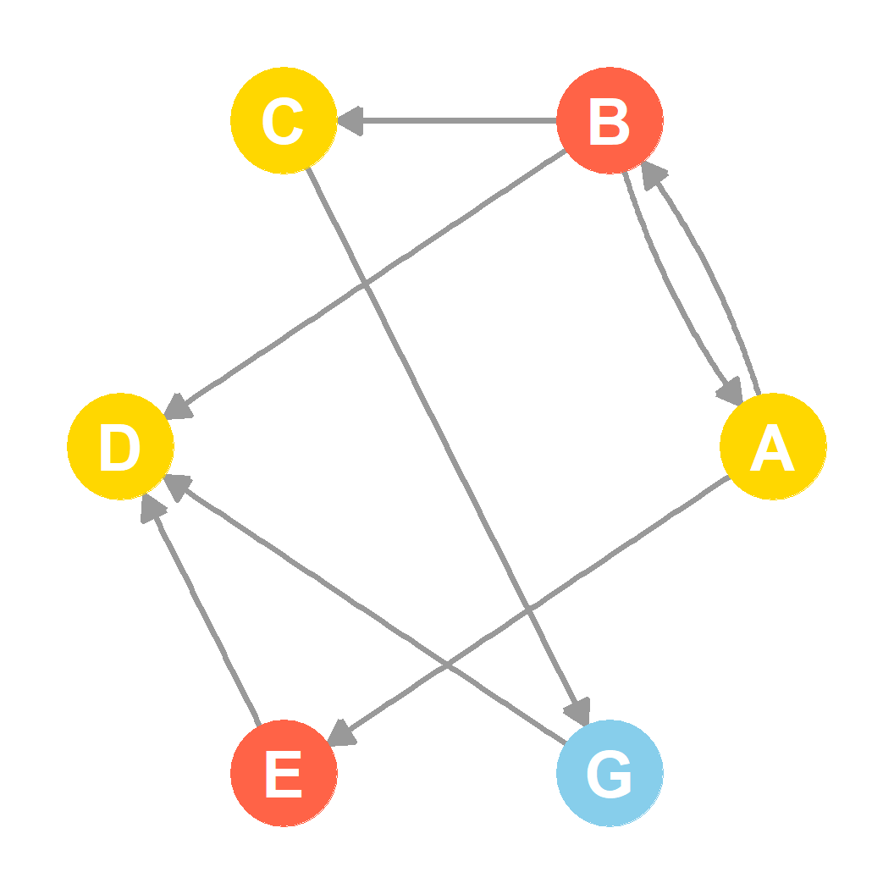{fig-align='center' width=528}
:::
:::

:::

::::

---

# Node Degree

---

## Node Degree in Undirected Graphs

::: {.incremental}
- In an undirected graph, a node's **degree** ($k_i$) has two equivalent definitions:
  1. **Neighborhood Cardinality**: The number of neighbors of node $i$ ($k_i = |\mathcal{N}(i)|$).
  2. **Incident Edges Count**: The number of edges connected to node $i$.
- Sociological meaning: **Degree Centrality** (reflects popularity, influence, or activity).
:::

---

## Node Degree: An Example

:::: {.columns align=center}

::: {.column width="55%"}
::: {.incremental}
- Let's calculate the degree for Node **A** (in tomato) on the right:
  - Neighbors of **A**: $\mathcal{N}(A) = \{B, C, D, F\}$
  - Neighborhood size: $k_A = |\mathcal{N}(A)| = 4$
  - Incident edges: $AB$, $AC$, $AD$, and $AF$ ($k_A = 4$)
- Thus, the degree of Node **A** is **4**.
:::
:::

::: {.column width="45%"}

::: {.cell layout-align="center"}
::: {.cell-output-display}
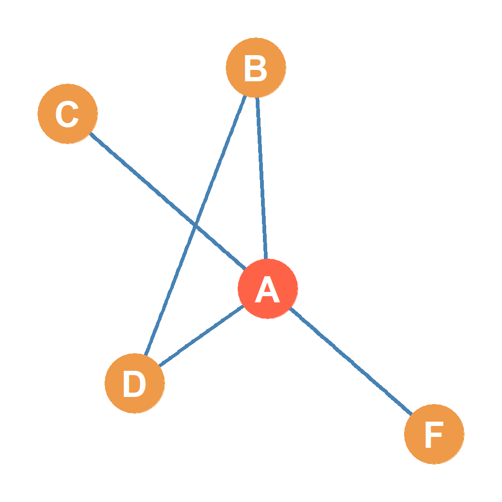{fig-align='center' width=528}
:::
:::

:::

::::

---

## Endpoints in Undirected Graphs

::: {.incremental}
- **Endpoints** (or leaves/periphery):
  - Nodes that have a degree equal to **one** ($k_i = 1$).
  - They have just a single neighbor in the graph.
:::

---

## Endpoints: An Example

:::: {.columns align=center}

::: {.column width="55%"}
::: {.incremental}
- Let's identify the endpoints in the graph on the right:
  - Nodes **C** and **F** (in tomato) are connected only to node **A**.
  - Since $k_C = 1$ and $k_F = 1$, they have degree one.
  - Therefore, **C** and **F** are the endpoints of this graph.
:::
:::

::: {.column width="45%"}

::: {.cell layout-align="center"}
::: {.cell-output-display}
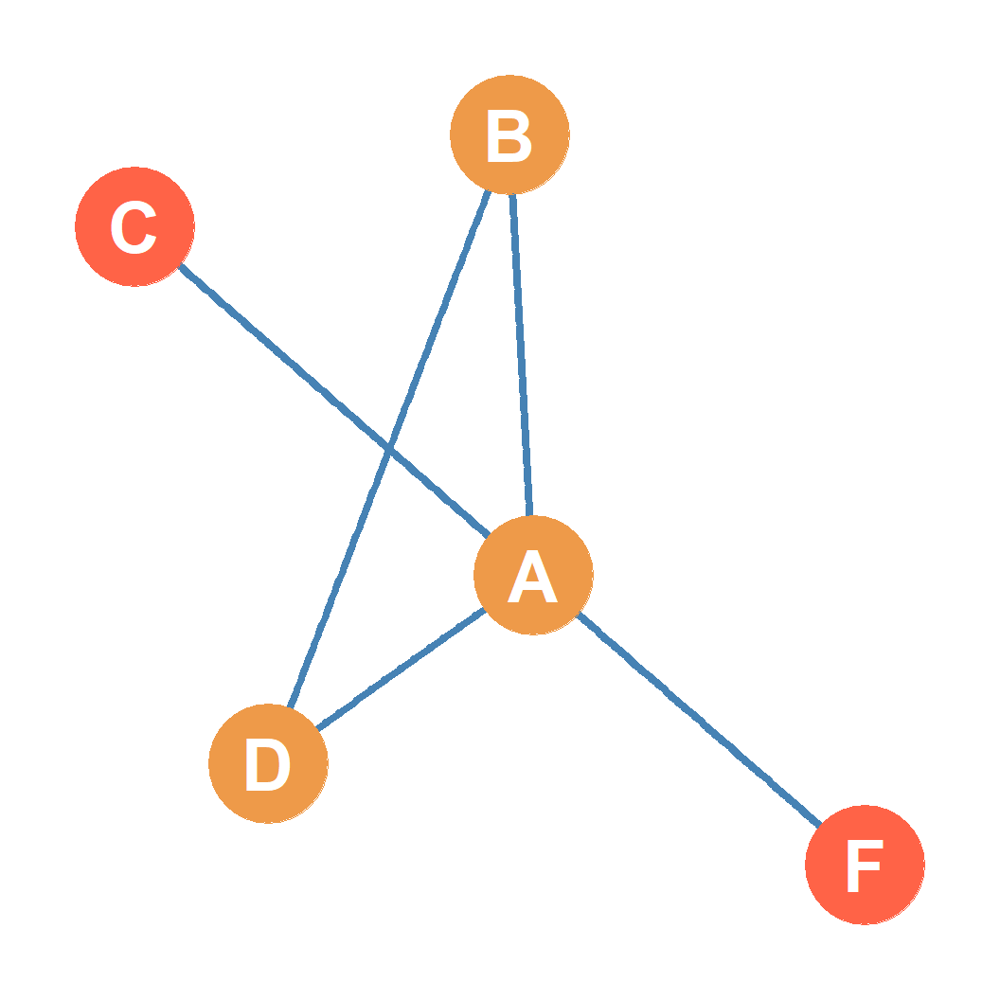{fig-align='center' width=528}
:::
:::

:::

::::

---

## Node Degree in Directed Graphs: Indegree

::: {.incremental}
- Directed graphs have two distinct degrees for each node.
- **Indegree** ($k^{in}_i$):
  - Number of edges pointing to node $i$ (cardinality of $N^{in}(i)$).
  - Sociological meaning: **Popularity, Prestige, or Status**.
:::

---

## Indegree: An Example

:::: {.columns align=center}

::: {.column width="55%"}
::: {.incremental}
- Let's find the indegree for Node **D** (in tomato) on the right:
  - Source nodes pointing to **D**: $N^{in}(D) = \{B, E, G\}$ (in gold)
  - Indegree: $k^{in}_D = |N^{in}(D)| = 3$
- Node **D** has 3 incoming arrows, representing a node with relatively high popularity or status.
:::
:::

::: {.column width="45%"}

::: {.cell layout-align="center"}
::: {.cell-output-display}
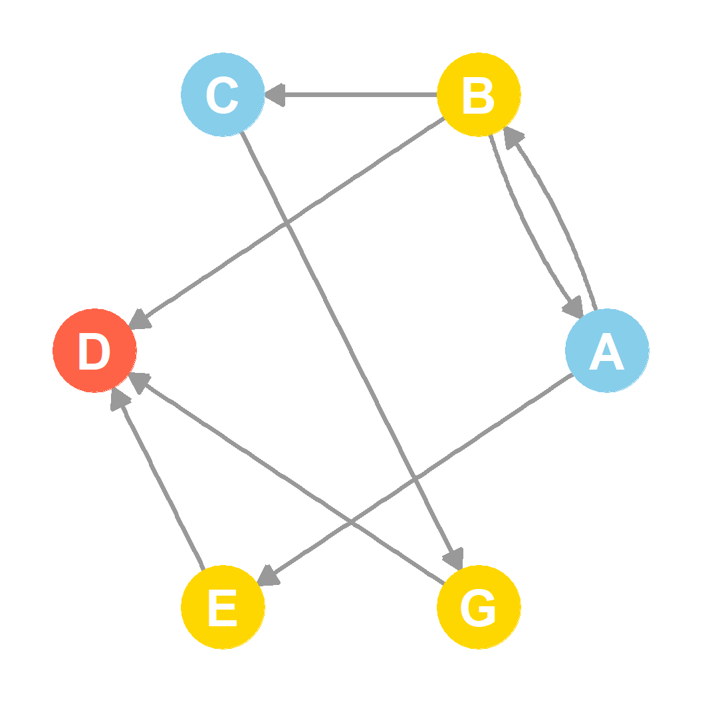{fig-align='center' width=528}
:::
:::

:::

::::

---

## Node Degree in Directed Graphs: Outdegree

::: {.incremental}
- **Outdegree** ($k^{out}_i$):
  - Number of edges pointing from node $i$ (cardinality of $N^{out}(i)$).
  - Sociological meaning: **Sociability or Activity**.
:::

---

## Outdegree: An Example

:::: {.columns align=center}

::: {.column width="55%"}
::: {.incremental}
- Let's find the outdegree for Node **B** (in tomato) on the right:
  - Target nodes that **B** points to: $N^{out}(B) = \{A, C, D\}$ (in gold)
  - Outdegree: $k^{out}_B = |N^{out}(B)| = 3$
- Node **B** has 3 outgoing arrows, representing a node with relatively high sociability or activity.
:::
:::

::: {.column width="45%"}

::: {.cell layout-align="center"}
::: {.cell-output-display}
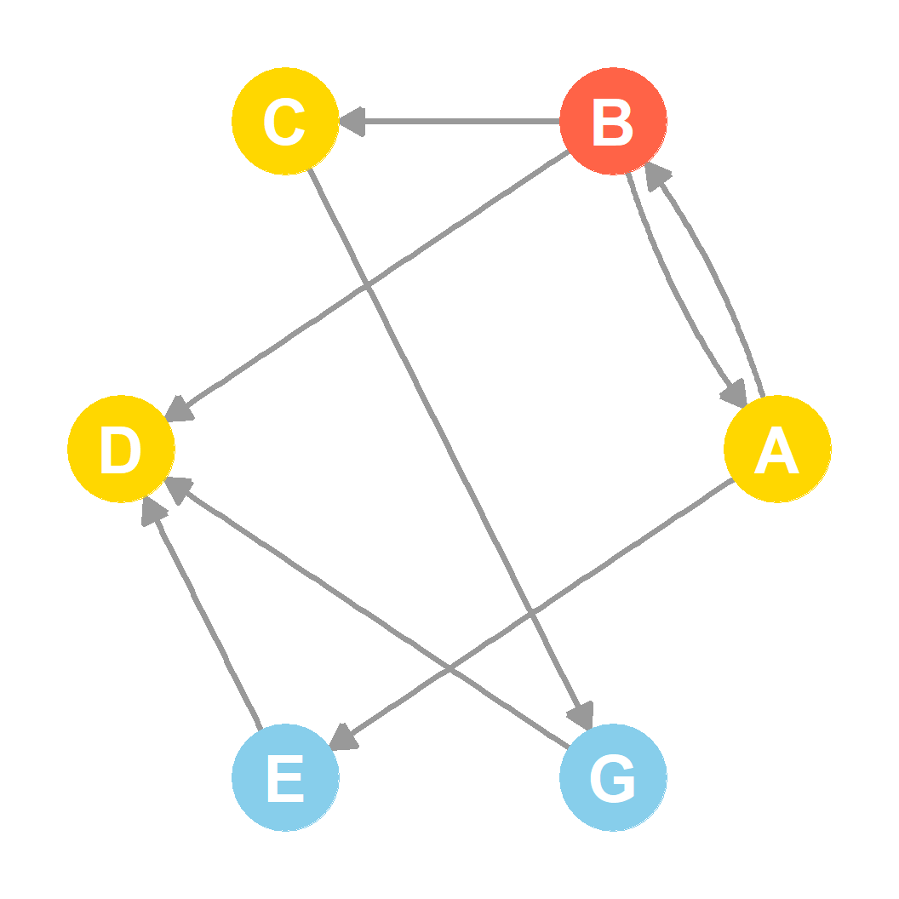{fig-align='center' width=528}
:::
:::

:::

::::

---

# Basic Graph Metrics

---

## Graph Order and Size

::: {.incremental}
- **Graph Order** ($n$):
  - The number of nodes in the graph ($n = |V|$).
  - Cardinality of the vertex set.
- **Graph Size** ($m$):
  - The number of edges in the graph ($m = |E|$).
  - Cardinality of the edge set.
:::

---

## Order and Size: Undirected Example

:::: {.columns align=center}

::: {.column width="55%"}
::: {.incremental}
- Let's look at the undirected graph on the right:
  - **Node Set** ($V$): $\{1, 2, 3, 4, 5, 6, 7\}$
  - **Edge Set** ($E$): $\{13, 43, 47, 25, 56, 62, 32\}$
  - **Graph Order** ($n = |V|$): **7** nodes
  - **Graph Size** ($m = |E|$): **7** edges
:::
:::

::: {.column width="45%"}

::: {.cell layout-align="center"}
::: {.cell-output-display}
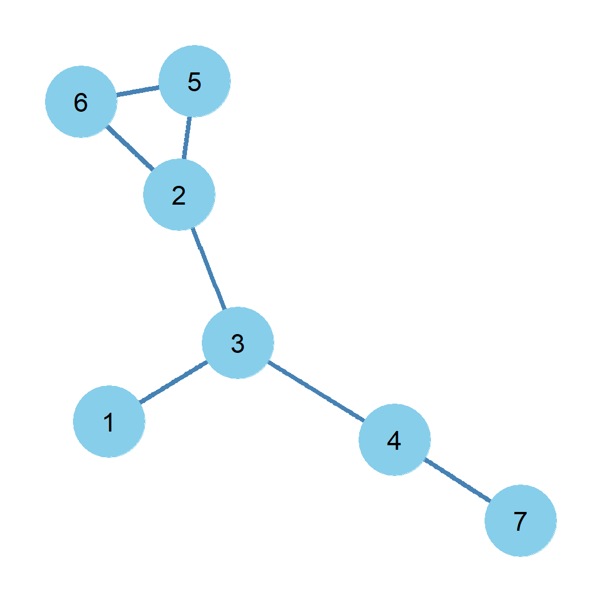{fig-align='center' width=528}
:::
:::

:::

::::

---

## Order and Size: Directed Example

:::: {.columns align=center}

::: {.column width="55%"}
::: {.incremental}
- Let's look at the directed graph on the right:
  - **Node Set** ($V$): $\{A, B, C, D, E, G\}$
  - **Edge Set** ($E$): 8 directed arcs:
    $B \rightarrow A, B \rightarrow C, B \rightarrow D, E \rightarrow D, G \rightarrow D, A \rightarrow E, C \rightarrow G, A \rightarrow B$
  - **Graph Order** ($n = |V|$): **6** nodes
  - **Graph Size** ($m = |E|$): **8** edges
:::
:::

::: {.column width="45%"}

::: {.cell layout-align="center"}
::: {.cell-output-display}
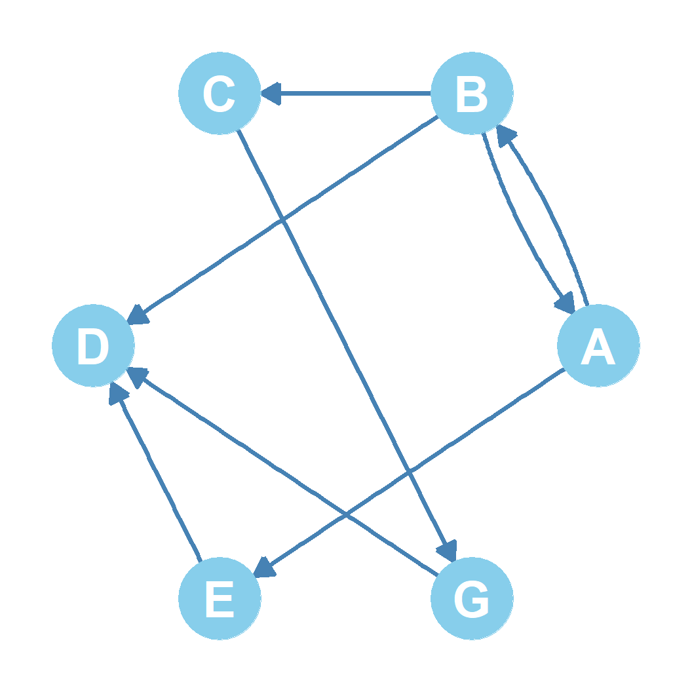{fig-align='center' width=528}
:::
:::

:::

::::

---

## Graph Maximum Size

::: {.incremental}
- The **maximum size** of a simple graph of order $n$ is the number of edges in a **complete graph** (where every node is connected to every other node).
- Undirected: $Max(E) = \frac{n(n - 1)}{2}$
- Directed: $Max(E) = n(n - 1)$
:::

---

## Graph Density

::: {.incremental}
- **Density** ($d$) is the ratio of the observed number of edges ($m$) to the maximum possible number of edges.
- It's a value between 0 (empty) and 1 (complete).
- Undirected: $d = \frac{2m}{n(n-1)}$
- Directed: $d = \frac{m}{n(n-1)}$
- It can be interpreted as the probability that any two randomly chosen nodes are connected.
- Denser networks are less vulnerable to breakdowns when key nodes are removed.
:::

---

# Degree-Based Graph Metrics

---

## Graph Degree Set and Sequence

::: {.incremental}
- **Graph Degree Set**: A list of the degrees of every node in the graph.
- **Graph Degree Sequence**: The degree set sorted in descending order.
- This provides a "fingerprint" of the graph's overall connectivity structure.
:::

---

## Degree Range & Sum

::: {.incremental}
- **Maximum Degree** ($k_{max}$) and **Minimum Degree** ($k_{min}$).
- **Degree Range** ($k_r$): $k_{max} - k_{min}$.
- **Sum of Degrees** ($\sum k_i$):
  - In an undirected graph, this is always twice the number of edges: $\sum k_i = 2m$.
:::

---

## Graphical Degree Sequences

::: {.incremental}
- A **graphical degree sequence** is a sequence of numbers that *can* be the degree sequence of a simple graph.
- Not every sequence of integers is graphical.
- **Havel-Hakimi Theorem** provides a recursive algorithm to check if a sequence is graphical.
:::

---

## Average Degree

::: {.incremental}
- **Average Degree** ($\bar{k}$): The average of all node degrees in the graph.
  
  $$\bar{k} = \frac{1}{n} \sum_{i=1}^{n} k_i = \frac{2m}{n}$$
  
- It represents the expected degree of a randomly chosen node.
- It is also directly related to density: $\bar{k} = d(n-1)$.
:::

---

## Degree Variance

::: {.incremental}
- **Degree Variance** ($\sigma^2_k$): A measure of how much the node degrees vary from the average degree.
  
  $$\sigma^2_k = \frac{1}{n} \sum_{i=1}^{n} (k_i - \bar{k})^2$$
  
- A low variance indicates a more homogeneous or uniform network (like a **regular graph**).
- A high variance indicates a heterogeneous network with both low-degree nodes and high-degree "hubs" (like a **scale-free** network).
:::

---

## Regular Graphs

:::: {.columns align=center}

::: {.column width="55%"}
::: {.incremental}
- A **regular graph** is a graph where every node has the same degree.
- If every node has degree $k$, it is called a **$k$-regular graph**.
- This means the degree variance is zero:
  $$\sigma^2_k = 0$$
- These are often used as baseline models but are rare in real-world social networks.
- Example: A **3-regular** graph on 6 nodes (shown on the right).
:::
:::

::: {.column width="45%"}

::: {.cell layout-align="center"}
::: {.cell-output-display}
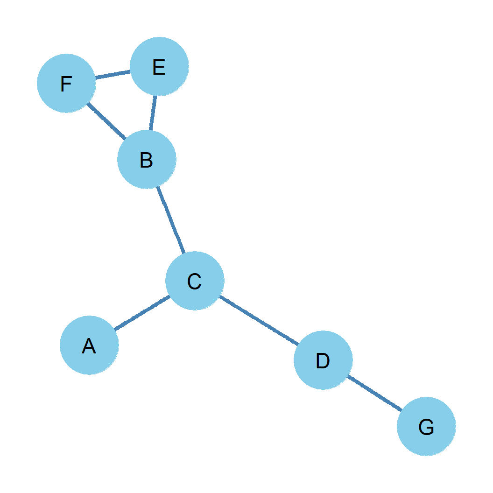{fig-align='center' width=528}
:::
:::

:::

::::

---

## Feld's Friendship Paradox

::: {.incremental}
- **Average Nearest Neighbor Degree** ($\bar{k}_{nn(i)}$):
  - The average degree of node $i$'s neighbors:
    $$\bar{k}_{nn(i)} = \frac{1}{k_i} \sum_{j \in \mathcal{N}(i)} k_j$$
- **The Friendship Paradox** (Scott Feld, 1991):
  - In almost all social networks, the average degree of a person's friends ($\bar{k}_{nn}$) is **greater** than the average degree of the people in the network ($\bar{k}$).
  - **Your friends have more friends than you do!**
:::

---

# Directed Graph Elements & Metrics

---

## Directed Degree Sets & Sequences

::: {.incremental}
- Directed graphs have two distinct degree sets (In-Degree set and Out-Degree set) and two distinct sequences.
- **Sum of Degrees**:
  - The sum of in-degrees is always equal to the sum of out-degrees, which is equal to the size $m$ (number of edges):
    
    $$\sum k^{in}_i = \sum k^{out}_i = m$$
  
  - Since both sum to $m$, directed graphs have only **one** average degree: $\bar{k} = m/n$.
:::

