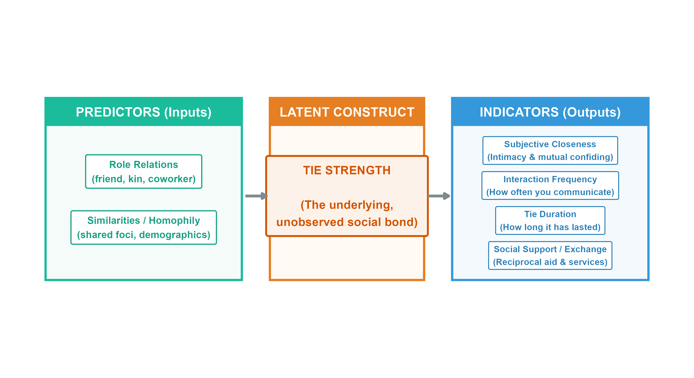
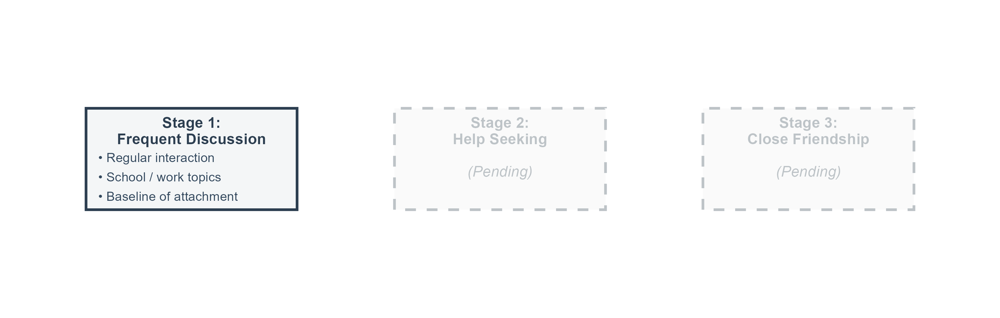
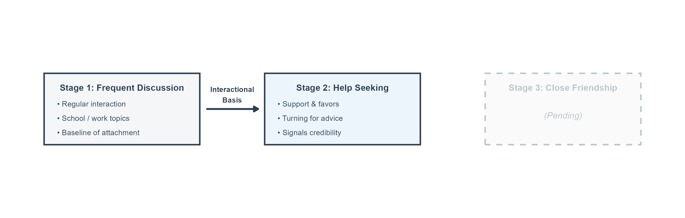
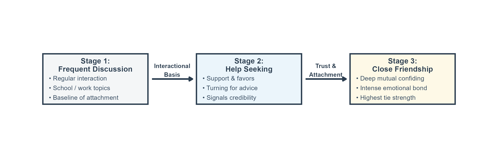
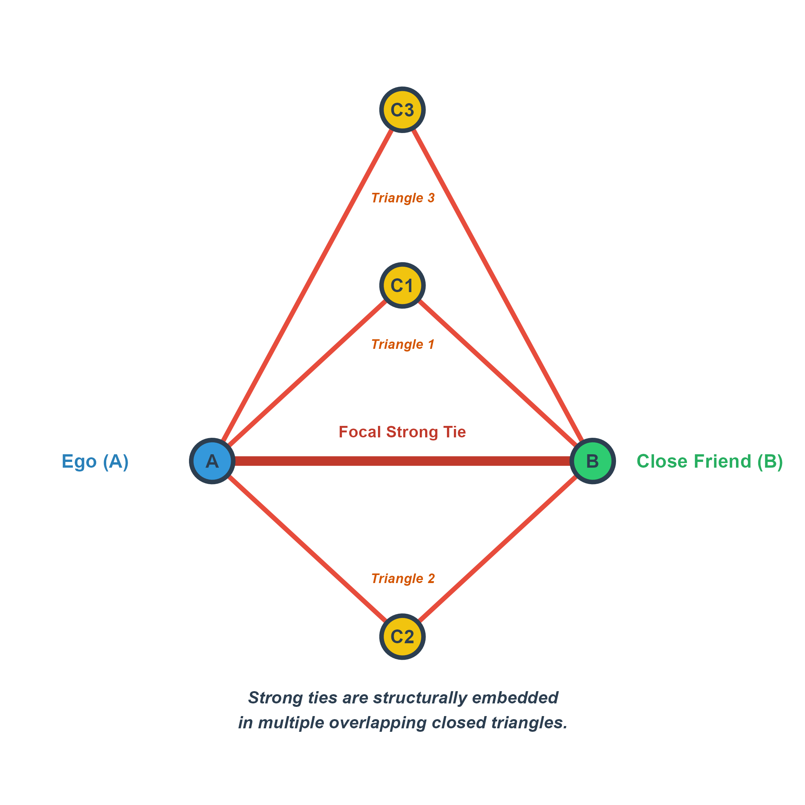
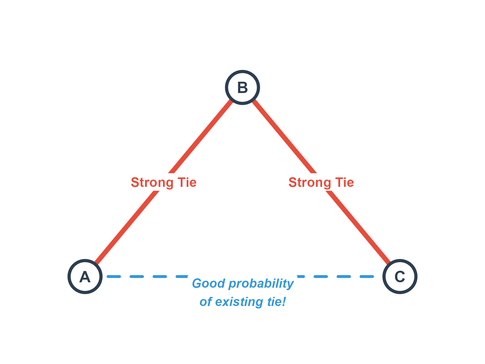
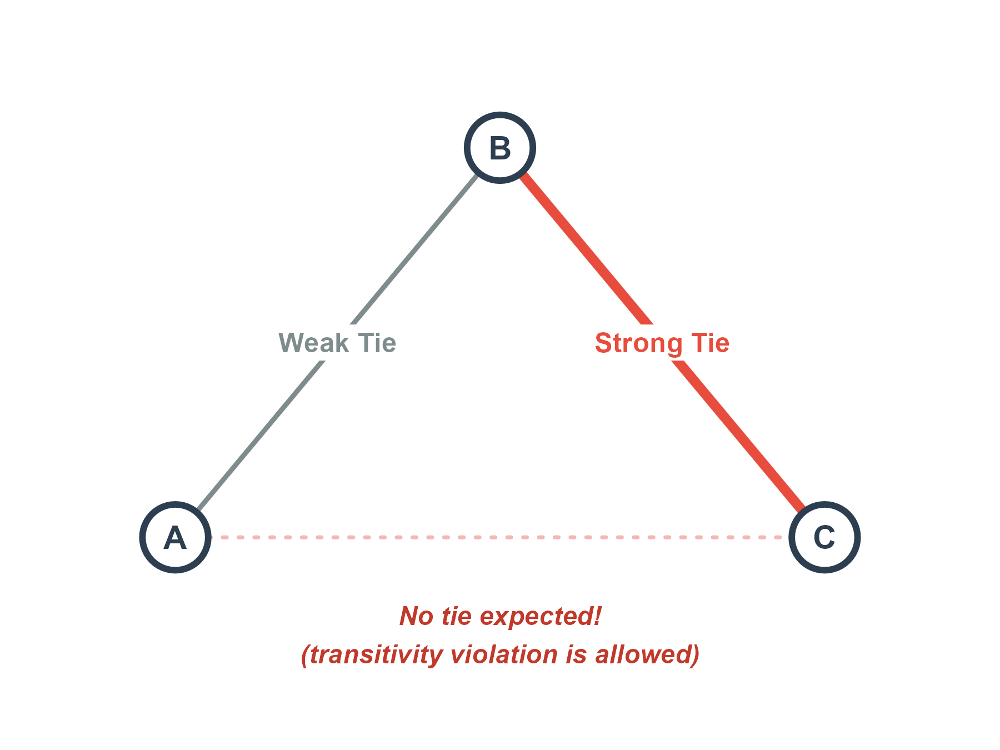
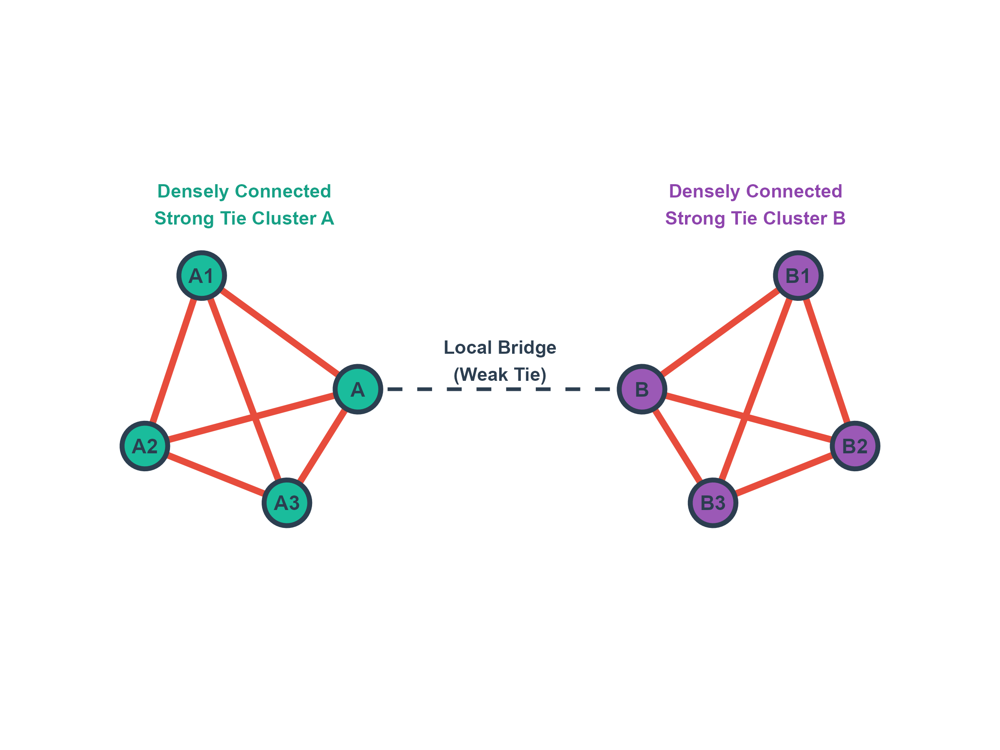
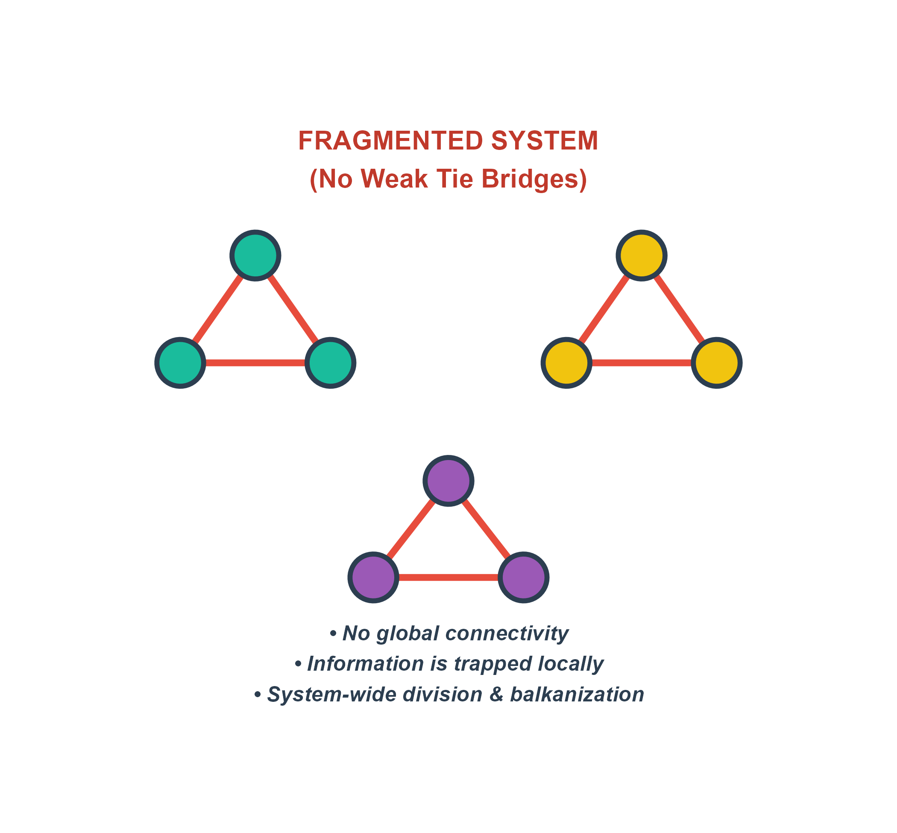
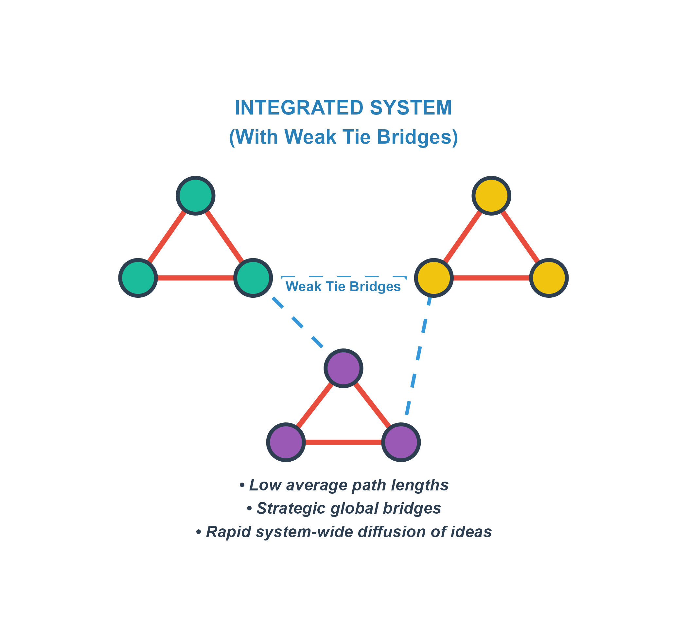

## Form vs. Content in Social Relations

- In everyday life, we tend to categorize relations by their **content**:
  - Kin (parent, sibling), Friends (best friend, work friend), Romantic partners, or activity-based groups (workout buddies, gaming crew).

- **Network Analysis** abstracts away from content to study the **form** of social relations:
  - **Tie Strength (intensity)** is a formal property that cuts across different contents.
  - For example, you can have a coworker (content) with whom you interact daily (frequency, form) or a sibling (content) whom you rarely see (frequency, form).
  - Formal properties allow us to build generalizable theories of social structure.

---

## What is a Social Tie? (States vs. Events)

- Social network researchers classify ties into two major clusters (Borgatti et al., 2009):

- **1. States (Static Situations)**
  - **Similarities**: Demographic overlaps, shared group memberships, or spatial proximity.
  - **Relations**: Kinship roles (parent-child), organizational roles (boss-employee), or affective/cognitive states (liking, trusting).

- **2. Events (Processes in Time)**
  - **Interactions**: Discrete, temporal behavioral events (talking, working together, helping move).
  - **Flows**: The transmission of physical or intangible items (information, money, disease).

- **Connection to Tie Strength**:
  - Tie strength represents an affective/role **state** that is built, maintained, and indicated by temporal **events** (interaction frequency and flow of support).

---

## Defining Tie Strength

- **Intuition**: If you scan your personal network, some ties are highly intimate, durable, and active (**strong ties**), while others are more casual acquaintances (**weak ties**).

- **Granovetter's Classic Definition (1973)**:
  - Tie strength is a *(probably linear)* combination of:
    1. **Amount of time** spent together
    2. **Emotional intensity** (subjective closeness)
    3. **Intimacy** (mutual confiding)
    4. **Reciprocal services** (mutual aid and support)

- **The Tie Strength Continuum**:
  - Relationships are not binary; they lie on a continuum. Mixed ties (e.g., family members you rarely see, or coworkers you see daily but aren't close to) sit in between.

---

## Caveats of Tie Strength: Correlation vs. Identity

- **Rule 1: Multiple indicators are required**
  - Having only one property is not sufficient to qualify a tie as strong.
  - *Counter-Example 1 (High frequency, Low intimacy)*: You see a coworker you hate every single weekday. This is high interaction frequency (event), but low intimacy or sentiment. The tie is **weak** (or even negative!).
  - *Counter-Example 2 (Low frequency, High intimacy)*: You confide an intimate secret to a casual acquaintance. This is a one-time confiding event, but lacks duration and frequency. The tie remains **weak**.

- **Rule 2: Tie types are correlations, not identities**
  - Kin ties or similar-race ties are *expected* to be strong, but they do not have to be.
  - *Example*: You can be estranged from a parent or sibling (kin role is a state, but interaction events are zero).
  - Role relations and similarities are **predictors** of tie strength, not identical to tie strength itself.

---

## Measuring Tie Strength: Indicators & Predictors

- Peter Marsden and Karen Campbell (1984) proposed a systematic framework to measure tie strength, dividing variables into **Predictors** and **Indicators**:

- **Predictors (Inputs)**:
  - Factors that influence whether a strong tie is likely to form.
  - **Role Relations**: Kin, coworker, neighbor, or friend.
  - **Similarities**: Homophily (socio-demographic similarity) or shared social foci (shared context).

- **Indicators (Outputs)**:
  - Characteristics that reveal how strong an existing bond actually is.
  - **Subjective Closeness**: The degree of mutual confiding and intimacy. *This is considered the most reliable survey indicator of tie strength.*
  - **Interaction Frequency**: How often individuals communicate.
  - **Tie Duration**: How long the relationship has lasted.
  - **Exchange/Social Support**: Reciprocal services, resources, or aid.

- **Core Recommendation**:
  - Do not rely on single proxies (like role or frequency). A robust measurement should combine multiple indicators.

---

## Marsden & Campbell's Model: The Visual Framework

- Peter Marsden and Karen Campbell (1984) distinguish between the **predictors** (inputs) and the **indicators** (outputs) of tie strength:

{fig-align="center" width="100%"}

---

## Tie Strengthening: Stage 1 (Frequent Discussion)

- Interpersonal ties are dynamic; they develop through qualitative, developmental stages over time rather than forming instantly (Friedkin, 1990):

- **Stage 1: Frequent Discussion (The Baseline)**
  - **Definition**: Regular interaction and communication regarding daily, academic, or professional matters.
  - **Role**: This forms the interactional **baseline of attachment**. Before trust or intimacy can develop, there must be a routine history of contact.
  - **Indicators**: High interaction frequency, shared context (work/school).

{fig-align="center" width="85%" height="240px"}

---

## Tie Strengthening: Stage 2 (Help Seeking)

- As the interactional basis stabilizes, the relationship progresses to instrumental and cognitive exchanges:

- **Stage 2: Help Seeking (Advice & Support)**
  - **Definition**: Turning to the other actor for information, favors, resources, or specialized advice.
  - **Role**: Asking for assistance requires an interactional history (Stage 1) and signals **emerging trust and credibility**.
  - **Indicators**: Flow of reciprocal services, mutual aid, and active confiding.

{fig-align="center" width="85%" height="240px"}

---

## Tie Strengthening: Stage 3 (Close Friendship)

- Finally, the relationship reaches its emotional peak, integrating both behavioral and affective ties:

- **Stage 3: Close Friendship (Highest Tie Strength)**
  - **Definition**: A subjective claim of an intimate, deep emotional bond and mutual confiding.
  - **Role**: Deeper friendship presupposes both a baseline of regular contact (Stage 1) and a history of mutual support and aid (Stage 2).
  - **Indicators**: High subjective closeness, intense emotional attachment, and mutual confiding.

{fig-align="center" width="85%" height="240px"}

---

## Granovetter-Transitivity: Rule 1 (Structural Embeddedness)

::: {.columns}
::: {.column width="45%"}
- **Rule 1 (Shared Common Neighbors)**:
  - If two people (Ego A and Friend B) are strongly connected, they tend to share many other friends in common.
  - This embeds their relationship within multiple overlapping closed triangles.
  - **Implications**:
    - High local density of mutual connections.
    - Fosters intense trust, collective memory, and rapid local communication.
    - Creates a cohesive subgroup, but leads to highly **redundant information**.
:::

::: {.column width="55%"}
{fig-align="center" width="100%"}
:::
:::

---

## Granovetter-Transitivity: Rule 2 (Triadic Closure)

::: {.columns}
::: {.column width="45%"}
- **Rule 2 (Triadic Closure)**:
  - If Ego A has a strong tie to B, and B has a strong tie to C, there is a **high probability** of at least a weak tie forming between A and C.
  - *"A friend of a friend is (likely to be) a friend."*
  - **Mechanisms**:
    - **Homophily**: A, B, and C share similar demographics, traits, or values.
    - **Shared Foci**: A, B, and C meet and interact in shared social contexts.
    - **Propinquity**: Physical proximity.
:::

::: {.column width="55%"}
{fig-align="center" width="100%"}
:::
:::

---

## The Weak Tie Principle

::: {.columns}
::: {.column width="45%"}
- The core of Granovetter's theory rests on the **weak tie principle**:
  - Weak ties are valuable precisely because they **allow violations of g-transitivity**.
  - If A has a weak tie to B, and B has a strong tie to C, there is a **good probability of no tie** between A and C.
  - You do not need to be connected to everyone who is connected to your acquaintances.
  - This allows weak ties to escape dense, redundant local clusters.
:::

::: {.column width="55%"}
{fig-align="center" width="100%"}
:::
:::

---

## Weak Ties as Bridges

::: {.columns}
::: {.column width="45%"}
- **Local Bridges & Brokerage**:
  - Weak ties frequently function as **bridges** connecting otherwise isolated clusters of strong ties.
- **The Information Tradeoff**:
  - **Strong Ties (Redundancy)**: Due to g-transitivity, your close friends know the same people and same information.
  - **Weak Ties (Novelty)**: Because they violate transitivity, weak ties provide access to novel, non-redundant information from distant parts of the social structure.
:::

::: {.column width="55%"}
{fig-align="center" width="100%"}
:::
:::

---

## System-Level Consequences: Fragmented Networks

::: {.columns}
::: {.column width="45%"}
- What happens to a macro social system if it **lacks weak tie bridges**?

- **Social Fragmentation**:
  - The macro-network fragments into isolated, disconnected communities characterized by dense strong-tie clusters.

- **Information Isolation**:
  - Ideas, innovations, and news remain trapped within local groups. Diffusion across clusters is impossible.

- **Systemic Balkanization**:
  - Social divisions become highly salient, creating isolated echo chambers.
:::

::: {.column width="55%"}
{fig-align="center" width="100%"}
:::
:::

---

## System-Level Consequences: Integrated Networks

::: {.columns}
::: {.column width="45%"}
- What happens to a macro social system when **weak tie bridges are present**?

- **Global Cohesion**:
  - Distant communities are linked, creating a single, globally connected system.

- **Rapid Diffusion**:
  - Strategic weak tie bridges create shortcuts, reducing average shortest-path lengths and enabling rapid system-wide diffusion of ideas.

- **Collective Coordination**:
  - Low average path lengths facilitate large-scale mobilization and consensus.
:::

::: {.column width="55%"}
{fig-align="center" width="100%"}
:::
:::

---

## Core Applications of the Theory

- **1. Finding a Job and Social Mobility**
  - Granovetter's classic empirical finding (1974) showed that most people find jobs through **weak ties** (acquaintances), not close friends.
  - Close friends have redundant information. Acquaintances belong to different circles and hear about opportunities you would never otherwise discover.

- **2. Diffusion of Innovations**
  - Innovations spread across social systems via weak ties.
  - "Cosmopolites"—individuals with many diverse weak ties spanning different networks—act as early adopters who bring new ideas into local clusters.

---

## Causal Testing: The LinkedIn Experiment

- Despite 50 years of influence, classical tests of the Strength of Weak Ties were largely correlational and subject to **selection bias** (e.g., highly skilled individuals naturally have more weak ties).
- **The "Dream Experiment"** (Rajkumar et al., 2022, *Science*):
  - Collaborated with LinkedIn to exogenously randomize connection recommendations for **20 Million users** globally over a **5-year window** (2015–2019).
  - **Two Experimental Waves**:
    - **Wave 1 (2015)**: Retrospective edge-level analysis of 4 Million subjects and 19 Million connections.
    - **Wave 2 (2019)**: Worldwide node-level analysis of 16 Million subjects, tracking 2 Billion connections, 70 Million job applications, and **600,000 job transitions**.
- **Experimental Causal Method**:
  - Achieved clean causal evidence by algorithmically randomizing whether users were recommended **weak ties** (fewer mutual friends) or **strong ties** (many mutual friends) in their recommendation feed.
- **Operationalizing "Job Transmission"**:
  - Measured the dependent variable using strict chronological sequencing to confirm causal direction:
    1. **Connection**: User A and User B form a tie on LinkedIn via recommendations.
    2. **Baseline**: User A works at Company X; User B works at Company Y.
    3. **Transmission**: User A subsequently leaves Company X and is hired at Company Y (at least one year after the connection).

---

## Measuring Tie Strength in Digital Networks

- The LinkedIn *Science* study evaluated tie strength using two distinct digital measurements, yielding crucial differences in outcomes:

- **1. Structural Strength (Neighborhood Overlap)**:
  - Mathematically operationalized as the Jaccard-like neighborhood overlap coefficient:
    $\text{Structural Tie Strength}_{ij} = \frac{M_{ij}}{D_i + D_j - M_{ij} - 2}$
    where $M_{ij}$ is the number of mutual friends, and $D_i$, $D_j$ are the total connections of users $i$ and $j$.
  - **The Paradox Reversal**: Simple observational correlations suggest strong ties are more helpful. However, this massive randomized experiment *reversed* this result, proving a consistent **Inverted U-Shape Relationship**.
  - **Takeaway**: Moderately weak ties (~10 mutual connections) are the most effective. True strangers (0–1 mutuals) lack trust/motivation, while close ties have redundant info.

- **2. Interaction Strength (Message Intensity)**:
  - Measured by the **frequency of bilateral direct messages** exchanged between users.
  - **Linear Negative Relationship**: Ties with the absolute *lowest* messaging frequency (the weakest active ties) delivered the highest overall number of job transmissions!

---

## The Industry Nuance: Digital vs. Traditional Sectors

- A major revision to the Weak Tie theory is that its power is **highly contingent on the industry's level of digitization**:

- **High-Tech & Digitally-Intense Sectors**:
  - **Sectors**: Software, Information Technology, Suitability for AI/Machine Learning, Remote Work, and high Robotization.
  - **Causal Finding**: **Weak ties significantly outperform strong ties**.
  - **Why?** Rapidly evolving tech environments move extremely fast. Succeeding in these sectors relies on accessing diverse, novel, and highly dispersed global information pools via low-bandwidth weak ties.

- **Traditional & Less-Digital Sectors**:
  - **Sectors**: Agriculture, Construction, Manufacturing, and Hospitality (low software-intensity, low automation).
  - **Causal Finding**: **Strong ties are actually more effective for job mobility than weak ties!**
  - **Why?** Traditional industries rely much more heavily on high-trust referrals, physical endorsements, offline relationships, and close, local hiring loops.

---

## Summary of Key Takeaways

- **The Structural Value of Weakness**: Seemingly "weak" connections are the critical bridges that bind different parts of a social system together.
- **Redundancy vs. Novelty**:
  - **Inner Circles (Strong Ties)** provide trust, emotional support, and deep, high-bandwidth knowledge transfer.
  - **Outer Circles (Weak Ties)** provide diversity, structural reach, and access to novel opportunities.
- **The Social Fabric**: A healthy, resilient social network requires a balanced mixture of both strong, supportive local clusters and weak, bridging global ties.
