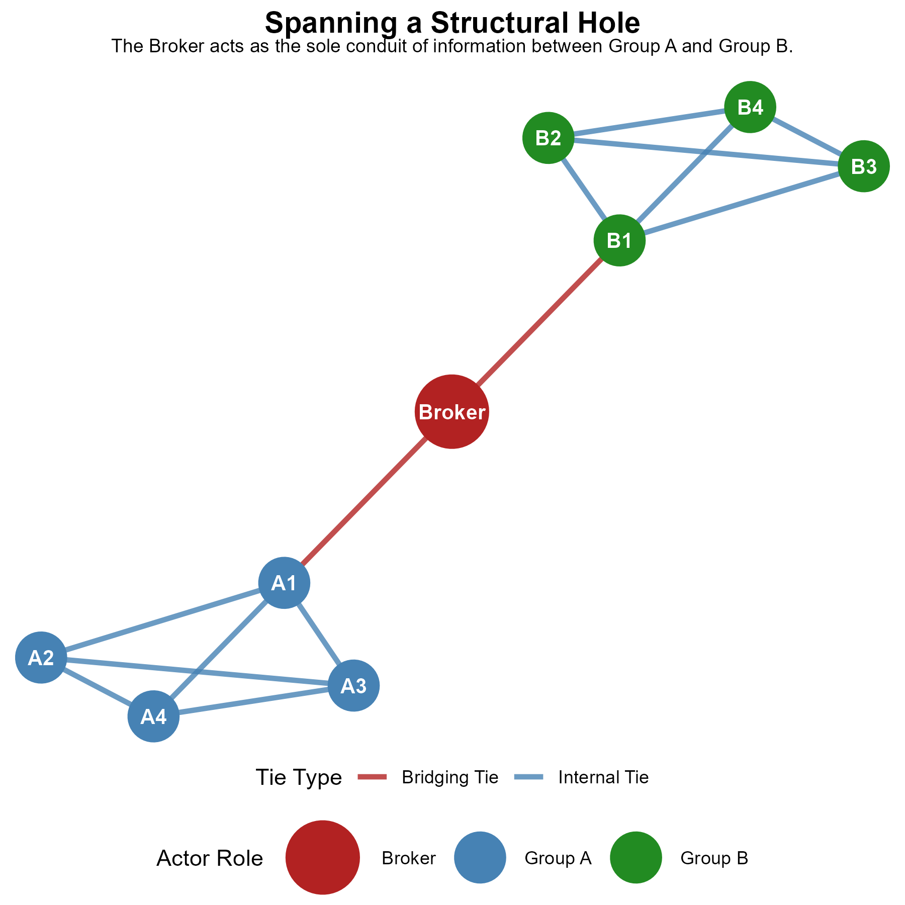
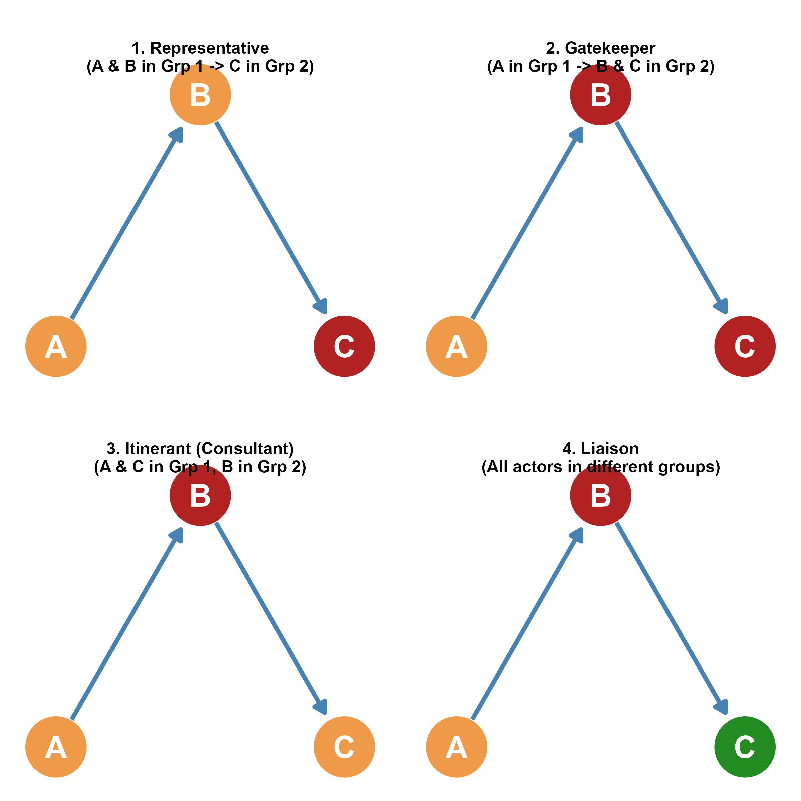

## From Dyads to Triads: Introduction to Brokerage

- In network analysis, moving from **dyads** (two nodes) to **triads** (three nodes) introduces group-level dynamics:
  - Georg Simmel (1908) argued that a third actor introduces options for alliance, conflict, and **intermediation**.

- **Intermediation** represents two-paths:
  - If node A is connected to B, and B is connected to C, but A and C are not connected, B acts as an intermediary.

- **Brokerage Opportunities**:
  - The gaps between disconnected actors represent opportunities for control and information flow.
  - Ronald Burt's **Structural Holes Theory (SHT)** (1992, 1995) formalizes these opportunities as a key source of **social capital**.

---

## What is a Structural Hole?

::: {.columns}
::: {.column width="50%"}
- **Definition**:
  - A **structural hole** is the absence of a tie between two parts of a social network.
  - In graph-theoretic terms, they are **two-paths that are not closed triangles**.

- **Open vs. Closed Networks**:
  - Densely connected groups with high **clustering** (where friends of friends are friends) lack structural holes.
  - Networks with many disconnected groups contain structural holes.
  
- **The Broker**:
  - An actor who spans or "fills" a structural hole is a **broker**.
:::

::: {.column width="50%"}
- **Structural Redundancy**:
  - Densely clustered networks have high **redundancy**—information spreads rapidly, but everyone hears the same things.
  - Spanning a structural hole allows an actor to access non-redundant information.
:::
:::

---

## Visualizing a Structural Hole

::: {.columns}
::: {.column width="45%"}
- **The Spanning Structure**:
  - Group A (blue) is internally cohesive and densely connected.
  - Group B (green) is also internally cohesive and densely connected.
  - There is a **structural hole** (gap) between Group A and Group B.
  - The **Broker** (red) is the only node connecting Group A and Group B.
  - **Result**: All information, influence, and resources flowing between the groups must pass through the broker.
:::

::: {.column width="55%"}
{fig-align="center" width="100%"}
:::
:::

---

## Twin Benefits of Structural Holes

- Ronald Burt (1995) argues that bridging structural holes delivers two primary types of social capital benefits:

- **1. Passive Exposure Effect (Information Access)**
  - Access to diverse, novel, and non-redundant information.
  - Since the connected groups do not interact, they possess different pools of knowledge.
  - The broker synthesizes these disparate inputs to generate novel ideas.

- **2. Active Control Effect (Brokerage Advantage)**
  - Power to control the flow of information (gatekeeping).
  - Ability to shape how group members perceive one another.
  - Opportunity to play disconnected actors against each other (**Tertius Gaudens**).
  - Greater behavioral freedom; brokers are less constrained by any single group's strict norms and expectations.

---

## Network Constraint: The Inverse of Structural Holes

- **Definition**:
  - The opposite of having structural holes in your network is **Network Constraint**.
  - If you have high constraint, your contacts are highly connected to one another, and you have few brokerage opportunities.

- **Characteristics of High Constraint Networks**:
  - Your ego network is highly closed (high clustering coefficient).
  - You are subject to the strong expectations of a single group.
  - You must rely on others for information rather than being an independent source.

- **Characteristics of Low Constraint Networks**:
  - Your ego network is open (many structural holes).
  - You have diverse, disconnected alters who provide unique pathways for information.

---

## Determinants of Network Constraint

- An actor's network constraint is determined by three main structural features:

- **1. Network Size (Degree)**
  - Larger networks typically have lower constraint, as it is harder for a large number of contacts to all be connected to one another.

- **2. Density (Clustering)**
  - Higher density (cohesion) among your contacts increases your network constraint, making their information redundant.

- **3. Hierarchy**
  - Hierarchy refers to the centralization of ties.
  - Constraint increases if your contacts are connected to a single central contact (i.e., they convey information to you via another alter, making you dependent on a central channel).

---

## Mathematical Formulation of Constraint

- The constraint $c_{ij}$ that alter $j$ exerts on ego $i$ is calculated as:
  $$c_{ij} = \left(p_{ij} + \sum_{q \neq i,j} p_{iq} p_{qj}\right)^2$$

- **Where**:
  - $p_{ij}$ is the proportion of ego $i$'s network investment (e.g., tie strength, time, or frequency) dedicated to alter $j$:
    $$p_{ij} = \frac{z_{ij} + z_{ji}}{\sum_{k} (z_{ik} + z_{ki})}$$
  - $\sum_{q} p_{iq} p_{qj}$ is the indirect investment of $i$ in $j$ through mutual contacts $q$.

- **Aggregate Network Constraint** ($C_i$) is the sum of dyadic constraints across all alters:
  $$C_i = \sum_{j} c_{ij}$$

---

## Empirical Findings: SHT in Corporate Settings

- Ronald Burt's empirical work (e.g., 2004, 2005) conducts extensive studies in corporate settings to test SHT.

- **Key Findings for Low Constraint (Open Network) Managers**:
  - **Higher Salaries**: Senior managers and executives with low constraint earn significantly higher compensation.
  - **Faster Promotions**: Low constraint individuals are promoted to higher ranks at a faster rate.
  - **Better Performance Evaluations**: They receive superior ratings from their organizations.

- **Rank Nuance**:
  - Constraint matters less for lower-level and entry-level managers, whose work is highly standardized.
  - For senior managers and executives, constraint is a critical predictor of performance and rewards.

---

## Idea Generation: The Broker's Creative Edge

- Why do people bridging structural holes perform better?
  - **Burt's (2004) Mechanism**: They generate **better ideas**.

- **The Idea-Generation Process**:
  - Densely clustered groups suffer from cognitive entrapment (local echo chambers).
  - Brokers sit at the intersection of different cognitive and cultural worlds.
  - By spanning structural holes, brokers can select, translate, and combine disparate concepts from different groups.
  - This synthesis leads to creative, novel, and highly valued organizational innovations.

---

## Gould & Fernandez: Typology of Brokerage Roles

::: {.columns}
::: {.column width="45%"}
- **Structural Brokerage Roles**:
  - Gould & Fernandez (1989) formalized brokerage by grouping nodes into distinct categories or partitions.
  - They identified **five distinct brokerage roles** in directed networks based on the group memberships of:
    1. The **Source** (Sender)
    2. The **Broker** (Intermediary)
    3. The **Target** (Receiver)
- These roles differentiate between within-group and between-group mediation.
:::

::: {.column width="55%"}
{fig-align="center" width="100%"}
:::
:::

---

## Within-Group vs. Between-Group Brokerage

- **1. Coordinator (Within-Group)**
  - Source, Broker, and Target all belong to the same group.
  - The Broker facilitates internal coordination and information sharing.

- **2. Itinerant Broker / Consultant (Within-Group)**
  - Source and Target belong to the same group; the Broker is an outsider.
  - The Broker provides external mediation or consulting.

- **3. Gatekeeper (Between-Group)**
  - Source is an outsider; Broker and Target are in the same group.
  - The Broker controls the flow of external resources or information into their group.

- **4. Representative (Between-Group)**
  - Source and Broker are in the same group; Target is an outsider.
  - The Broker represents their group to the external world.

- **5. Liaison (Between-Group)**
  - Source, Broker, and Target belong to three completely different groups.
  - The Broker connects disparate worlds without belonging to either.

---

## Brokerage as a Process: Action vs. Structure

- **Structure vs. Action**:
  - Obstfeld, Borgatti, and Davis (2014) argue that a structural hole is only an **opportunity**.
  - Realizing brokerage benefits requires **motivation and action**.
  - Brokerage can occur even between parties who already interact, acting as a facilitation process.

- **Three Forms of Brokerage Action**:
  - **1. Conduit**:
    - The broker transfers information, ideas, or solutions between parties to solve problems.
  - **2. Tertius Gaudens ("The third who benefits")**:
    - The broker exploits the relationship by keeping alters disconnected or encouraging conflict ("divide and conquer") to maintain control.
  - **3. Tertius Lungens ("The third who joins")**:
    - The broker actively connects or coordinates interactions between alters, potentially closing the structural hole to foster collaboration.

---

## SHT meets SWT: The Diversity-Bandwidth Tradeoff

- Aral and Van Alstyne (2011) integrate Structural Holes Theory with Strength of Weak Ties (SWT) by focusing on **information environments**.

- **The Tradeoff**:
  - **Information Diversity**: Access to unique/novel information (maximized by low constraint, weak ties, open networks).
  - **Channel Bandwidth**: The rate/frequency of communication (maximized by high constraint, strong ties, closed networks).

- **Information Complexity**:
  - Simple information (e.g., job leads, rumors) can travel through low-bandwidth weak ties.
  - Complex, tacit, or highly interdependent knowledge (e.g., learning R or programming) requires high-bandwidth strong ties.

---

## Matching Network Structure to the Environment

- The optimal network configuration depends on the diversity and complexity of the information:

- **Scenario A: High Diversity + Simple Information**
  - **Optimal Network**: Open networks with low constraint (weak ties).
  - You maximize access to diverse information at a low cost.

- **Scenario B: Low Diversity + Complex Information**
  - **Optimal Network**: Densely clustered networks with high constraint (strong ties).
  - High-bandwidth channels are necessary to transfer and synthesize complex, interdependent knowledge.

- **Low-Bandwidth Redundancy**:
  - Weak ties lose their advantage if the contacts they connect you to possess the same homogeneous information.

---

## Burt's Work on Network Dynamics: Tie Decay

::: {.columns}
::: {.column width="50%"}
- **Tie Decay and Persistence**:
  - Personal networks are dynamic. In addition to tie formation, Burt studied how relationships decay.

- **Liability of Newness**:
  - Newly formed ties are highly vulnerable and have a high probability of decaying.
  - As ties age, their probability of decay decreases (liability of newness curves outward).

- **Predictors of Tie Persistence**:
  - **Tie Age**: Older ties are extremely stable.
  - **Homophily**: Ties between similar people persist longer.
  - **Subjective Closeness**: Affective closeness increases stability.
:::

::: {.column width="50%"}
- **Structural Embeddedness**:
  - The number of mutual friends (third parties) connecting two actors dramatically lowers their probability of tie decay.
  - **Simmelian Ties**:
    - Ties embedded in a triad (where A, B, and C are all connected) are highly durable.
    - Standalone dyads decay much faster than Simmelian dyads.
:::
:::

---

## Burt's Earlier Work: Structural Equivalence

- Before developing SHT, Ronald Burt (1976) made foundational contributions to measuring social roles and positions.

- **Structural Equivalence**:
  - Two actors are structurally equivalent if they have identical ties to all other actors in the network.

- **Euclidean Distance Measure**:
  - Burt proposed using the **Euclidean Distance** ($d_{ij}$) between row vectors in the adjacency matrix to measure structural similarity:
    $$d_{ij} = \sqrt{\sum_{k \neq i,j} (x_{ik} - x_{jk})^2 + \sum_{k \neq i,j} (x_{ki} - x_{kj})^2}$$
  - A distance of $0$ indicates perfect structural equivalence.
  - This mathematical formulation became a cornerstone of deterministic **blockmodeling** techniques.

---

## Summary of Ronald Burt's SHT

- **The Value of Spanning Gaps**:
  - Gaps in social structures (structural holes) create opportunities for social capital.

- **Redundancy vs. Brokerage**:
  - Densely clustered networks (high constraint) lead to redundant information.
  - Open networks (low constraint) provide information access (passive) and control benefits (active).

- **Action is Key**:
  - Structure provides opportunities, but brokerage processes (Conduit, Tertius Gaudens, Tertius Lungens) represent the actual behavior of brokers.

- **Bandwidth Matters**:
  - Social capital is a function of both network structure and the information environment. Open networks are best for simple, diverse info; closed networks are best for complex, tacit knowledge.
