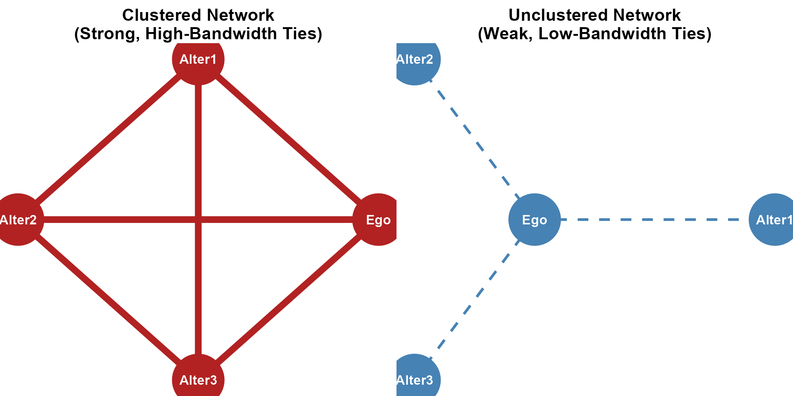
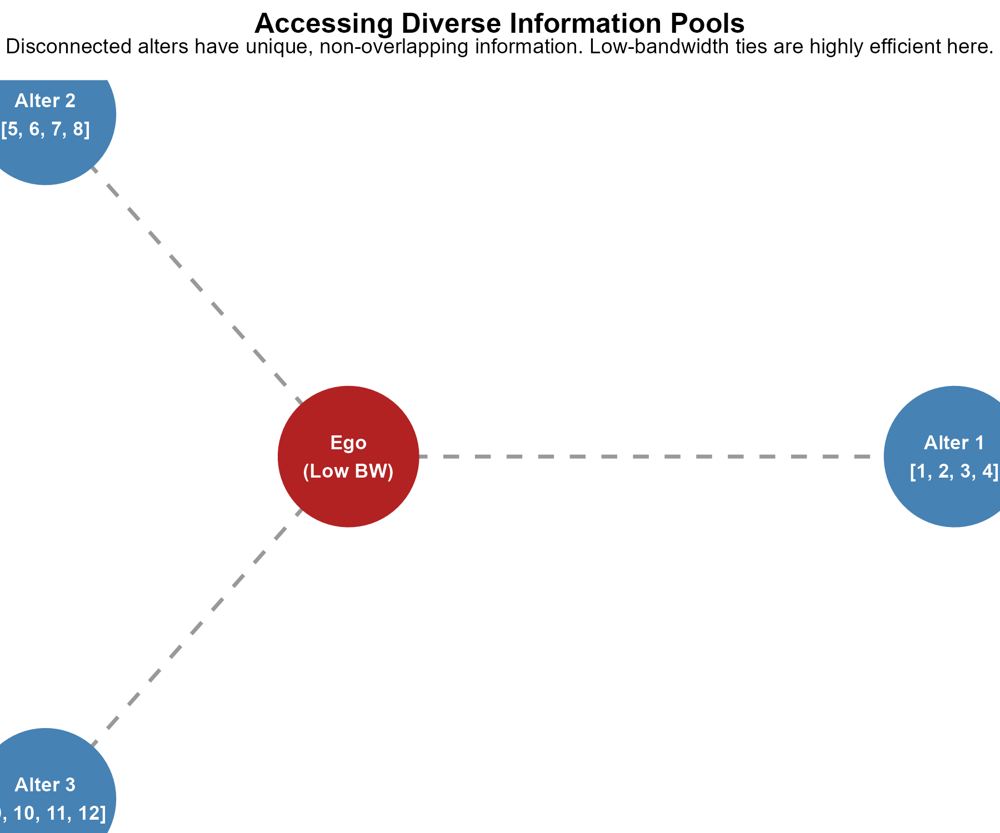
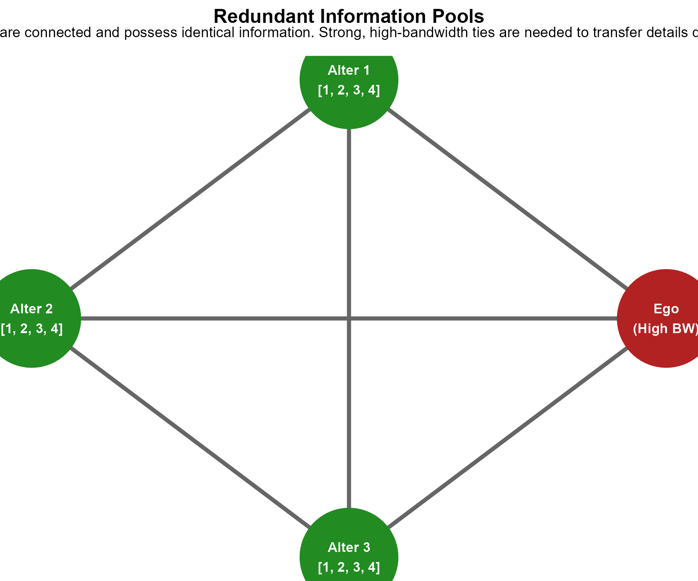
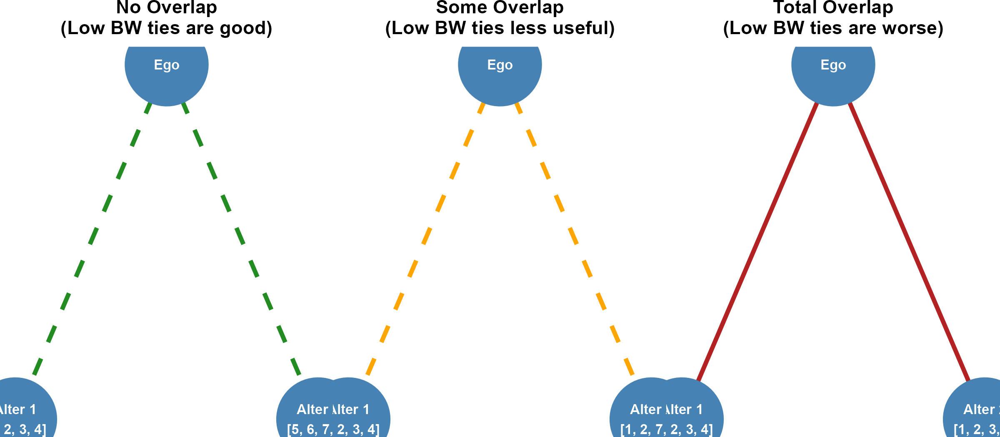

```{r setup, include=FALSE}
library(ggplot2)
library(ggraph)
library(tidygraph)
library(igraph)
library(dplyr)
library(patchwork)

# Set seed for reproducible layout of 6-node and triadic graphs
set.seed(555)

# 1. Structural Hole Live Plot
edges_sh <- data.frame(
  from = c("1","1","2","2","3", "5","5","6","6","7", "9", "9"),
  to   = c("2","3","3","4","4", "6","7","7","8","8", "1", "5")
)
nodes_sh <- data.frame(
  name = as.character(1:9),
  group = c(rep("Group A", 4), rep("Group B", 4), "Broker")
)
gr_sh <- tbl_graph(nodes = nodes_sh, edges = edges_sh, directed = FALSE)

l_coords_sh <- matrix(c(
  -1.5, 0.5,   # 1
  -2.2, 0.0,   # 2
  -1.5, -0.5,  # 3
  -2.2, -0.5,  # 4
  1.5, 0.5,    # 5
  2.2, 0.0,    # 6
  1.5, -0.5,   # 7
  2.2, -0.5,   # 8
  0.0, 0.0     # 9 (Broker)
), ncol = 2, byrow = TRUE)

p_sh <- ggraph(gr_sh, layout = "manual", x = l_coords_sh[,1], y = l_coords_sh[,2]) +
  geom_edge_link(color = "grey75", width = 1.5) +
  geom_node_point(aes(color = group), size = 14) +
  geom_node_text(aes(label = name), size = 7, fontface = "bold", color = "white") +
  scale_color_manual(values = c("Group A" = "steelblue", "Group B" = "forestgreen", "Broker" = "firebrick")) +
  theme_graph() + theme(legend.position = "none") +
  coord_cartesian(xlim = c(-2.5, 2.5), ylim = c(-1.0, 1.0), clip = "off")

# 2. Gould & Fernandez Brokerage Roles Live Plot Function
plot_brokerage <- function(node_groups, title) {
  edges_gf <- data.frame(
    from = c("A", "B"),
    to   = c("B", "C")
  )
  nodes_gf <- data.frame(
    name = c("A", "B", "C"),
    group = node_groups
  )
  g_gf <- tbl_graph(nodes = nodes_gf, edges = edges_gf, directed = TRUE)
  
  l_coords_gf <- matrix(c(
    -1.0,  0.0,  # A
     0.0,  0.8,  # B (Broker)
     1.0,  0.0   # C
  ), ncol = 2, byrow = TRUE)
  
  ggraph(g_gf, layout = "manual", x = l_coords_gf[,1], y = l_coords_gf[,2]) +
    geom_edge_link(color = "steelblue", width = 1.8,
                   arrow = arrow(length = unit(3, 'mm')),
                   end_cap = circle(7.5, 'mm'),
                   start_cap = circle(6.0, 'mm')) +
    geom_node_point(aes(color = group), size = 14) +
    geom_node_text(aes(label = name), size = 7, fontface = "bold", color = "white") +
    scale_color_manual(values = c("Group 1" = "steelblue", 
                                  "Group 2" = "forestgreen", 
                                  "Group 3" = "firebrick")) +
    labs(title = title) +
    theme_graph() + 
    coord_cartesian(xlim = c(-1.2, 1.2), ylim = c(-0.2, 1.0), clip = "off") +
    theme(plot.title = element_text(hjust = 0.5, face = "bold", size = 14, margin = margin(b = 10)),
          legend.position = "none")
}

# 3. Obstfeld Processes Live Plots
# A) Conduit (Relays info, no A-C tie)
edges_con <- data.frame(from = c("A", "B"), to = c("B", "C"))
g_con <- tbl_graph(nodes = data.frame(name = c("A", "B", "C")), edges = edges_con, directed = TRUE)
l_con <- matrix(c(-1.0, 0.0, 0.0, 0.5, 1.0, 0.0), ncol = 2, byrow = TRUE)
p_con <- ggraph(g_con, layout = "manual", x = l_con[,1], y = l_con[,2]) +
  geom_edge_link(color = "steelblue", width = 1.8, arrow = arrow(length = unit(3, 'mm')), end_cap = circle(6.5, 'mm'), start_cap = circle(5.0, 'mm')) +
  geom_node_point(size = 14, color = "tan2") +
  geom_node_text(aes(label = name), size = 7, fontface = "bold", color = "white") +
  labs(title = "Conduit Flow (Relaying)") + theme_graph() + 
  coord_cartesian(xlim = c(-1.2, 1.2), ylim = c(-0.2, 0.8), clip = "off") +
  theme(plot.title = element_text(hjust = 0.5, face = "bold", size = 14))

# B) Tertius Gaudens (Dividing, B keeps them apart/exploits)
edges_gau <- data.frame(from = c("B", "B"), to = c("A", "C"))
g_gau <- tbl_graph(nodes = data.frame(name = c("A", "B", "C")), edges = edges_gau, directed = TRUE)
l_gau <- matrix(c(-1.0, 0.0, 0.0, 0.5, 1.0, 0.0), ncol = 2, byrow = TRUE)
p_gau <- ggraph(g_gau, layout = "manual", x = l_gau[,1], y = l_gau[,2]) +
  geom_edge_link(color = "firebrick", width = 1.8, arrow = arrow(length = unit(3, 'mm')), end_cap = circle(6.5, 'mm'), start_cap = circle(5.0, 'mm')) +
  geom_node_point(size = 14, color = "tan2") +
  geom_node_text(aes(label = name), size = 7, fontface = "bold", color = "white") +
  labs(title = "Tertius Gaudens (Dividing)") + theme_graph() + 
  coord_cartesian(xlim = c(-1.2, 1.2), ylim = c(-0.2, 0.8), clip = "off") +
  theme(plot.title = element_text(hjust = 0.5, face = "bold", size = 14))

# C) Tertius Iungens (Connecting, forging a direct trust tie A-C)
# We use an undirected graph to represent the newly closed triad
edges_iun <- data.frame(
  from = c("A", "B", "A"),
  to   = c("B", "C", "C")
)
# Add an edge attribute 'type' to highlight the closed tie
g_iun <- tbl_graph(nodes = data.frame(name = c("A", "B", "C")), edges = edges_iun, directed = FALSE)
l_iun <- matrix(c(-1.0, 0.0, 0.0, 0.5, 1.0, 0.0), ncol = 2, byrow = TRUE)
# We can color the A-C link (the third edge) differently in ggraph
p_iun <- ggraph(g_iun, layout = "manual", x = l_iun[,1], y = l_iun[,2]) +
  geom_edge_link(aes(color = (node1.name == "A" & node2.name == "C") | (node1.name == "C" & node2.name == "A")), width = 1.8) +
  scale_edge_color_manual(values = c("TRUE" = "firebrick", "FALSE" = "steelblue")) +
  geom_node_point(size = 14, color = "tan2") +
  geom_node_text(aes(label = name), size = 7, fontface = "bold", color = "white") +
  labs(title = "Tertius Iungens (Connecting)") + theme_graph() + 
  coord_cartesian(xlim = c(-1.2, 1.2), ylim = c(-0.2, 0.8), clip = "off") +
  theme(plot.title = element_text(hjust = 0.5, face = "bold", size = 14), legend.position = "none")
```

## From Dyads to Triads: Introduction to Brokerage

- In network analysis, moving from **dyads** (two nodes) to **triads** (three nodes) introduces group-level dynamics:
  - Georg Simmel (1908) argued that a third actor introduces options for alliance, conflict, and **intermediation**.

- **Intermediation** represents two-paths:
  - If node A is connected to B, and B is connected to C, but A and C are not connected, B acts as an intermediary.

- **Brokerage Opportunities**:
  - The gaps between disconnected actors represent opportunities for control and information flow.
  - Ronald Burt's **Structural Holes Theory (SHT)** (1992, 1995) formalizes these opportunities as a key source of **social capital**.

---

## What is a Structural Hole?

::: {.columns}
::: {.column width="50%"}
- **Definition**:
  - A **structural hole** is the absence of a tie between two parts of a social network.
  - In graph-theoretic terms, they are **two-paths that are not closed triangles**.

- **Open vs. Closed Networks**:
  - Densely connected groups with high **clustering** (where friends of friends are friends) lack structural holes.
  - Networks with many disconnected groups contain structural holes.
  
- **The Broker**:
  - An actor who spans or "fills" a structural hole is a **broker**.
:::

::: {.column width="50%"}
- **Structural Redundancy**:
  - Densely clustered networks have high **redundancy**—information spreads rapidly, but everyone hears the same things.
  - Spanning a structural hole allows an actor to access non-redundant information.
:::
:::

---

## Visualizing a Structural Hole

::: {.columns}
::: {.column width="45%"}
- **The Spanning Structure**:
  - Group A (blue) is internally cohesive and densely connected.
  - Group B (green) is also internally cohesive and densely connected.
  - There is a **structural hole** (gap) between Group A and Group B.
  - The **Broker** (red) is the only node connecting Group A and Group B.
  - **Result**: All information, influence, and resources flowing between the groups must pass through the broker.
:::

::: {.column width="55%"}
```{r}
#| echo: false
#| fig-height: 4.8
#| fig-width: 5.5
p_sh
```
:::
:::

---

## Twin Benefits of Structural Holes

- Ronald Burt (1995) argues that bridging structural holes delivers two primary types of social capital benefits:

- **1. Passive Exposure Effect (Information Access)**
  - Access to diverse, novel, and non-redundant information.
  - Since the connected groups do not interact, they possess different pools of knowledge.
  - The broker synthesizes these disparate inputs to generate novel ideas.

- **2. Active Control Effect (Brokerage Advantage)**
  - Power to control the flow of information (gatekeeping).
  - Ability to shape how group members perceive one another.
  - Opportunity to play disconnected actors against each other (**Tertius Gaudens**).
  - Greater behavioral freedom; brokers are less constrained by any single group's strict norms and expectations.

---

## Network Constraint: The Inverse of Structural Holes

- **Definition**:
  - The opposite of having structural holes in your network is **Network Constraint**.
  - If you have high constraint, your contacts are highly connected to one another, and you have few brokerage opportunities.

- **Characteristics of High Constraint Networks**:
  - Your ego network is highly closed (high clustering coefficient).
  - You are subject to the strong expectations of a single group.
  - You must rely on others for information rather than being an independent source.

- **Characteristics of Low Constraint Networks**:
  - Your ego network is open (many structural holes).
  - You have diverse, disconnected alters who provide unique pathways for information.

---

## Determinants of Network Constraint

- An actor's network constraint is determined by three main structural features:

- **1. Network Size (Degree)**
  - Larger networks typically have lower constraint, as it is harder for a large number of contacts to all be connected to one another.

- **2. Density (Clustering)**
  - Higher density (cohesion) among your contacts increases your network constraint, making their information redundant.

- **3. Hierarchy**
  - Hierarchy refers to the centralization of ties.
  - Constraint increases if your contacts are connected to a single central contact (i.e., they convey information to you via another alter, making you dependent on a central channel).

---

## Mathematical Formulation of Constraint

- The constraint $c_{ij}$ that alter $j$ exerts on ego $i$ is calculated as:
  $$c_{ij} = \left(p_{ij} + \sum_{q \neq i,j} p_{iq} p_{qj}\right)^2$$

- **Where**:
  - $p_{ij}$ is the proportion of ego $i$'s network investment (e.g., tie strength, time, or frequency) dedicated to alter $j$:
    $$p_{ij} = \frac{z_{ij} + z_{ji}}{\sum_{k} (z_{ik} + z_{ki})}$$
  - $\sum_{q} p_{iq} p_{qj}$ is the indirect investment of $i$ in $j$ through mutual contacts $q$.

- **Aggregate Network Constraint** ($C_i$) is the sum of dyadic constraints across all alters:
  $$C_i = \sum_{j} c_{ij}$$

---

## Empirical Findings: SHT in Corporate Settings

- Ronald Burt's empirical work (e.g., 2004, 2005) conducts extensive studies in corporate settings to test SHT.

- **Key Findings for Low Constraint (Open Network) Managers**:
  - **Higher Salaries**: Senior managers and executives with low constraint earn significantly higher compensation.
  - **Faster Promotions**: Low constraint individuals are promoted to higher ranks at a faster rate.
  - **Better Performance Evaluations**: They receive superior ratings from their organizations.

- **Rank Nuance**:
  - Constraint matters less for lower-level and entry-level managers, whose work is highly standardized.
  - For senior managers and executives, constraint is a critical predictor of performance and rewards.

---

## Idea Generation: The Broker's Creative Edge

- Why do people bridging structural holes perform better?
  - **Burt's (2004) Mechanism**: They generate **better ideas**.

- **The Idea-Generation Process**:
  - Densely clustered groups suffer from cognitive entrapment (local echo chambers).
  - Brokers sit at the intersection of different cognitive and cultural worlds.
  - By spanning structural holes, brokers can select, translate, and combine disparate concepts from different groups.
  - This synthesis leads to creative, novel, and highly valued organizational innovations.

---

## Gould & Fernandez: Typology of Brokerage Roles

- Gould & Fernandez (1989) formalized brokerage by analyzing how nodes mediate directed transactions between different groups.
- They argue that brokerage is fundamentally a **triadic relationship** involving three distinct actors:
  1. The **Source** (Sender)
  2. The **Broker** (Intermediary)
  3. The **Target** (Receiver)
- By partitioning nodes into distinct social groups, they identified **five distinct brokerage roles** based on the group memberships of these three actors.
- These roles differentiate between **within-group** and **between-group intermediation**.

---

## 1. Coordinator (Within-Group Brokerage)

::: {.columns}
::: {.column width="55%"}
- **Definition**:
  - The **Source**, the **Broker**, and the **Target** all belong to the **same social group** (Group 1).
- **Core Action**:
  - The broker acts as an **internal facilitator**, helping to coordinate relations, resolve blockages, and synthesize ideas within their own cohesive cluster.
- **Sociological Significance**:
  - Highlights **local integration** and group-level cohesion, making sure internal cliques communicate smoothly.
- **Real-World Example**:
  - An **internal project manager** linking two disconnected engineers within the same department.
:::

::: {.column width="45%"}
<center>
```{r}
#| echo: false
#| fig-height: 4.8
#| fig-width: 4.8
plot_brokerage(c("Group 1", "Group 1", "Group 1"), "1. Coordinator")
```
</center>
:::
:::

---

## 2. Itinerant Broker / Consultant (Within-Group)

::: {.columns}
::: {.column width="55%"}
- **Definition**:
  - The **Source** and the **Target** belong to the **same group** (Group 1), but the **Broker** is an **outsider** (member of Group 2).
- **Core Action**:
  - The broker provides **external mediation** or **unbiased consulting**, acting as an objective intermediary between two insiders.
- **Sociological Significance**:
  - Demonstrates **impartial intermediation** where groups recruit third-party experts to facilitate internal relations.
- **Real-World Example**:
  - An **external mediator** or consultant brought in to resolve a dispute between two executives in the same company.
:::

::: {.column width="45%"}
<center>
```{r}
#| echo: false
#| fig-height: 4.8
#| fig-width: 4.8
plot_brokerage(c("Group 1", "Group 2", "Group 1"), "2. Itinerant Broker (Consultant)")
```
</center>
:::
:::

---

## 3. Gatekeeper (Between-Group Brokerage)

::: {.columns}
::: {.column width="55%"}
- **Definition**:
  - The **Source** is an **outsider** (Group 1), but the **Broker** and the **Target** belong to the **same group** (Group 2).
- **Core Action**:
  - The broker controls **inward boundary spanning**, deciding whether to admit, block, or filter external information, resources, or actors entering their group.
- **Sociological Significance**:
  - Represents **gatekeeping power**, protecting group boundaries and filtering noise.
- **Real-World Example**:
  - An **executive assistant** filtering which client calls or emails reach their supervisor.
:::

::: {.column width="45%"}
<center>
```{r}
#| echo: false
#| fig-height: 4.8
#| fig-width: 4.8
plot_brokerage(c("Group 1", "Group 2", "Group 2"), "3. Gatekeeper")
```
</center>
:::
:::

---

## 4. Representative (Between-Group Brokerage)

::: {.columns}
::: {.column width="55%"}
- **Definition**:
  - The **Source** and the **Broker** belong to the **same group** (Group 1), while the **Target** is an **outsider** (Group 2).
- **Core Action**:
  - The broker controls **outward boundary spanning**, acting as a spokesperson or link who represents their group to the external world.
- **Sociological Significance**:
  - Represents **external representation**, projecting group voice and managing outgoing resources.
- **Real-World Example**:
  - A **PR officer** or **sales representative** presenting their department's work to external clients.
:::

::: {.column width="45%"}
<center>
```{r}
#| echo: false
#| fig-height: 4.8
#| fig-width: 4.8
plot_brokerage(c("Group 1", "Group 1", "Group 2"), "4. Representative")
```
</center>
:::
:::

---

## 5. Liaison (Between-Group Brokerage)

::: {.columns}
::: {.column width="55%"}
- **Definition**:
  - The **Source** (Group 1), the **Broker** (Group 2), and the **Target** (Group 3) all belong to **three completely different groups**.
- **Core Action**:
  - The broker provides **cross-boundary mediation**, linking entirely disparate social worlds without belonging to either. This is the **most expansive** and least constrained form of brokerage.
- **Sociological Significance**:
  - Acts as a **structural bridge** connecting disconnected societies, vital for systemic innovation.
- **Real-World Example**:
  - A **real estate agent** connecting a buyer from one city with a seller from another.
:::

::: {.column width="45%"}
<center>
```{r}
#| echo: false
#| fig-height: 4.8
#| fig-width: 4.8
plot_brokerage(c("Group 1", "Group 2", "Group 3"), "5. Liaison")
```
</center>
:::
:::

---

## Brokerage as a Process: Action vs. Structure

- **Action vs. Structure**:
  - Obstfeld, Borgatti, and Davis (2014) argue that a structural hole is only a **structural opportunity**.
  - Realizing the benefits of brokerage requires **motivation and active social action**.
  - They decouple brokerage behavior from network structure:
    - Brokerage can occur even between parties who **already interact**, acting as a facilitation process.
    - Having a structural hole does **not guarantee** that brokerage will take place.
- **Strategic Orientations**:
  - They distinguish between **three primary brokerage orientations (behaviors)**:
    1. **Conduit**: Ego mediates information/resource flows.
    2. **Tertius Gaudens**: Ego exploits gaps and keeps alters disconnected.
    3. **Tertius Iungens**: Ego actively connects and unites alters.

---

## 1. The Conduit Process

::: {.columns}
::: {.column width="55%"}
- **Core Action**:
  - The broker simply **transfers information, ideas, or solutions** between two parties without attempting to change the underlying relationship between them.
- **Key Characteristics**:
  - B acts as a **passive transmitter** or **relay**.
  - Alters A and C may never meet, or even become aware of each other's existence.
  - Value is generated through the **synthesis** of disparate knowledge bases.
- **Real-World Example**:
  - A **retailer** who buys products from manufacturers (A) and sells them to consumers (C) without connecting them directly.
:::

::: {.column width="45%"}
<center>
```{r}
#| echo: false
#| fig-height: 4.5
#| fig-width: 4.5
p_con
```
</center>
:::
:::

---

## 2. The Tertius Gaudens Orientation

::: {.columns}
::: {.column width="55%"}
- **Core Action**:
  - Translating from Latin to **"the third who benefits"** (Simmel, 1950), the broker actively exploits the separation of alters.
- **Key Characteristics**:
  - B stands between A and C and **maintains the gap**, keeping them disconnected or actively **encouraging conflict/competition** between them.
  - Also known as **divide et impera** (**divide and conquer**).
  - Maximizes the broker's **control advantage** and **information arbitrage**.
- **Real-World Example**:
  - A **manager** who prevents two employees from collaborating directly so they remain dependent on the manager for coordination and praise.
:::

::: {.column width="45%"}
<center>
```{r}
#| echo: false
#| fig-height: 4.2
#| fig-width: 4.2
# Let's draw the Tertius Gaudens plot where B separates A and C
g_tg <- tbl_graph(nodes = data.frame(name=c("A", "B", "C"), group=c("Group 1", "Group 2", "Group 1")),
                  edges = data.frame(from=c("B", "B"), to=c("A", "C")), directed=TRUE)
l_coords_tg <- matrix(c(-1.0, 0.0,  0.0, 0.8,  1.0, 0.0), ncol=2, byrow=TRUE)
ggraph(g_tg, layout = "manual", x = l_coords_tg[,1], y = l_coords_tg[,2]) +
  geom_edge_link(color = "steelblue", width = 1.8, arrow = arrow(length = unit(3, 'mm')), end_cap = circle(7.5, 'mm'), start_cap = circle(6.0, 'mm')) +
  geom_node_point(aes(color = group), size = 14) +
  geom_node_text(aes(label = name), size = 7, fontface = "bold", color = "white") +
  scale_color_manual(values = c("Group 1" = "steelblue", "Group 2" = "forestgreen")) +
  theme_graph() + theme(legend.position = "none") +
  coord_cartesian(xlim = c(-1.2, 1.2), ylim = c(-0.2, 1.0), clip = "off")
```
</center>
:::
:::

---

## 3. The Tertius Iungens Orientation

::: {.columns}
::: {.column width="55%"}
- **Core Action**:
  - Translating from Latin to **"the third who joins"** (Obstfeld, 2005), the broker actively connects or facilitates interactions between alters.
- **Key Characteristics**:
  - B **introduces A and C**, closing the structural hole by creating a new direct connection between them.
  - Focuses on **coordinating collaborative action**, **joint problem-solving**, and **building trust**.
  - Ego may step back after introducing them (**introduce-and-depart**), sacrificing their long-term structural advantage for immediate collaborative value.
- **Real-World Example**:
  - A **matchmaker** who introduces two entrepreneurs with complementary skills to start a new business together.
:::

::: {.column width="45%"}
<center>
```{r}
#| echo: false
#| fig-height: 4.5
#| fig-width: 4.5
p_iun
```
- A new **direct relationship link** is forged between A and C (highlighted in red), closing the structural hole.
</center>
:::
:::

---

## Decoupling Action from Structure: The Obstfeld Matrix

- Obstfeld et al. (2014) summarize how **three strategic orientations** manifest under **two network structures** (Open vs. Closed), completely decoupling action from structural holes:

| Network Structure | **Conduit** | **Tertius Gaudens** | **Tertius Iungens** |
|:---|:---|:---|:---|
| **Open Network** <br> *(Absence of A-C tie)* | **Information Transfer**:<br>B transfers information, knowledge, or resources between A and C where they have no prior connection. | **Arbitrage & Separation**:<br>B plays A and C against one another, or actively keeps them apart to maintain control. | **Introducing Alters**:<br>B introduces A and C, closing the structural hole by creating a new tie. |
| **Closed Network** <br> *(Presence of A-C tie)* | **Facilitated Synthesis**:<br>B facilitates transfer between already-connected A and C and helps synthesize new knowledge. | **Divide et Impera (Divide & Rule)**:<br>B cultivates conflict, competition, or separation between A and C. | **Coordinated Collaboration**:<br>B coordinates new collaborative action or deepens partnership between A and C. |

---

## SHT meets SWT: The Diversity-Bandwidth Tradeoff

- Aral and Van Alstyne (2011) extend Granovetter's Strength of Weak Ties (SWT) theory by incorporating **temporal flow** and **information complexity**.

- **Static vs. Dynamic View**:
  - Granovetter's original theory conceives of tie properties (e.g., tie strength) in static terms.
  - In reality, information transmission and access are **events that happen in time**.

- **The Core Tradeoff**:
  - Accessing novel information through social networks involves a tradeoff between **information diversity** and **channel bandwidth**.

---

## Visualizing Bandwidth vs. Clustering

::: {.columns}
::: {.column width="45%"}
- **Two Network Configurations**:
  - **High Bandwidth + High Clustering**:
    - Densely connected networks where strong ties facilitate rapid, frequent communication.
  - **Low Bandwidth + Low Clustering**:
    - Sparse, open networks where weak ties connect ego to disconnected contacts at lower transmission rates.
:::

::: {.column width="55%"}
{fig-align="center" width="100%"}
:::
:::

---

## What is Tie Bandwidth?

- **Tie Bandwidth**:
  - The rate or frequency at which information is transmitted through a social tie.
  - **Weak Ties** = Low bandwidth (slower, less frequent communication events).
  - **Strong Ties** = High bandwidth (faster, highly frequent communication events).

- **The Tradeoff Paradox**:
  - Weak ties offer high **diversity** (access to novel circles) but low **bandwidth**.
  - Strong ties offer high **bandwidth** but low **diversity** (due to triadic closure and local redundancy).

---

## Information Complexity & Channel Capacity

- **Simple Information**:
  - Simple, non-complex details (e.g., job leads, rumors, product recommendations).
  - Easily transmitted through **low-bandwidth weak ties**.

- **Complex Information**:
  - Tacit, highly interdependent, or complex knowledge (e.g., learning R programming, complex organizational procedures).
  - Requires **high-bandwidth strong ties** due to:
    - Higher trust, intimacy, and cooperativeness.
    - Better shared memory of "who knows what."
    - Active problem-solving and collective synthesis.

---

## Accessing Diverse Information Pools

::: {.columns}
::: {.column width="45%"}
- **Condition for Weak Ties**:
  - Low-bandwidth (weak) ties are highly efficient when contacts possess **diverse, non-overlapping information pools**.
  
- **Visual Example**:
  - Alter 1 knows `[1, 2, 3, 4]`.
  - Alter 2 knows `[5, 6, 7, 8]`.
  - Alter 3 knows `[9, 10, 11, 12]`.
  - Because their information does not overlap, Ego maximizes diversity at minimal bandwidth cost.
:::

::: {.column width="55%"}
{fig-align="center" width="100%"}
:::
:::

---

## Redundant Information Pools

::: {.columns}
::: {.column width="45%"}
- **Condition for Strong Ties**:
  - Weak ties lose their advantage if contacts are connected and possess **redundant/homogeneous information**.
  
- **Visual Example**:
  - Alters talk to each other and all know `[1, 2, 3, 4]`.
  - Low-bandwidth ties simply receive the same redundant information slowly.
  - In this case, **strong, high-bandwidth ties are better** because they provide faster, deeper access to the complex details of `[1, 2, 3, 4]`.
:::

::: {.column width="55%"}
{fig-align="center" width="100%"}
:::
:::

---

## The Information Overlap Spectrum

::: {.columns}
::: {.column width="45%"}
- **Tie Preferences and Overlap**:
  - The choice between low-bandwidth and high-bandwidth ties depends on the **degree of information overlap** among contacts:
  - **No Overlap**: Low-bandwidth ties are highly effective.
  - **Some Overlap**: Low-bandwidth ties start losing their efficiency.
  - **Total Overlap**: Low-bandwidth ties are worse; high-bandwidth channels are preferred to transfer complex details quickly.
:::

::: {.column width="55%"}
{fig-align="center" width="100%"}
:::
:::

---


## Summary of Ronald Burt's SHT

- **The Value of Spanning Gaps**:
  - Gaps in social structures (structural holes) create opportunities for social capital.

- **Redundancy vs. Brokerage**:
  - Densely clustered networks (high constraint) lead to redundant information.
  - Open networks (low constraint) provide information access (passive) and control benefits (active).

- **Action is Key**:
  - Structure provides opportunities, but brokerage processes (Conduit, Tertius Gaudens, Tertius Lungens) represent the actual behavior of brokers.

- **Bandwidth Matters**:
  - Social capital is a function of both network structure and the information environment. Open networks are best for simple, diverse info; closed networks are best for complex, tacit knowledge.
