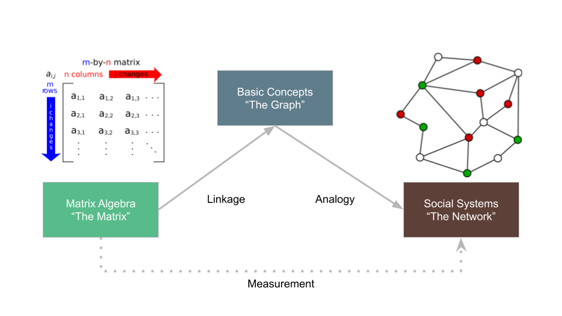
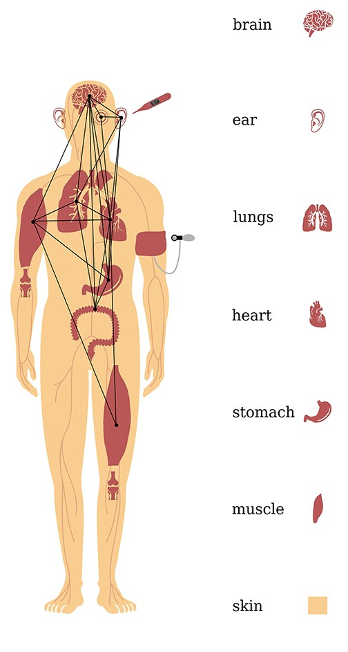

```{r setup, include=FALSE}
library(ggplot2)
library(ggraph)
library(tidygraph)
library(igraph)
library(dplyr)
library(kableExtra)
library(patchwork)
library(factoextra)

# Reusable 5-node undirected graph for subgraphs/cliques
nodes_5 <- data.frame(name = c("B", "E", "C", "D", "A"), x = c(0, 1, 2, 2, 3), y = c(0, 0, 1, -1, 0))
edges_undir <- data.frame(from = c(1, 2, 2, 3, 4, 3), to = c(2, 3, 4, 5, 5, 4)) # B-E, E-C, E-D, C-A, D-A, C-D
gr_undir <- tbl_graph(nodes = nodes_5, edges = edges_undir, directed = FALSE)

# 4-node clique
gr_clique_4 <- create_complete(4) %>% mutate(name = 1:4)
# 5-node clique
gr_clique_5 <- create_complete(5) %>% mutate(name = 1:5)
```

# Part 1: Cohesion, Subgroups, & The Anti-Categorical Imperative

---

## Levels of Analysis in Social Networks

::: {.incremental}
- In social network analysis, we navigate several nested levels of structure:
  1. **Individual (Micro-Node)**: Node centrality, roles, and actor attributes.
  2. **Dyads (Subgraphs of Order 2)**: Core ties, reciprocity, and direct sentiment.
  3. **Triads (Subgraphs of Order 3)**: Brokerage, balance, and small-group transitivity.
  4. **Subgroups, Cliques, & Communities**: Meso-level clusters of cohesive actors.
  5. **Whole Network (Macro)**: Global density, diameter, and centralization.
- The **Subgroup Level** acts as the crucial bridge between micro-interactions and macro-network systems.
:::

---

## The Anti-Categorical Imperative

:::: {.columns}

::: {.column width="65%"}
::: {.incremental}
- Traditional sociology often divides people into **pre-existing categories** (race, gender, age cohorts, occupations, social classes).
- **The Anti-Categorical Imperative** (Emirbayer & Goodwin, 1994):
  - SNA rejects the idea that pre-defined category labels are the best way to understand social groups or positions.
  - Instead, we must use the **patterns of actual interconnections** in social networks to discover groups and assign people to social positions.
:::
:::

::: {.column width="35%"}
{fig-align="center" width="100%"}
:::

::::

---

## Group vs. Social Position

::: {.incremental}
- In network analysis, **partitioning** (splitting) the nodes in a graph leads to two fundamentally distinct imageries:
  1. **The Group Approach**:
     - Subsets of nodes that are **strongly and densely interconnected** among themselves (e.g., a tight circle of friends).
     - Logically implies direct or near-direct co-membership.
  2. **The Positional Approach**:
     - Subsets of nodes that share **similar patterns of connectivity with others**, without necessarily being connected to one another.
     - e.g., all doctors in NYC and LA occupy the same social role but don't know each other.
- Today, we cover the main varieties of the **Group Approach**.
:::

---

## Translating "Groups" to Graph Theory

:::: {.columns align=center}

::: {.column width="60%"}
::: {.incremental}
- "Group," "community," or "clique" are intuitive but fuzzy sociological concepts.
- **Graph-Theoretic Translation**:
  - A cohesive subgroup is a relatively dense subgraph featuring more links among the subset of vertices that belong to the subgraph than links to vertices in the rest of the graph.
  - Formally, we define these subgraphs using criteria with varying degrees of strictness, ranging from perfect completeness (density = 1.0) to relaxed degree and distance bounds.
:::
:::

::: {.column width="40%"}
```{r}
#| echo: false
#| fig-align: "center"
#| fig-width: 5.5
#| fig-height: 5.5
ggraph(gr_undir, layout = "manual", x = x, y = y) +
  geom_edge_link(color = "steelblue", edge_width = 1.5) +
  geom_node_point(size = 20, color = "tan2") +
  geom_node_text(aes(label = name), size = 10, fontface = "bold", color = "white") +
  theme_graph() + coord_cartesian(clip = "off")
```
:::

::::

# Part 2: Cliques & Cliques as Affiliation Networks

---

## Graphs and Subgraphs: A Review

::: {.incremental}
- Recall that a subgraph $G' = (V', E')$ of a graph $G = (V, E)$ exists when:
  - $V' \subseteq V$ (the node subset)
  - $E' \subseteq E$ (the edge subset)
- A subgraph is **maximal** with respect to a given property if:
  - No additional nodes or edges from the larger graph can be added to the subgraph without losing that property.
  - For example, a "maximal connected subgraph" is a **component**.
- We use the principle of **maximality** to define cohesive subgroups.
:::

---

## What is a Clique?

:::: {.columns align=center}

::: {.column width="60%"}
::: {.incremental}
- **Clique** (Luce & Perry, 1949):
  - A maximally complete subgraph where every node is directly connected to every other node (density = 1.0).
  - e.g., a closed triad is a clique of size 3!
- **Size of a Clique**:
  - The number of vertices in it (clique of size 3, size 4, size 5, etc.).
  - Overlapping cliques are common; the same actor can belong to multiple cliques simultaneously, acting as a crucial bridge.
:::
:::

::: {.column width="40%"}
```{r}
#| echo: false
#| fig-align: "center"
#| fig-width: 5.5
#| fig-height: 5.5
ggraph(gr_clique_4, layout = "circle") +
  geom_edge_link(color = "steelblue", edge_width = 1.5) +
  geom_node_point(size = 20, color = "tan2") +
  geom_node_text(aes(label = name), size = 10, fontface = "bold", color = "white") +
  theme_graph() + ggtitle("Clique of Size 4") + coord_cartesian(clip = "off") +
  theme(plot.title = element_text(size = 14, face = "bold", hjust = 0.5))
```
:::

::::

---

## Overlapping Cliques & Nestedness

:::: {.columns align=center}

::: {.column width="60%"}
::: {.incremental}
- Nodes can belong to multiple cliques at once for two reasons:
  - **Nestedness**: Smaller cliques are nested within larger ones (e.g., inside a clique of size 4, there are 4 separate cliques of size 3!).
  - **Intersection**: Two distinct cliques can share a subset of nodes.
  - In the figure, node $D$ is shared by a clique of size 4 and a clique of size 5:
  - $$\{A, B, C, D\} \cap \{D, E, F, G, H\} = \{D\}$$
:::
:::

::: {.column width="40%"}
```{r}
#| echo: false
#| fig-align: "center"
#| fig-width: 5.5
#| fig-height: 5.5
set.seed(123)
gr_overlap <- play_islands(n_islands = 2, size_islands = 4, p_within = 1.0, m_between = 0) %>% 
  bind_edges(data.frame(from = 4, to = 5:8)) %>%
  mutate(clique = as.factor(group_leading_eigen())) 
V(gr_overlap)$name <- toupper(letters[1:length(V(gr_overlap))])
ggraph(gr_overlap, layout = 'auto') +
  geom_edge_link(color = "steelblue", edge_width = 1.5) +
  geom_node_point(aes(color = clique), size = 20) +
  geom_node_text(aes(label = name), size = 10, fontface = "bold", color = "white") +
  theme_graph() + theme(legend.position = "none") + coord_cartesian(clip = "off")
```
:::

::::

---

## Enumerating Cliques in a Network

:::: {.columns align=center}

::: {.column width="55%"}
- To analyze a network's group structure, we often **enumerate** (count) all cliques above a minimum size.
- In the graph on the right, there are **eight** cliques of size 4 or larger:
  1. $\{D, E, F, G, H\}$
  2. $\{D, E, G, H\}$
  3. $\{I, J, K, L\}$
  4. $\{A, B, C, D\}$
  5. $\{E, F, G, H\}$
  6. $\{D, F, G, H\}$
  7. $\{D, E, F, G\}$
  8. $\{D, E, F, H\}$
:::

::: {.column width="45%"}
```{r}
#| echo: false
#| fig-align: "center"
#| fig-width: 5.5
#| fig-height: 5.5
gr_enum <- play_islands(n_islands = 3, size_islands = 4, p_within = 1.0, m_between = 1) %>% 
  bind_edges(data.frame(from = 4, to = 5:8)) %>%
  bind_edges(data.frame(from = 5, to = 12)) 
V(gr_enum)$name <- toupper(letters[1:length(V(gr_enum))])
ggraph(gr_enum, layout = 'auto') +
  geom_edge_link(color = "steelblue", edge_width = 1.25) +
  geom_node_point(color = "tan2", size = 18) +
  geom_node_text(aes(label = name), size = 9, fontface = "bold", color = "white") +
  theme_graph() + coord_cartesian(clip = "off")
```
:::

::::

---

## Cliques as Affiliation Networks

::: {.incremental}
- Since cliques represent social groups, we can view clique memberships as a **bipartite (two-mode) network** (Breiger, 1974).
- We map people (Mode 1) to the cliques they belong to (Mode 2).
- This creates a **Clique Affiliation Matrix** ($C$):
  - Row $i$ represents actors, Column $j$ represents cliques of size $\ge 4$.
  - $C_{ij} = 1$ if actor $i$ is in clique $j$, else $0$.
:::

---

## The Clique Affiliation Matrix ($C$)

```{r}
#| echo: false
clique.el <- data.frame(matrix(ncol = 2, nrow = 0))
c_vec <- rep(0, length(V(gr_enum))*8)
clique.mat <- matrix(c_vec, nrow = length(V(gr_enum)))
clique.list <- cliques(gr_enum, min = 4)
len <- sapply(clique.list, length)
clique.list <- clique.list[order(len, decreasing = TRUE)]
for (i in 1:length(V(gr_enum))) {
  for (j in 1:8) {
    if (i %in% clique.list[[j]] == 1) {
      clique.mat[i,j] = 1
      clique.el <- rbind(clique.el, c(toupper(letters[i]), j))
    }
  }
}
rownames(clique.mat) <- toupper(letters[1:length(V(gr_enum))])
colnames(clique.mat) <- paste("C", 1:8, sep = "")
colnames(clique.el) <- c("Node", "Clique")

kbl(clique.mat, format = "html") %>%
  column_spec(1, bold = TRUE) %>%
  kable_styling(bootstrap_options = c("hover", "condensed", "responsive"))
```

- Node $A$ belongs to only 1 clique ($C_4$), whereas node $D$ is highly "over-committed", belonging to **6 different cliques**!

---

## Clique Co-membership & Overlap Matrices

:::: {.columns}

::: {.column width="50%"}
### Co-membership ($M = C \times C^T$)
- Cells tell us the number of cliques shared by actors $i$ and $j$.
```{r}
#| echo: false
M <- clique.mat %*% t(clique.mat)
kbl(M, format = "html") %>%
  column_spec(1, bold = TRUE) %>%
  kable_styling(bootstrap_options = c("hover", "condensed"), font_size = 14)
```
:::

::: {.column width="50%"}
### Clique Overlap ($O = C^T \times C$)
- Cells tell us the number of shared members between cliques $i$ and $j$.
```{r}
#| echo: false
O <- t(clique.mat) %*% clique.mat
rownames(O) <- paste("C", 1:8, sep = "")
colnames(O) <- paste("C", 1:8, sep = "")
kbl(O, format = "html") %>%
  column_spec(1, bold = TRUE) %>%
  kable_styling(bootstrap_options = c("hover", "condensed"), font_size = 14)
```
:::

::::

---

## The Clique Graph

:::: {.columns align=center}

::: {.column width="50%"}
::: {.incremental}
- Using the **clique overlap matrix** ($O$), we can construct a **Clique Graph** (Everett & Borgatti, 1998).
- **Clique Graph**:
  - A weighted network where **nodes are cliques** ($C_1$ to $C_8$).
  - **Edges are weighted** by the number of shared members.
  - $C_3$ (nodes $\{I, J, K, L\}$) has no members in common with any other cliques, appearing as an **isolate** in the clique graph!
:::
:::

::: {.column width="50%"}
```{r}
#| echo: false
#| fig-align: "center"
#| fig-width: 5.5
#| fig-height: 5.5
gr_cliquegraph <- graph.adjacency(O, mode="undirected", weighted=TRUE)
ggraph(gr_cliquegraph, layout = 'circle') +
  geom_edge_link(color = "steelblue", aes(edge_width = 0.2*weight)) +
  geom_node_point(shape = "circle", color = "tan2", size = 20) +
  geom_node_text(aes(label = name), size = 10, fontface = "bold", color = "white") +
  theme_graph() + theme(legend.position = "none") + coord_cartesian(clip = "off")
```
:::

::::

# Part 3: Relaxed Cliques & Distance-Based Subgroups

---

## The Limitation of Strict Cliques

::: {.incremental}
- While mathematically elegant, strict cliques (density = 1.0) are **notoriously rare** in real-world social networks.
  - Social groups are often friendly and cohesive without being perfectly complete.
  - A single missing tie in a 10-person group immediately disqualifies the entire group from being a clique!
- If we insist only on strict cliques, we miss almost all actual social grouping.
- To solve this, network analysts use **relaxed clique criteria**, focusing on distance, degree, or density bounds.
:::

---

## $n$-Cliques: Relaxing by Distance

:::: {.columns align=center}

::: {.column width="60%"}
::: {.incremental}
- Developed by Duncan Luce (1950), an **$n$-clique** is a maximal subgraph where the geodesic (shortest path) distance between any pair of nodes *within* the larger graph is at most $n$:
  - $$d(u, v) \le n \quad \text{for all } u, v \in V'$$
- **Types of $n$-cliques**:
  - **1-Clique**: A standard strict clique ($d(u, v) = 1$).
  - **2-Clique**: Every pair can reach each other in at most 2 steps ($d(u, v) \le 2$).
  - **3-Clique**: Every pair can reach each other in at most 3 steps ($d(u, v) \le 3$).
- Typically, we limit $n$ to 2 or 3; larger values make the group definition too loose to represent cohesive social groups.
:::
:::

::: {.column width="40%"}
```{r}
#| echo: false
#| fig-align: "center"
#| fig-width: 5.5
#| fig-height: 5.5
set.seed(789)
gr_nclique <- play_islands(n_islands = 3, size_islands = 4, p_within = 0.8, 1) 
V(gr_nclique)$name <- toupper(letters[1:length(V(gr_nclique))])
gr_nclique <- add_edges(gr_nclique, c("E","F", "A","H"))
ggraph(gr_nclique, layout = 'auto') +
  geom_edge_link(color = "steelblue", edge_width = 1.5) +
  geom_node_point(color = "tan2", size = 18) +
  geom_node_text(aes(label = name), size = 9, fontface = "bold", color = "white") +
  theme_graph() + coord_cartesian(clip = "off")
```
:::

::::

---

## Finding $n$-cliques in a Graph

:::: {.columns align=center}

::: {.column width="60%"}
::: {.incremental}
- In the graph on the right:
  - $\{E, F, G, H\}$ is a strict **1-clique** (complete subgraph).
  - $\{A, B, C, D, H\}$ is not complete (missing edges $\{AC, BH, DH\}$).
  - However, it forms a **2-clique**!
  - Every node can reach every other node in at most 2 steps. For example, $A$ can reach $C$ via $D$ ($A \rightarrow D \rightarrow C$) or $B$ ($A \rightarrow B \rightarrow C$).
  - The "kite" subgraph $\{I, J, K, L\}$ also forms a 2-clique.
  - $\{A, E, H, I, J, K, L\}$ forms a **3-clique**.
:::
:::

::: {.column width="40%"}
```{r}
#| echo: false
#| fig-align: "center"
#| fig-width: 5.5
#| fig-height: 5.5
ggraph(gr_nclique, layout = 'auto') +
  geom_edge_link(color = "steelblue", edge_width = 1.5) +
  geom_node_point(color = "tan2", size = 20) +
  geom_node_text(aes(label = name), size = 10, fontface = "bold", color = "white") +
  theme_graph() + coord_cartesian(clip = "off")
```
:::

::::

---

## Other Relaxations: $k$-plexes & $K$-Cores

::: {.incremental}
- Rather than distance, we can relax cliques by **degree** (the number of ties within the subgroup):
- **$k$-plex** (Seidman & Foster, 1978):
  - A subgraph of size $g$ where each member node is connected to at least $g - k$ other members of the subgraph.
  - A 1-plex is a standard clique (connected to all $g-1$ members).
  - A 2-plex allows each member to miss at most 1 tie within the group.
- **$K$-Core**:
  - A subgraph where every node is connected to at least $k$ other nodes *within the subgraph*.
  - Focuses on a minimum absolute degree threshold within the group.
:::

# Part 4: Pairwise Connectivity & Menger's Theorems

---

## Intrinsic vs. Positional Cohesion

::: {.incremental}
- What actually makes a cohesive group a group?
- **Intrinsic Cohesion**:
  - Group membership defined solely by the level of connectivity that actors share *with each other* (e.g., cliques, $n$-cliques).
- **Positional Cohesion**:
  - Group membership defined by how well-connected members are to insiders *relative to outsiders*.
  - "Group members should have more connections with people inside the group than with those outside the group" (Seidman & Foster, 1978).
- **Cohesive Subsets**: Subgraphs that satisfy both intrinsic and positional criteria.
:::

---

## Pairwise Edge Connectivity ($\lambda(u, v)$)

:::: {.columns align=center}

::: {.column width="60%"}
::: {.incremental}
- The **pairwise edge connectivity** between nodes $u$ and $v$---written $\lambda(u, v)$---is the minimum number of edges that must be removed from the graph to disconnect all paths between $u$ and $v$.
- In the graph on the right:
  - $\lambda(D, H) = 1$ (removing the single edge $DH$ disconnects them).
  - Node $D$ has degree 1, so $\lambda(D, \text{any node}) = 1$.
  - $\lambda(F, E) = 2$ (removing edge $FE$ is not enough because of the path $F \rightarrow G \rightarrow E$; we must remove both $\{FE, FG\}$ or $\{FE, EG\}$).
:::
:::

::: {.column width="40%"}
```{r}
#| echo: false
#| fig-align: "center"
#| fig-width: 5.5
#| fig-height: 5.5
set.seed(463)
gr_edgecon <- play_gnm(8, 12, directed = FALSE) %>% 
  mutate(name = toupper(letters[1:8])) 
ggraph(gr_edgecon, layout = 'kk') +
  geom_edge_link(color = "steelblue", edge_width = 1.25) +
  geom_node_point(size = 20, color = "tan2") +
  geom_node_text(aes(label = name), size = 10, fontface = "bold", color = "white") +
  theme_graph() + coord_cartesian(clip = "off")
```
:::

::::

---

## The Edge Connectivity Matrix

```{r}
#| echo: false
n_nodes <- length(V(gr_edgecon))
m_edge <- matrix(0, n_nodes, n_nodes)
for (i in 1:n_nodes) {
  for (j in 1:n_nodes) {
    if (i != j) {
      m_edge[i,j] <- edge_connectivity(gr_edgecon, source = i, target = j)
    }
  }
}
rownames(m_edge) <- toupper(letters[1:n_nodes])
colnames(m_edge) <- toupper(letters[1:n_nodes])
diag(m_edge) <- "--"

kbl(m_edge, format = "html") %>% 
  column_spec(1, bold = TRUE) %>% 
  kable_styling(bootstrap_options = c("hover", "condensed", "responsive"))
```

::: {.incremental}
- **Interpretation**: Pairwise edge connectivity represents the **strength of indirect ties** between nodes.
- In this network, nodes $E$ and $G$ have the highest edge connectivity ($\lambda(E, G) = 4$). We must remove 4 distinct edges to disconnect them!
:::

---

## Edge-Independent Paths & Menger's Theorem

:::: {.columns align=center}

::: {.column width="60%"}
::: {.incremental}
- **Theorem (Menger, 1927)**:
  - The pairwise edge connectivity $\lambda(u, v)$ is equal to the maximum number of **edge-independent paths** connecting $u$ and $v$.
  - Two paths are edge-independent if they do not share any edges.
- Since $\lambda(E, G) = 4$, there are exactly **4 edge-independent paths** connecting $E$ and $G$:
  1. $\{EG\}$ (direct link)
  2. $\{EF, FG\}$
  3. $\{EH, HB, BG\}$
  4. $\{EA, AG\}$
  - Notice that all edges in these 4 paths are completely distinct!
:::
:::

::: {.column width="40%"}
```{r}
#| echo: false
#| fig-align: "center"
#| fig-width: 5.5
#| fig-height: 5.5
ggraph(gr_edgecon, layout = 'kk') +
  geom_edge_link(color = "steelblue", edge_width = 1.25) +
  geom_node_point(size = 20, color = "tan2") +
  geom_node_text(aes(label = name), size = 10, fontface = "bold", color = "white") +
  theme_graph() + coord_cartesian(clip = "off")
```
:::

::::

---

## Pairwise Node Connectivity ($\kappa(u, v)$)

:::: {.columns align=center}

::: {.column width="60%"}
::: {.incremental}
- The **pairwise node connectivity** between two **non-adjacent** nodes $u$ and $v$---written $\kappa(u, v)$---is the minimum number of nodes that must be removed from the graph to disconnect $u$ and $v$.
- Note: Node connectivity is only defined for non-adjacent nodes (we cannot disconnect adjacent nodes by removing other nodes).
- In the graph on the right:
  - $\kappa(E, G) = 1$ (removing node $A$ completely disconnects them).
  - $\kappa(B, H) = 3$ (we must remove all three nodes $\{A, F, C\}$ to disconnect $B$ and $H$).
:::
:::

::: {.column width="40%"}
```{r}
#| echo: false
#| fig-align: "center"
#| fig-width: 5.5
#| fig-height: 5.5
set.seed(463)
gr_nodecon <- play_gnp(8, .45, directed = FALSE) %>% 
  mutate(name = toupper(letters[1:8])) 
ggraph(gr_nodecon, layout = 'kk') +
  geom_edge_link(color = "steelblue", edge_width = 1.25) +
  geom_node_point(size = 20, color = "tan2") +
  geom_node_text(aes(label = name), size = 10, fontface = "bold", color = "white") +
  theme_graph() + coord_cartesian(clip = "off")
```
:::

::::

---

## The Node Connectivity Matrix

```{r}
#| echo: false
n_nodes <- length(V(gr_nodecon))
adj_mat <- as.matrix(as_adjacency_matrix(gr_nodecon))
m_node <- matrix(0, n_nodes, n_nodes)
for (i in 1:n_nodes) {
  for (j in 1:n_nodes) {
    if (i != j & adj_mat[i, j] != 1) {
      m_node[i,j] <- vertex_connectivity(gr_nodecon, source = i, target = j)
    }
  }
}
rownames(m_node) <- toupper(letters[1:n_nodes])
colnames(m_node) <- toupper(letters[1:n_nodes])
m_node[m_node == 0] <- "--"
diag(m_node) <- "--"

kbl(m_node, format = "html") %>% 
  column_spec(1, bold = TRUE) %>% 
  kable_styling(bootstrap_options = c("hover", "condensed", "responsive"))
```

- **Menger's Theorem (Nodes)**: Pairwise node connectivity is equal to the maximum number of **node-independent paths** (paths that share no *inner nodes*) between $u$ and $v$.
- Nodes $A$ and $F$ are adjacent, but $A$ and $H$ have node connectivity $\kappa(A, H) = 5$, requiring the removal of 5 nodes $\{B, C, D, H, G\}$ to disconnect them.

# Part 5: Lambda Sets & Cohesive Blocking

---

## Using Edge Connectivity to Find Cohesive Subsets

::: {.incremental}
- We can use pairwise edge connectivity $\lambda(u, v)$ to recursively find **Lambda Sets** (Borgatti, Everett, & Shirey, 1990).
- **The Core Property of Lambda Sets**:
  - The pairwise edge connectivity between nodes *inside* a lambda set is always strictly larger than the edge connectivity between any node inside the set and any node outside the set.
  - This mathematically guarantees that group members have stronger indirect ties with each other than with any outsider!
- Let's walk through the hierarchical partition algorithm on a 16-node graph.
:::

---

## Lambda Sets: Step-by-Step Splitting

:::: {.columns}

::: {.column width="50%"}
### Step 1: Start with Graph $G$
- The edge connectivity of this graph is $\lambda(G) = 3$.
- Removing the minimum edge cutset $\{AF, AL, CP\}$ splits the graph.
```{r}
#| echo: false
#| fig-align: "center"
#| fig-width: 5.5
#| fig-height: 5.5
set.seed(456)
gr_lambda <- play_islands(4, 4, .75, 1) %>% 
  mutate(name = toupper(letters[1:16])) 
gr_lambda <- gr_lambda + edge(which(letters[1:16] == "e"),
             which(letters[1:16] == "h"))
gr_lambda <- gr_lambda + edge(which(letters[1:16] == "i"),
             which(letters[1:16] == "n"))
l_layout <- as.matrix(ggraph(gr_lambda, layout = 'kk')$data[,1:2])

plot_net_lambda <- function(x) {
  p <- ggraph(x, layout = l_layout) +
    geom_edge_link(color = "steelblue", edge_width = 1.0) +
    geom_node_point(size = 16, color = "tan2") +
    geom_node_text(aes(label = name), size = 8, fontface = "bold", color = "white") +
    theme_graph() + coord_cartesian(clip = "off")
  return(p)
}
plot_net_lambda(gr_lambda)
```
:::

::: {.column width="50%"}
### Step 2: Remove $\{AF, AL, CP\}$
- This splits the graph into a clique component $\{A, B, C, D\}$ ($\lambda = 3$) and a giant component ($\lambda = 2$).
```{r}
#| echo: false
#| fig-align: "center"
#| fig-width: 5.5
#| fig-height: 5.5
gr_l2 <- gr_lambda - edge("A|F") - edge("A|L") - edge("C|P")
plot_net_lambda(gr_l2)
```
:::

::::

---

## Lambda Sets: Step-by-Step Splitting (Cont.)

:::: {.columns}

::: {.column width="50%"}
### Step 3: Remove $\{HJ, HM\}$
- The giant component is disconnected by removing $\{HJ, HM\}$, yielding a new component and a clique of size 4.
```{r}
#| echo: false
#| fig-align: "center"
#| fig-width: 5.5
#| fig-height: 5.5
gr_l3 <- gr_l2 - edge("H|J") - edge("H|M")
plot_net_lambda(gr_l3)
```
:::

::: {.column width="50%"}
### Step 4: Remove $\{JN, IN\}$
- Disconnecting the final remaining components reveals four cohesive subgroups (cliques of size 4).
```{r}
#| echo: false
#| fig-align: "center"
#| fig-width: 5.5
#| fig-height: 5.5
gr_l4 <- gr_l3 - edge("J|N") - edge("I|N")
plot_net_lambda(gr_l4)
```
:::

::::

---

## Dendrogram of Lambda Sets

:::: {.columns align=center}

::: {.column width="50%"}
::: {.incremental}
- Because lambda sets are **hierarchically nested**, we can plot their nested relationship using a **dendrogram**.
- **Properties of Lambda Sets**:
  - At any given partition height, each node belongs to **exactly one** lambda set.
  - Smaller, tighter lambda sets are cleanly nested within larger, looser ones.
  - Excellent for showing multi-level nested structures (e.g., departments nested in divisions, nested in the firm).
:::
:::

::: {.column width="50%"}
```{r}
#| echo: false
#| fig-align: "center"
#| fig-width: 6.5
#| fig-height: 6.5
a_dend <- list()
a_dend$merge <- matrix(c(-1, -2,
                    -3, 1,
                    -4, 2,
                    -5, -6,
                    -7, 4,
                    -8, 5,
                    -9, -10,
                    -11, 7,
                    -12, 8,
                    -13, -14,
                    -15, 10,
                    -16, 11,
                     9, 12,
                     6, 13,
                     3, 14), nc=2, byrow=TRUE)
a_dend$height <- c(rep(1, 12), 3, 4, 5)
a_dend$order <- 1:16
a_dend$labels <- LETTERS[1:16]
class(a_dend) <- "hclust"
d_dend <- as.dendrogram(a_dend)
p_dend <- fviz_dend(d_dend, k = 4, k_colors = "uchicago", show_labels = TRUE, cex = 1.2, lwd = 1) +
  theme(axis.text.y = element_blank(),
        axis.title.y = element_blank(),
        axis.ticks.y = element_blank(),
        title = element_blank())
p_dend
```
:::

::::

---

## $K$-Connectivity as Structural Cohesion

::: {.incremental}
- James Moody and Douglas White (2003) proposed translating **social cohesion** directly to graph-theoretic **$k$-connectivity**:
  - **Structural Cohesion**: A social group is cohesive to the extent that it can remain connected despite the removal of members.
- **The Core Intuition**:
  - The larger the **node-cutset** (the minimum number of nodes required to disconnect a subgraph), the more integrated and robust the group is.
  - A group that requires removing 3 nodes to fragment is more cohesive than one that can be split by removing a single broker.
:::

---

## Cohesive Blocking Algorithm

::: {.incremental}
- Moody & White developed a recursive algorithm to identify nested, hierarchically organized cohesive subgroups (cohesive blocks):
  1. Identify the **node $k$-connectivity** of the input graph ($G$).
  2. Find and remove the **minimum $k$-node cutset** (the specific vertices that disconnect the graph).
  3. This splits the graph into separate connected subgraphs.
  4. Repeat steps 1–3 on each resulting subgraph recursively until no more subdivisions can be obtained.
- This creates an elegant quantitative map of social groups, moving from loose, sprawling associations down to highly integrated, resilient social cliques.
:::

# Part 6: K-Core Decomposition & Core-Periphery Structures

---

## Core-Periphery Structures

:::: {.columns align=center}

::: {.column width="60%"}
::: {.incremental}
- Many social, economic, and organizational networks are structured with:
  - A highly cohesive, densely interconnected **Core** subgroup.
  - A sparsely connected **Periphery** that links to the core but rarely to each other.
- **Key Examples**:
  - **Science**: A core of elite, heavily co-authoring scientists surrounded by a periphery of occasional authors.
  - **Global Economy**: Wealthy core countries exchanging high-value goods, surrounded by peripheral nations exporting raw materials.
:::
:::

::: {.column width="40%"}
{fig-align="center" width="90%"}
:::

::::

---

## $K$-Core Decomposition

:::: {.columns align=center}

::: {.column width="60%"}
::: {.incremental}
- How do we find cores in a messy, complex network?
- **$k$-core decomposition** is an algorithm that peels a network like an onion to find well-connected cores:
  1. Calculate the degree of all nodes.
  2. Recursively prune (remove) all nodes with **degree $< k$** (along with their edges).
  3. Nodes that remain form the **$k$-core** of the network.
  4. Increase $k$ step-by-step to reveal deeper, highly connected "shells" (k-shells).
:::
:::

::: {.column width="40%"}
```{r}
#| echo: false
#| fig-align: "center"
#| fig-width: 5.5
#| fig-height: 5.5
# Visualizing a core periphery graph structure
set.seed(329)
gr_core <- play_islands(n_islands = 1, size_islands = 12, p_within = 0.8, 0) %>%
  bind_nodes(data.frame(name = 13:18)) %>%
  bind_edges(data.frame(from = 1:6, to = 13:18))
V(gr_core)$coreness <- coreness(gr_core)
ggraph(gr_core, layout = 'kk') +
  geom_edge_link(color = "steelblue", alpha = 0.5) +
  geom_node_point(aes(color = as.factor(coreness)), size = 10) +
  geom_node_text(aes(label = 1:18), size = 4, fontface = "bold", color = "white") +
  theme_graph() + labs(color = "K-Core Shell") +
  theme(legend.position = "bottom")
```
:::

::::

---

## Visualizing $K$-Core Pruning Step-by-Step

:::: {.columns}

::: {.column width="50%"}
### Original Network ($k=0$ or $k=1$)
- Nodes on the outer edge (degrees 1) represent peripheral members.
- Pruning nodes with degree $< 2$ begins our search.
```{r}
#| echo: false
#| fig-align: "center"
#| fig-width: 5
#| fig-height: 5
ggraph(gr_core, layout = 'kk') +
  geom_edge_link(color = "steelblue", alpha = 0.5) +
  geom_node_point(color = "tan2", size = 8) +
  theme_graph()
```
:::

::: {.column width="50%"}
### The Core Remains ($k=4$)
- After recursively peeling away low-degree shells, only the **core** subgraph of tightly connected nodes survives!
```{r}
#| echo: false
#| fig-align: "center"
#| fig-width: 5
#| fig-height: 5
gr_peeled <- gr_core %>% filter(node_coreness() >= 4)
ggraph(gr_peeled, layout = 'circle') +
  geom_edge_link(color = "steelblue", edge_width = 1.0) +
  geom_node_point(color = "red", size = 8) +
  theme_graph()
```
:::

::::

---

## Mathematical Core-Periphery Models

::: {.incremental}
- To formally test for core-periphery structures, we fit **ideal blockmodels** to our observed adjacency matrix:
- **Ideal Core-Periphery Adjacency Matrix**:
  - The Core block is a 1-block (density $\approx$ 1.0).
  - The Core-to-Periphery blocks are 1-blocks (density $\approx$ 1.0, periphery is tied to the core).
  - The Periphery-to-Periphery block is a 0-block (density $\approx$ 0.0, peripheral nodes do not connect).
- $$
  \mathbf{Adj} = 
  \begin{pmatrix}
  \mathbf{Core} & \mathbf{Core/Periph} \\
  \mathbf{Periph/Core} & \mathbf{Periphery}
  \end{pmatrix}
  =
  \begin{pmatrix}
  \mathbf{1} & \mathbf{1} \\
  \mathbf{1} & \mathbf{0}
  \end{pmatrix}
  $$
- This mathematical structure allows us to predict network outcomes and analyze systemic robustness.
:::

# Part 7: Conclusion & Summary

---

## Comparing Meso-Level Structures

| Structure Type | Connectivity Criterion | Flexibility | Primary Application |
| :--- | :--- | :--- | :--- |
| **Strict Clique** | Complete adjacency (density = 1.0) | Extremely Strict | Highly intimate, close-knit friendship dyads/triads |
| **$n$-Clique** | Reachability (geodesic distance $\le n$) | Moderately Strict | Multi-step information flow, close groupings |
| **Lambda Set** | Pairwise edge-connectivity ($\lambda(u, v)$) | Structural | Robust indirect path strength, hierarchical depts |
| **Cohesive Block** | Pairwise node-connectivity ($\kappa(u, v)$) | Structural | Structural cohesion, political coalitions, solidarity |
| **$k$-Core** | Minimum degree threshold ($d \ge k$) | Algorithmic | Large-scale core-periphery peeling, finding elites |

---

## Key Takeaways

::: {.incremental}
- **Move past pre-existing categories**:
  - Following the anti-categorical imperative, look at patterns of interconnections to find social groups.
- **Strictness vs. Realism**:
  - Pure cliques are too strict for messy real-world data, prompting distance and degree-based relaxations ($n$-cliques, $k$-plexes).
- **Group Co-membership is an Affiliation Network**:
  - Intersecting cliques can be modeled using affiliation matrices ($C$) and transformed into Actor Co-membership ($C \times C^T$) and Clique Overlap ($C^T \times C$) matrices.
- **Connectivity measures social robustness**:
  - Pairwise edge and node connectivity define nested, resilient social systems (Lambda sets and Cohesive blocks).
- **Cores anchor networks**:
  - $K$-core decomposition reveals the hidden, highly connected core at the center of sprawling network systems.
:::
