# Part 1: The Taxonomy of Ties

---

## The Relational Basis of Networks

::: {.incremental}
- In social network analysis, a **graph** represents concrete **relationships** (ties) between actors.
- Not all relationships are created equal!
  - Some ties are naturally mutual (e.g., being siblings).
  - Others are directional (e.g., seeking advice).
  - Some strictly forbid mutuality (e.g., being a supervisor).
- To study networks, we must separate the **mathematical property of the relationship** (the tie type) from its **empirical realization** (the dyad or triad).
:::

---

## The Sociological Classification of Types of Ties

::: {.incremental}
- Instead of treating all connections identically, sociologists classify social ties into **four major types** ([Borgatti et al. 2009](https://doi.org/10.1126/science.1165821)):
  1. **Similarities**: Having something in common (e.g., co-location, shared attributes).
  2. **Social Relations**: Culturally recognized labels or sentiments (e.g., friend, spouse, boss).
  3. **Interactions**: Regular communication or behavior (e.g., texting, talking).
  4. **Flows**: Transmission of resources or states (e.g., virus infection, lending money).
:::

---

## States vs. Events in Social Networks

::: {.incremental}
- We can divide these four types of ties into two fundamental clusters:
- **States (Static Situations)**:
  - **Similarities** & **Social Relations**.
  - Represent continuous, long-standing conditions.
  - *Examples*: Being in the same class, being siblings, being coworker/boss.
- **Events (Discrete Activities)**:
  - **Interactions** & **Flows**.
  - Occur at specific points in time and are transient.
  - *Examples*: Texting someone, lending money, transmitting a virus.
:::

---

## Graph-Theoretic Classification of Ties

::: {.incremental}
- While sociologists classify ties by their **substantive content** (similarities, relations, interactions, flows)...
- Mathematicians and graph theorists classify ties by their **formal, directionality properties**:
  - **Symmetric Ties**: Inherently mutual and undirected ($AB \iff BA$).
  - **Asymmetric Ties**: Directional, where reciprocity is optional ($AB \implies$ optional $BA$).
  - **Anti-Symmetric Ties**: Directional, where reciprocity is forbidden ($AB \implies \neg BA$).
- **The Link**: To represent a network, we must map our sociological tie types (e.g. boss-of, friend-of) onto these three graph-theoretic classes!
:::

---

## 1. Symmetric Ties & Similarities

:::: {.columns align=center}

::: {.column width="60%"}
::: {.incremental}
- **Definition**: A relation where connection is built-in and mutual by construction:
  - Formally: $AB \iff BA$
- **Representation**: Represented by **undirected graphs**.
- **Structural Constraint**: Pairs of actors can only be **disconnected** or **connected** by a single undirected edge.
- **Symmetric Similarities**:
  - *Similarities are necessarily symmetric*:
    - If you are in the same place at the same time as someone, they are there with you.
    - If you are zooming with someone, they are zooming with you.
    - If you go to UCLA with someone, they also go to UCLA with you.
:::
:::

::: {.column width="40%"}

::: {.cell layout-align="center"}
::: {.cell-output-display}
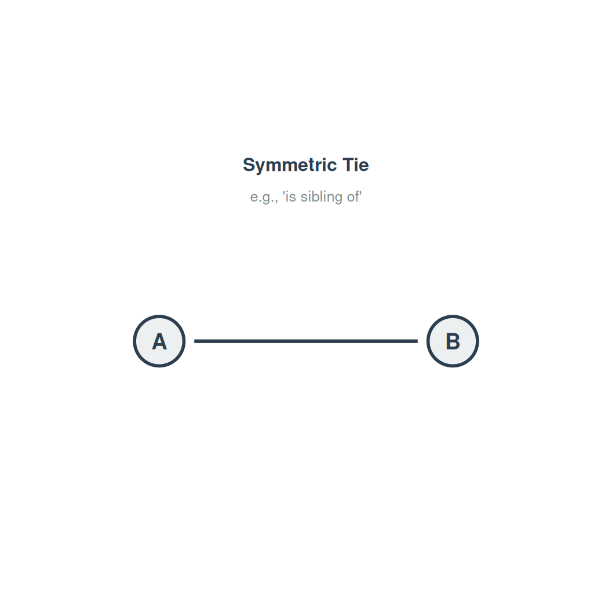{fig-align='center' width=528}
:::
:::

:::

::::

---

## 2. Asymmetric Ties & Interactions

:::: {.columns align=center}

::: {.column width="60%"}
::: {.incremental}
- **Definition**: A relation with natural directionality where reciprocity is possible but *not guaranteed*:
  - Formally: $AB \implies$ nothing about $BA$
- **Representation**: Represented by **directed graphs** (digraphs).
- **Structural Constraint**: Reciprocity is an **empirical event** (it may or may not occur), yielding three possible dyad configurations.
- **Asymmetric Interactions**:
  - *Interactions/sentiments are naturally asymmetric*:
    - You can follow someone on Twitter, but they don't have to follow you back.
    - You can send a text to someone, but they don't have to respond.
    - You can seek advice from someone without them seeking advice from you.
:::
:::

::: {.column width="40%"}

::: {.cell layout-align="center"}
::: {.cell-output-display}
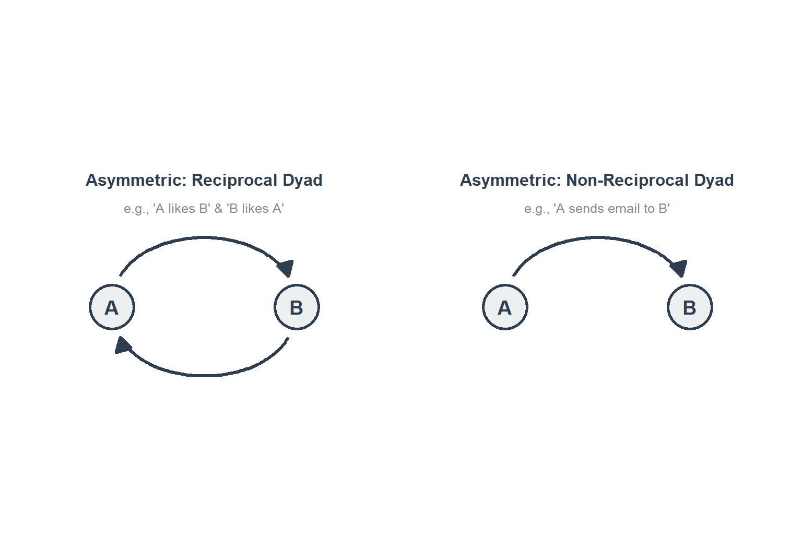{fig-align='center' width=624}
:::
:::

:::

::::

---

## 3. Anti-Symmetric Ties & Hierarchies

:::: {.columns align=center}

::: {.column width="60%"}
::: {.incremental}
- **Definition**: An inherently directional relation where reciprocity is **strictly forbidden**:
  - Formally: $AB \implies \neg BA$
- **Representation**: Represented by **directed graphs** (oriented graphs, DAGs, or trees).
- **Structural Constraint**: Reciprocity is structurally impossible, yielding only two possible dyad configurations.
- **Anti-Symmetric Hierarchies**:
  - *Hierarchical role relations are anti-symmetric*:
    - Kinship: If you are someone's parent, they cannot be your parent.
    - Formal: If you are someone's boss, they cannot be your boss at the same time.
:::
:::

::: {.column width="40%"}

::: {.cell layout-align="center"}
::: {.cell-output-display}
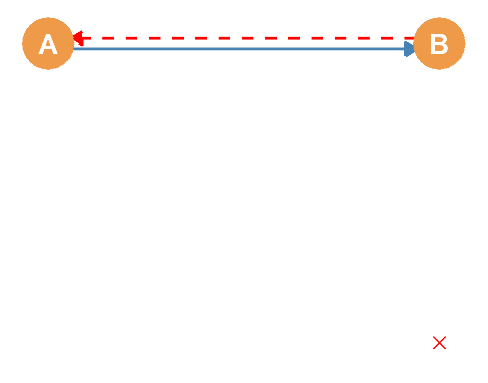{fig-align='center' width=528}
:::
:::

:::

::::

---

## Mapping Sociological to Graph-Theoretic Classifications

| Sociological Classification (Types of Ties) | Graph-Theoretic Classification (Mathematical Properties) | Allowed Dyads | Visual Graph Representation |
|:---|:---|:---|:---|
| **Co-membership, Propinquity** | **Symmetric** | • Disconnected • Connected | Undirected Graph ($A - B$) |
| **Sentiments, Advice-seeking** | **Asymmetric** | • Disconnected • Non-reciprocal • Reciprocal | Directed Graph ($A \rightarrow B$ or $A \leftrightarrow B$) |
| **Formal Hierarchies, Kinship** | **Anti-symmetric** | • Disconnected • Non-reciprocal | Oriented Graph/Tree ($A \rightarrow B$, no cycles) |

---

## Multiplexity in Social Relations

::: {.incremental}
- In real-world social networks, actors are rarely linked by only one relationship.
- **Multiplexity** refers to the presence of multiple, distinct types of ties linking the same pair of nodes simultaneously.
  - e.g., $A$ and $B$ are coworkers (**symmetric** tie) AND $A$ is the supervisor of $B$ (**anti-symmetric** tie) AND they are friends (**asymmetric** tie).
- Multiplexity adds rich, multi-layered complexity to networks, as the behavior or pattern in one relation heavily influences and moderates others.
:::

---

## Multiplexity: A Visual Example

:::: {.columns align=center}

::: {.column width="40%"}
::: {.incremental}
- **Four nodes** (diamond layout) connected by **four distinct relationship layers**:
  - **Symmetric Coworker**: (grey dotted arrows).
  - **Anti-Symmetric Supervisor-of**: (red solid arrows).
  - **Asymmetric Advice-Seeking**: (purple dashed arrows).
  - **Asymmetric/Mutual Friendship**: (green dot-dashed arrows).
- *Multi-layered ties shape complex social dynamics (e.g. supervisors who are also friends).*
:::
:::

::: {.column width="60%"}

::: {.cell layout-align="center"}
::: {.cell-output-display}
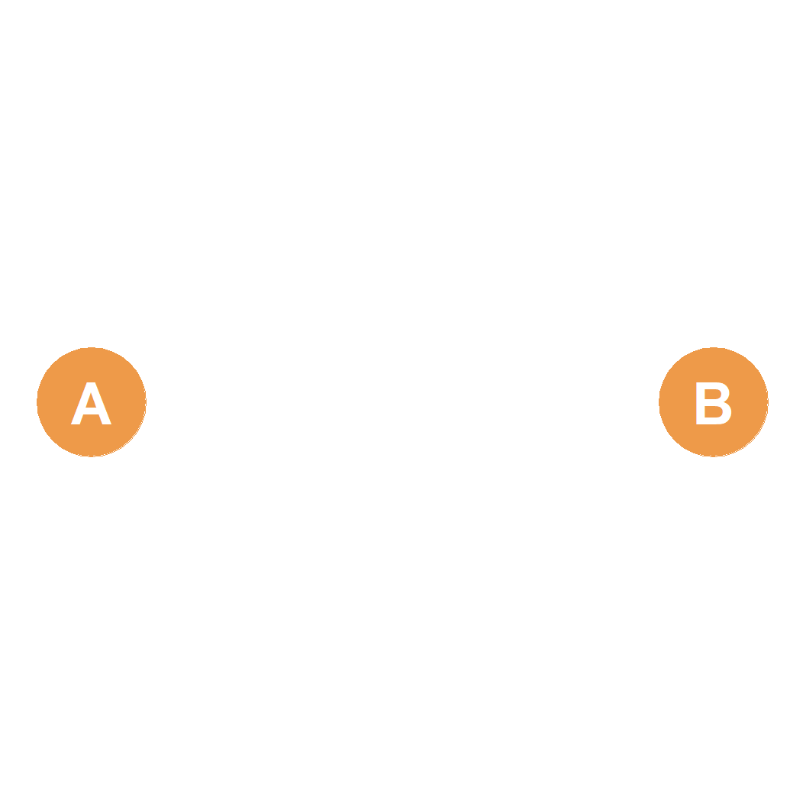{fig-align='center' width=624}
:::
:::

:::

::::

---

## The Growth of Social Networks

::: {.incremental}
- Social networks are highly dynamic, growing and evolving over time.
- A classic example of network growth is **the marriage cascade**:
  1. A romantic tie (an asymmetric, non-kin relation) forms between two individuals from separate families: `You` $\rightarrow$ `Riley`.
  2. This culminates in a marriage tie (a symmetric, kin relation): `You` $\leftrightarrow$ `Riley`.
  3. This single event immediately triggers a cascade of new "in-law" ties:
     - **Symmetric Sibling-in-Law**: between `You` $\leftrightarrow$ `Bro` and `Riley` $\leftrightarrow$ `Sis`.
     - **Anti-Symmetric Parent-in-Law**: `Parent 1` $\rightarrow$ `Riley` and `Parent 2` $\rightarrow$ `You`.
  4. This merges two previously separate, independent kinship trees into a single, cohesive, multiplex social network.
:::

# Part 2: Dyads and Their Realizations

---

## What is a Dyad?

:::: {.columns align=center}

::: {.column width="60%"}
::: {.incremental}
- A **dyad** is any pair of nodes in a graph, whether they are joined by an edge or not.
- Mathematically, a dyad is *any subgraph of order two* ($n = 2$).
- Crucially, a dyad represents the **realized configuration** of ties between two nodes.
- **Sociological Insight**: Ties that do *not* exist (disconnected dyads) are often just as socially meaningful as those that do!
- **Dyads: The Building Blocks**:
  - The simplest possible subgraph of order two.
  - Can contain zero, one, or two directed edges depending on relational constraints.
:::
:::

::: {.column width="40%"}

::: {.cell layout-align="center"}
::: {.cell-output-display}
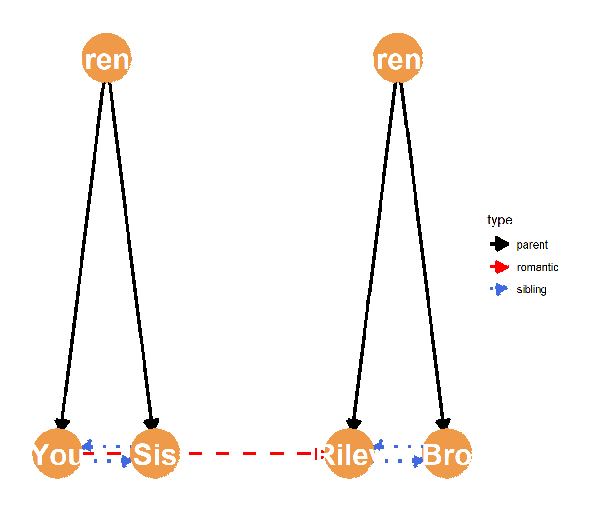{fig-align='center' width=528}
:::
:::

:::

::::

---

## Dyads under Symmetric Ties

:::: {.columns align=center}

::: {.column width="60%"}
::: {.incremental}
- Because undirected graphs do not allow directionality, a symmetric relation can only take on **two** dyadic states:
  1. **Disconnected Dyads** (historically called **null dyads**): The two nodes do not share an edge (size zero).
  2. **Connected Dyads**: The two nodes share an edge (size one).
- Every pair of actors in an undirected graph is either connected or disconnected.
:::
:::

::: {.column width="40%"}

::: {.cell layout-align="center"}
::: {.cell-output-display}
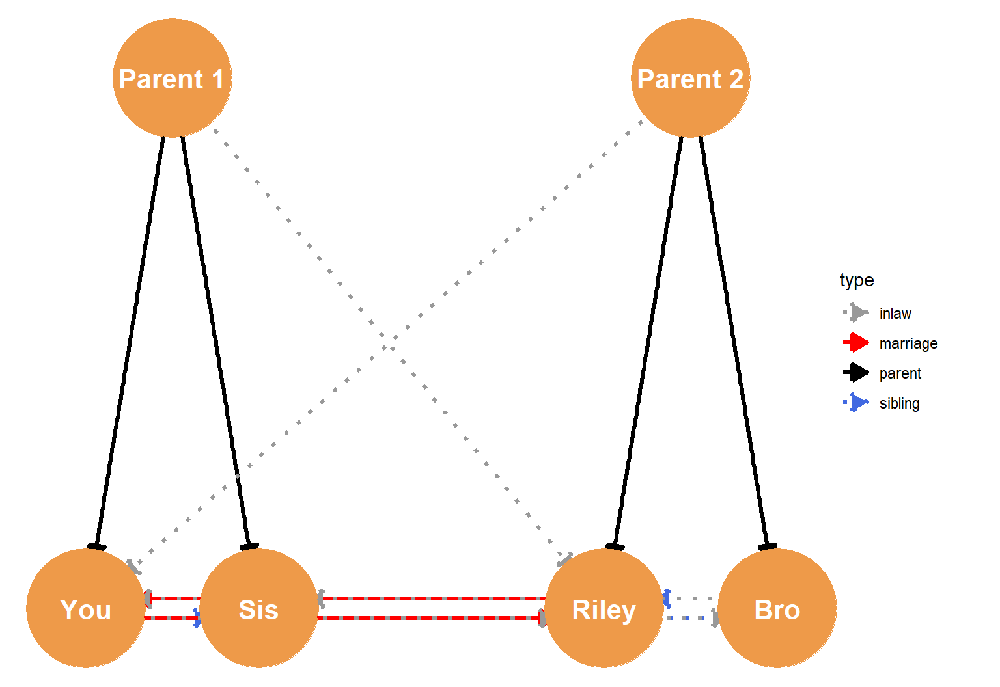{fig-align='center' width=576}
:::
:::

:::

::::

---

## Dyads under Asymmetric Ties

:::: {.columns align=center}

::: {.column width="60%"}
::: {.incremental}
- In directed graphs, reciprocity is possible but optional.
- Thus, asymmetric ties can yield **three** distinct kinds of dyads (the classic **MAN classification**):
  1. **Disconnected Dyads** (Null): Neither node sends a directed tie to the other (size zero).
  2. **Non-Reciprocal Dyads** (Asymmetric): One node sends a tie to another, but it is not reciprocated (size one).
  3. **Reciprocal Dyads** (Mutual): Both nodes send directed ties to each other (size two).
:::
:::

::: {.column width="40%"}

::: {.cell layout-align="center"}
::: {.cell-output-display}
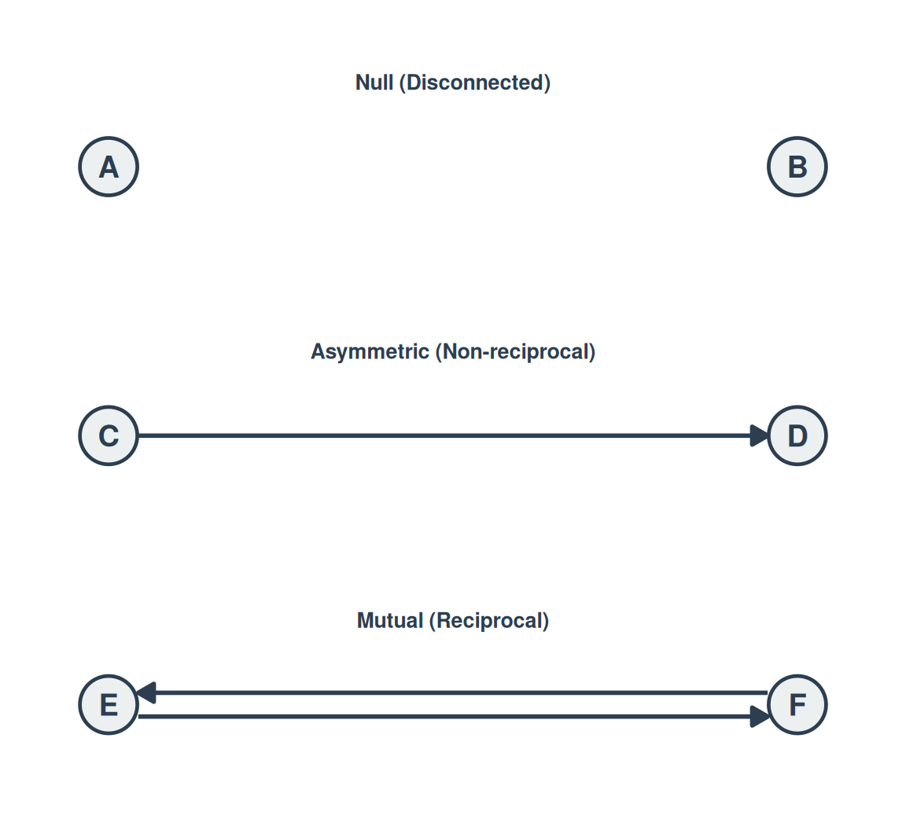{fig-align='center' width=576}
:::
:::

:::

::::

---

## Separating Tie Properties from Dyad Realizations

::: {.incremental}
- It is critical to keep the property of the **tie** separate from the property of the **dyad**:
  - **Asymmetric Tie**: Describes the type of *relation* (directionality is allowed; reciprocity is optional).
  - **Non-Reciprocal Dyad**: Describes a realized *configuration* of a pair of nodes where reciprocity failed to occur empirically.
  - **Reciprocal Dyad**: Describes an empirical configuration composed of a *pair* of directed edges under an asymmetric relation.
- Confusing "asymmetric tie" with "asymmetric dyad" is a common conceptual error!
:::

---

## Dyads under Anti-Symmetric Ties

:::: {.columns align=center}

::: {.column width="60%"}
::: {.incremental}
- Because reciprocity is strictly forbidden under anti-symmetric ties, mutual (reciprocal) dyads cannot occur.
- Therefore, anti-symmetric ties can only yield **two** types of dyads:
  1. **Disconnected Dyads**: The two nodes do not share any directed edge.
  2. **Non-Reciprocal Dyads**: Only a single one-way directed tie exists between them ($A \rightarrow B$).
- This simplifies the dyad census of hierarchical networks: every pair of nodes is either completely disconnected or connected by a strictly non-reciprocal arrow.
:::
:::

::: {.column width="40%"}

::: {.cell layout-align="center"}
::: {.cell-output-display}
{fig-align='center' width=576}
:::
:::

:::

::::

# Part 3: Triads and Motifs

---

## What is a Triad?

::: {.incremental}
- A **triad** is any set of three nodes, whether joined by edges or not.
- Mathematically, a triad is *any subgraph of order three* ($n = 3$).
- Triads have incredibly powerful sociological properties (e.g., structural balance, brokerage, coalitions).
- A triad can be thought of as a **concatenation of three dyads**: $\{A, B\}$, $\{B, C\}$, and $\{A, C\}$.
- Just like dyads, the allowed configurations of a triad depend entirely on the relational properties of its ties.
:::

---

## Triads under Symmetric Ties

:::: {.columns align=center}

::: {.column width="60%"}
::: {.incremental}
- Since undirected dyads can only be connected or disconnected, there are only **four** possible undirected triad configurations:
  1. **Null Triad**: 0 connected dyads ($DDD$).
  2. **Disconnected Triad**: 1 connected dyad ($CDD$).
  3. **Open Triad**: 2 connected dyads ($CCD$).
  4. **Closed Triad**: 3 connected dyads ($CCC$).
- These constitute the classic undirected subgraphs shown on the right.
:::
:::

::: {.column width="40%"}

::: {.cell layout-align="center"}
::: {.cell-output-display}
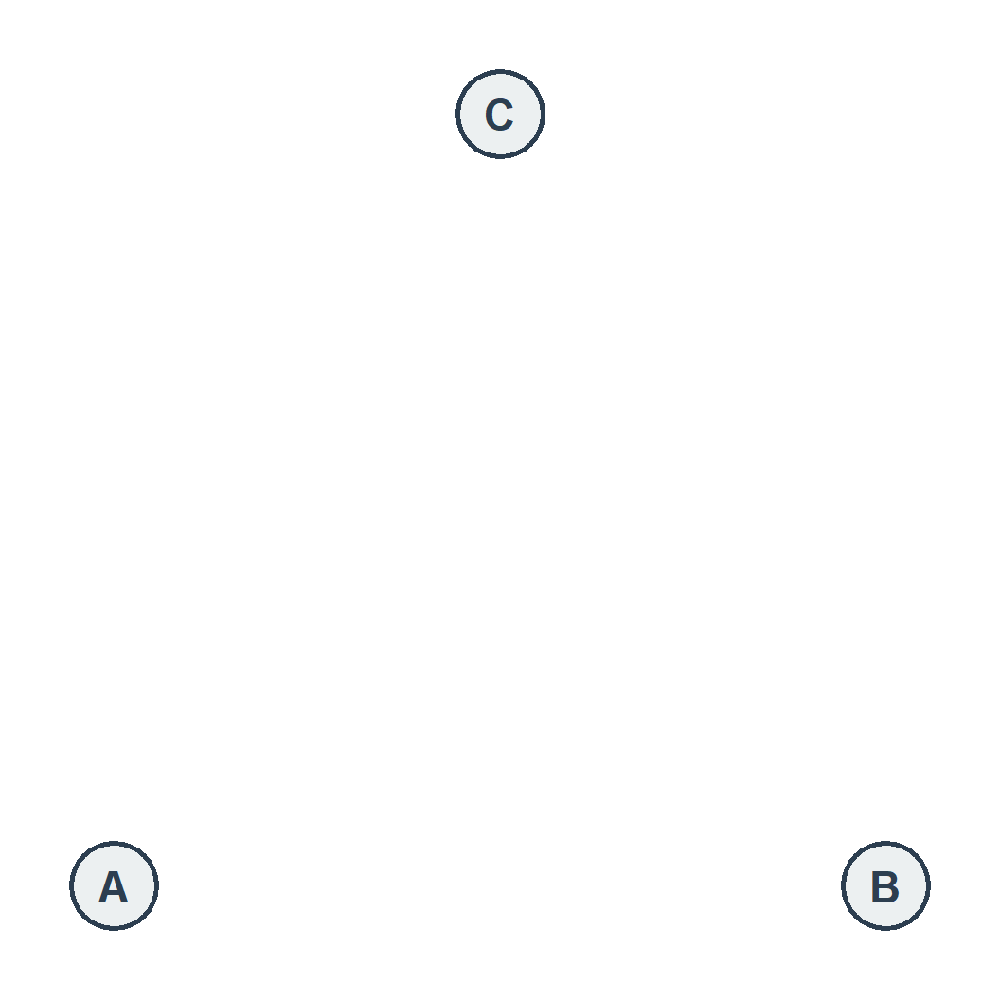{fig-align='center' width=528}
:::
:::

:::

::::

---

## The Four Undirected Triads

::: {.cell .fig-cap-location-bottom}
::: {.cell-output-display}
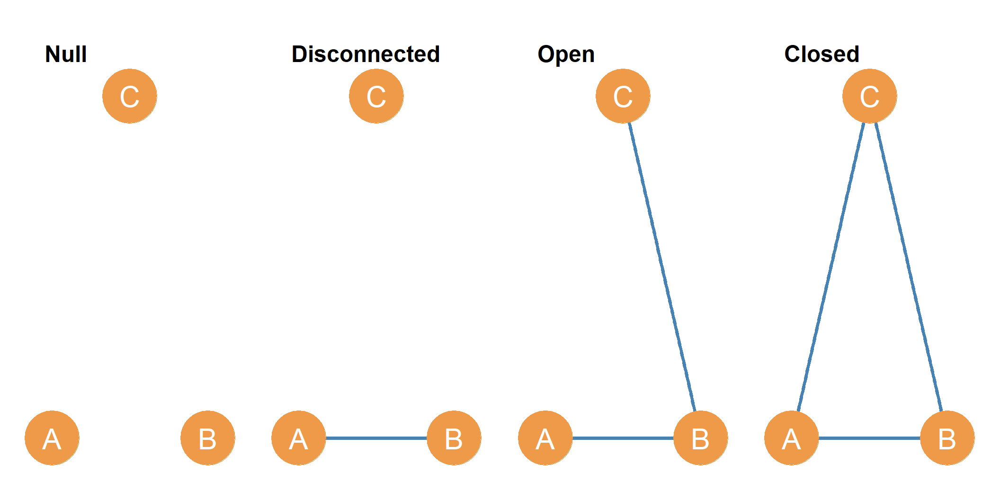{#fig-undir-triads width=1056}
:::
:::

---

## The Holland & Leinhardt (MAN) Labeling System

- Triads are classified using the standard **Holland and Leinhardt** (1970) system.
- Labels are composed of **three digits** representing:
  - **M**: Number of **Mutual** (reciprocal) dyads.
  - **A**: Number of **Asymmetric** (non-reciprocal) dyads.
  - **N**: Number of **Null** (disconnected) dyads.
- Since there are 3 node pairs, **M + A + N = 3** always.
- A trailing letter distinguishes topologies with identical counts:
  - **D** (Down): Arrows point down from a node, or into a mutual dyad.
  - **U** (Up): Arrows point up to a node, or out from a mutual dyad.
  - **C** (Cyclic / Path): Arrows form a path or a cycle.
  - **T** (Transitive): Arrows form a transitive path.

---

## Triads under Anti-Symmetric Ties

::: {.incremental}
- Because reciprocity is strictly forbidden, any triad containing a mutual connection is impossible.
- This prunes the directed triad census from **16 down to exactly seven** allowed configurations:
  1. **Null Triad** ($003$, panel 1): All three dyads are completely disconnected.
  2. **One-tie Triad** ($012$, panel 2): Contains a single non-reciprocal directed tie.
  3. **Directed Line** ($021C$, panel 3): Non-reciprocal ties form a directed path.
  4. **Out-Star Triad** ($021D$, panel 4): A single node sends ties to both other nodes.
  5. **In-Star Triad** ($021U$, panel 5): Both other nodes send ties to a single node.
  6. **Cycle Triad** ($030C$, panel 6): A directed cycle of length three ($A \rightarrow B \rightarrow C \rightarrow A$).
  7. **Transitive Hierarchy** ($030T$, panel 7): The classic transitive triad ($A \rightarrow B \rightarrow C$ and $A \rightarrow C$).
:::

---

## Anti-Symmetric Triads (Part 1)

::: {.cell layout-align="center"}
::: {.cell-output-display}
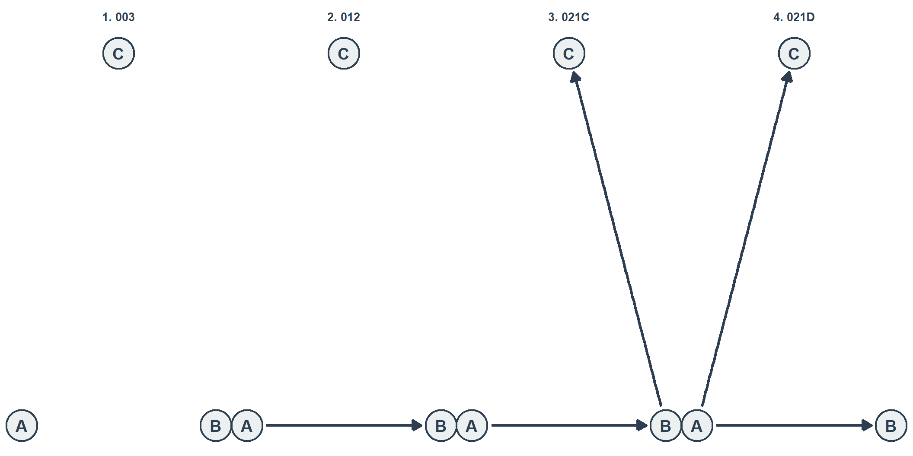{#fig-antisym-triads-slides-1 fig-align='center' width=1056}
:::
:::

---

## Anti-Symmetric Triads (Part 2)

::: {.cell layout-align="center"}
::: {.cell-output-display}
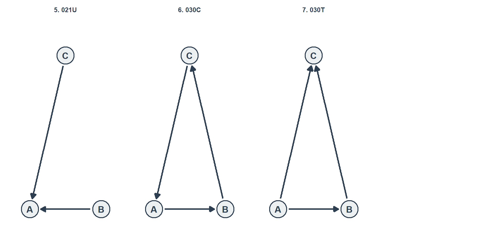{#fig-antisym-triads-slides-2 fig-align='center' width=1056}
:::
:::

---

## Anti-Symmetric Triads and Command Chains

::: {.incremental}
- This mathematical pruning simplifies the analysis of hierarchies.
- In formal organization command structures:
  - We expect to see **transitive triads** ($030T$), representing clean, unified chains of command (e.g., "the boss of my boss is my boss").
  - **Cycles** ($030C$) are structurally avoided because they generate circular authority paradoxes, where everyone takes orders from someone else in a loop.
:::

---

## Hierarchies: A Visual Example

:::: {.columns align=center}

::: {.column width="60%"}
::: {.incremental}
- On the right is a **formal organization hierarchy** built strictly from anti-symmetric ties (supervisor of):
  - Every connection flows downward.
  - The graph is completely acyclic (no loops).
  - Every node (except the President root) has an indegree of exactly 1.
- Removing the transitive and cyclic "noise" results in a clean **directed tree**.
:::
:::

::: {.column width="40%"}

::: {.cell layout-align="center"}
::: {.cell-output-display}
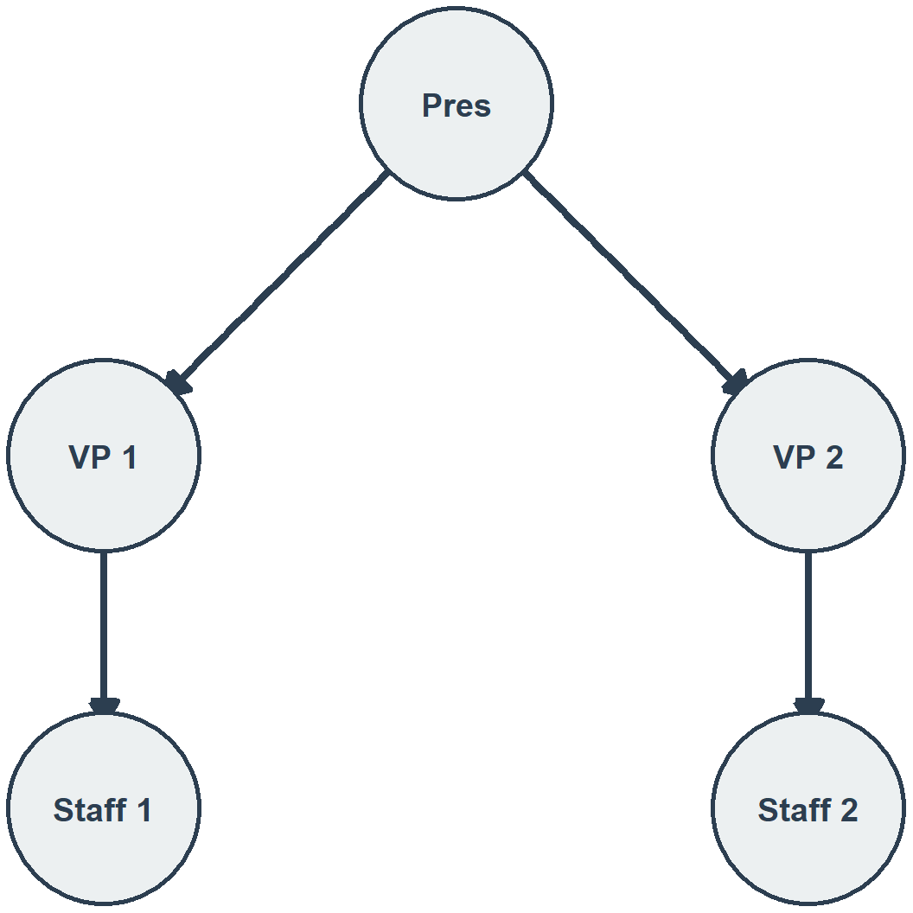{fig-align='center' width=528}
:::
:::

:::

::::

---

## Triads under Asymmetric Ties

::: {.incremental}
- When relations are asymmetric, reciprocity is allowed but optional.
- Because each dyadic slot can take on any of the **three** MAN states, we can generate all **sixteen** directed triad configurations.
- On the next slide, we show the **nine directed configurations** that require at least one **reciprocal (mutual) dyad** to exist:
  - **Single Mutual**: $102$ (panel 1), $111D$ (panel 2), $111U$ (panel 3).
  - **Double Mutual**: $201$ (panel 4).
  - **Mutual-Mixed Closed**: $120C$ (panel 5), $120D$ (panel 6), $120U$ (panel 7).
  - **Cohesive Closed**: $210$ (panel 8), $300$ (panel 9).
:::

---

## Reciprocal Triads (Part 1: Single Mutual)

::: {.cell layout-align="center"}
::: {.cell-output-display}
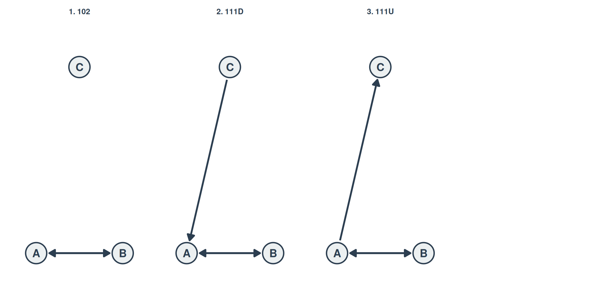{#fig-recip-triads-slides-1 fig-align='center' width=1056}
:::
:::

---

## Reciprocal Triads (Part 2: Double Mutual & Mixed Closed)

::: {.cell layout-align="center"}
::: {.cell-output-display}
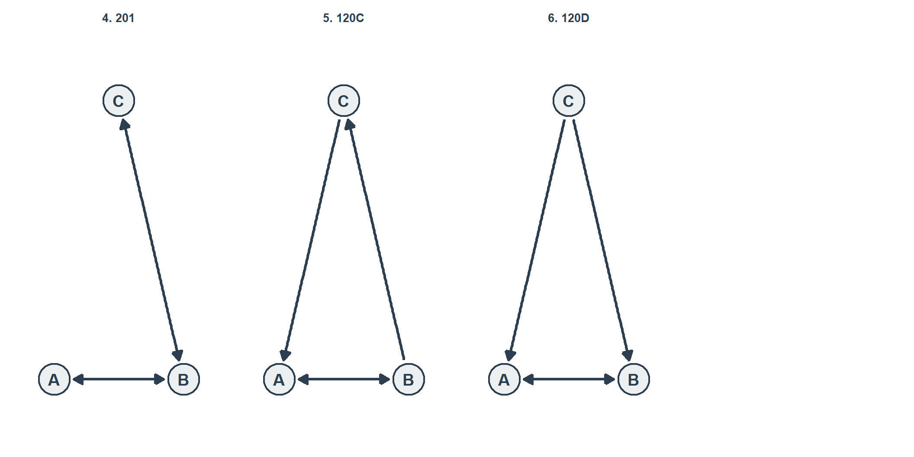{#fig-recip-triads-slides-2 fig-align='center' width=1056}
:::
:::

---

## Reciprocal Triads (Part 3: In-Star Closed & Cohesive)

::: {.cell layout-align="center"}
::: {.cell-output-display}
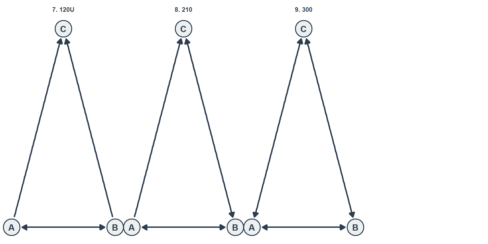{#fig-recip-triads-slides-3 fig-align='center' width=1056}
:::
:::

---

## Triad Summary: Strictly Non-Reciprocal

These 7 configurations contain **zero reciprocal (mutual) ties** (referenced in the 7-panel anti-symmetric figure):

* **0 connected dyads**:
  - **003** (Null, Anti-Symmetric panel 1)
* **1 connected dyad**:
  - **012** (Non-reciprocal, Anti-Symmetric panel 2)
* **2 connected dyads (Open)**:
  - **021C** (Directed Line, Anti-Symmetric panel 3)
  - **021D** (Out-Star, Anti-Symmetric panel 4)
  - **021U** (In-Star, Anti-Symmetric panel 5)
* **3 connected dyads (Closed)**:
  - **030C** (Directed Cycle, Anti-Symmetric panel 6)
  - **030T** (Transitive Hierarchy, Anti-Symmetric panel 7)

---

## Triad Summary: Requiring Reciprocal Ties

These 9 configurations contain **at least one reciprocal (mutual) tie** (referenced in the 9-panel reciprocal figure):

* **1 connected dyad**:
  - **102** (Reciprocal, Reciprocal panel 1)
* **2 connected dyads (Open)**:
  - **111D** & **111U** (Mixed-reciprocity, Reciprocal panels 2 & 3)
  - **201** (Double reciprocal, Reciprocal panel 4)
* **3 connected dyads (Closed)**:
  - **120C**, **120D**, & **120U** (Mixed closed, Reciprocal panels 5, 6, & 7)
  - **210** (Double reciprocal, Reciprocal panel 8)
  - **300** (Triple reciprocal, Reciprocal panel 9)

---

## Conclusion & Core Takeaways

::: {.incremental}
- **Ties define dyads, and dyads define triads**:
  - The mathematical type of relationship strictly controls the possible micro-structures in a network.
- **Symmetric Ties** $\implies$ connected vs. disconnected dyads $\implies$ 4 undirected triads.
- **Anti-Symmetric Ties** $\implies$ disconnected vs. non-reciprocal dyads $\implies$ 7 directed triads.
- **Asymmetric Ties** $\implies$ disconnected, non-reciprocal, or reciprocal dyads $\implies$ 16 directed triads (Triad Census).
- Understanding these micro-motifs is the key to decoding the macro-structures of power, friendship, and organization in society.
:::

---

## References {.unnumbered}

